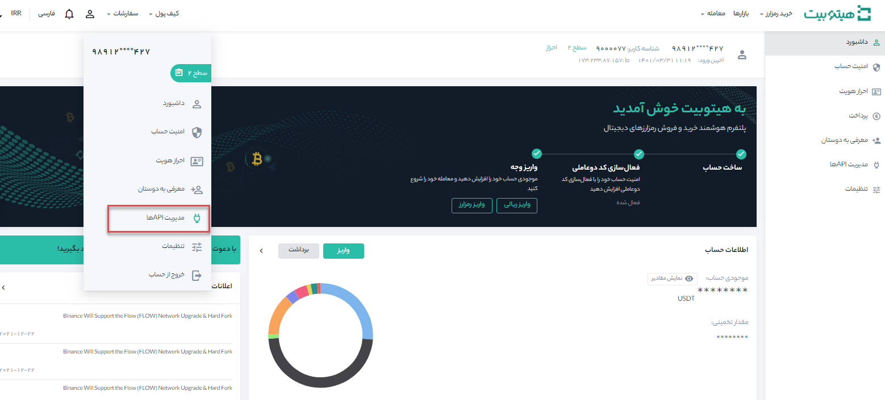
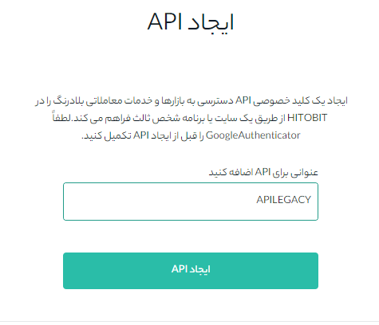
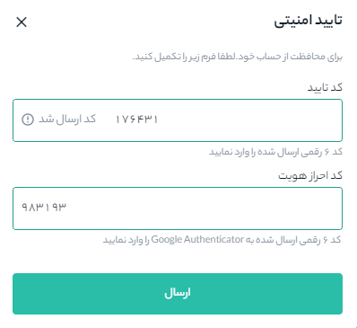
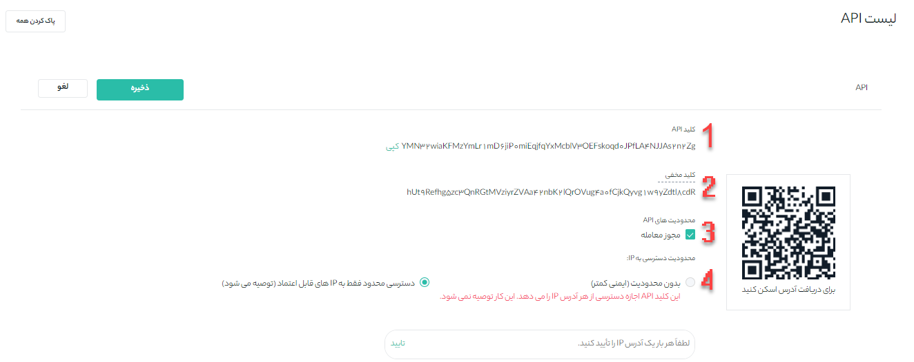

# نحوه ایجاد API

ایجاد یک API به شما امکان می‌دهد از طریق چندین زبان برنامه‌نویسی و پلتفرم‌های دیگر به سرورهای هیتوبیت متصل شوید. داده‌ها را می‌توانید از هیتوبیت منتقل  کرده و در پلتفرم دیگیری استفاده کنید. شما می‌توانید کیف پول فعلی و داده‌های تراکنش خود را مشاهده کنید، معاملات انجام دهید، و دارایی خود را در برنامه‌های شخص ثالث واریز و برداشت کنید، ساخت API یک فرایند ساده است که تنها در 5 دقیقه ایجاد و تکمیل می‌شود.

## چگونه در هیتوبیت API خود را ایجاد کنیم؟

**1.**	پس از ورود به‌حساب هیتوبیت خود، از صفحه داشبورد روی **[مدیریت APIها]** کلیک کنید.

**2.**	یک نام برای کلید API خود وارد کنید و روی **[ایجاد API]** کلیک کنید.

> **نکته امنیتی:** قبل از ایجاد یک API، باید احراز هویت دوعاملی (2FA) را در حساب خود فعال کنید.

**3.**	کد دریافت شده در موبایل را در قسمت **[کد تایید]** و رمز دریافت شده از Google authenticator را در **[کد احراز هویت]** وارد کنید. پس از تکمیل مقادیر، بر روی گزینه **[ارسال]** کلیک کنید.

**4.**	اکنون API شما ایجاد شده است.

1. کلید api: کلید api را کپی کرده و در قسمت مد نظر استفاده کنید.

2. کلید مخفی: لطفاً **کلید مخفی خود را یادداشت و در جای مناسب نگه دارید** زیرا دیگر نمایش  داده **نخواهد** شد. این کلید را با کسی به اشتراک نگذارید. اگر کلید مخفی خود را فراموش کردید، باید API را حذف کرده و یک API جدید ایجاد کنید

3. مجوز معامله: در صورت فعال کردن مجوز معامله، فرو می‌توایند از طریق این api معامله انجام دهد.

4. محدودیت دسترسی به IP: چک باکس **[بدون محدودیت]** نسبت به **[دسترسی محدود فقط به IP های قابل اعتماد]**، از ایمنی کمتری برخوردار است و توصیه می‌شود تا حد ممکن امنیت را بالا برد. در صورت فعال کردن چک باکس **[دسترسی محدود فقط به IP های قابل اعتماد]**، لازم است در فیلد پایین صفحه IP که می‌تواند دسترسی داشته باشد را وارد و **[تایید]** کنید.      

> لطفاً به محدودیت‌های دسترسی IP توجه داشته باشید. توصیه می‌کنیم به دلایل امنیتی گزینه **[فقط دسترسی به IPهای مورد اعتماد را محدود کنید]** را انتخاب کنید.

**5.** در انتها برای ذخیره کردن تغییرات بر روی دکمه **[ذخیره]** کلیک کنید. 
