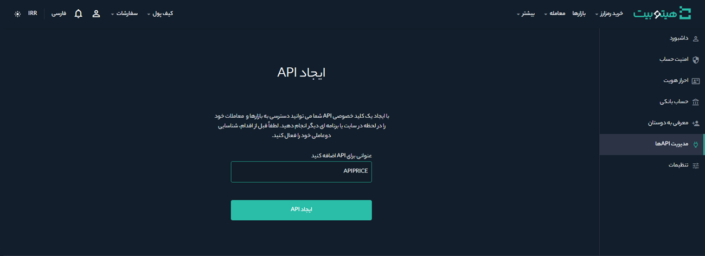
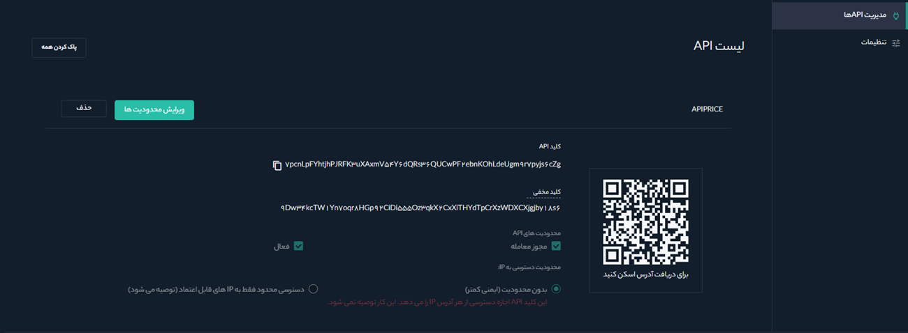

# نحوه ایجاد API

ایجاد یک API به شما امکان می‌دهد از طریق زبان‌های برنامه‌نویسی و پلتفرم‌های دیگر به سرورهای هیتوبیت متصل شوید؛ داده‌ها را از هیتوبیت منتقل و در پلتفرم دیگری استفاده کنید؛ کیف پول فعلی و داده‌های تراکنش خود را مشاهده کنید؛ معامله انجام دهید و دارایی خود را در برنامه‌های شخص ثالث واریز و برداشت کنید، ساخت API فرایند ساده‌ای است که تنها در پنج دقیقه انجام می‌شود.

## چگونه در هیتوبیت API خود را ایجاد کنیم؟

**1.**	پس از ورود به حساب هیتوبیت، از صفحه داشبورد روی **[مدیریت APIها]** کلیک کنید.

**2.**	یک نام برای کلید API خود انتخاب و بر روی **[ایجاد API]** کلیک کنید.

> **توجه:**  قبل از ایجاد  API، باید احراز هویت دوعاملی (2FA) را در حساب خود فعال کنید.

**3.**	کد دریافت شده در موبایل را در قسمت **[کد تایید]** و رمز دریافت شده از Google Authenticator را در **[کد احراز هویت]** وارد کنید. پس از تکمیل مقادیر، بر روی گزینه **[ارسال]** کلیک کنید.

**4.**	اکنون API شما ایجاد شده است و طبق مراحل زیر می‌توانید از آن استفاده کنید.

الف) کلید API را کپی و در قسمت موردنظر استفاده کنید. 
ب) **کلید مخفی خود را یادداشت و در جای مناسب نگه دارید** زیرا دیگر نمایش  داده **نخواهد** شد. این کلید را با کسی به اشتراک نگذارید. اگر کلید مخفی خود را فراموش کنید باید API را حذف و یک API جدید ایجاد کنید. 
ج) در صورت فعال کردن مجوز معامله، فرد می‌تواند از طریق این API معامله انجام دهد. 
د) انتخاب گزینه **[بدون محدودیت]** نسبت به **[دسترسی محدود فقط به IP های قابل اعتماد]** ایمنی کمتری دارد و توصیه می‌شود تا حد ممکن امنیت را بالا برد. در صورت فعال کردن گزینه  **[دسترسی محدود فقط به IP های قابل اعتماد]** لازم است در فیلد پایین صفحه، IP که می‌تواند دسترسی داشته باشد را وارد و **[تایید]** کنید.      

> **توجه**  
 به محدودیت‌های دسترسی IP توجه داشته باشید. توصیه می‌شود به دلایل امنیتی گزینه **[دسترسی محدود فقط به IP های قابل اعتماد
 ]** را انتخاب کنید.

**5.** در انتها برای ذخیره کردن تغییرات بر روی دکمه **[ذخیره]** کلیک کنید. 
