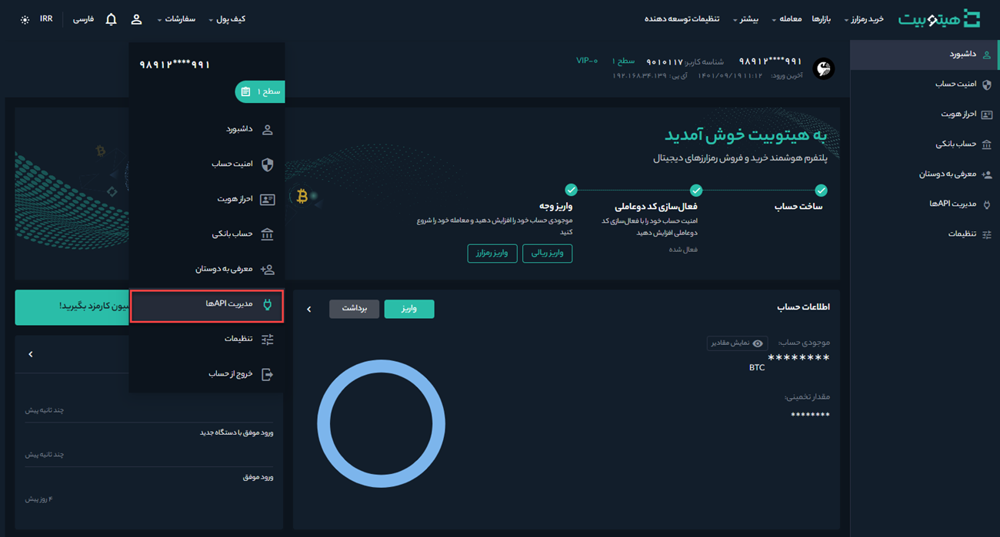
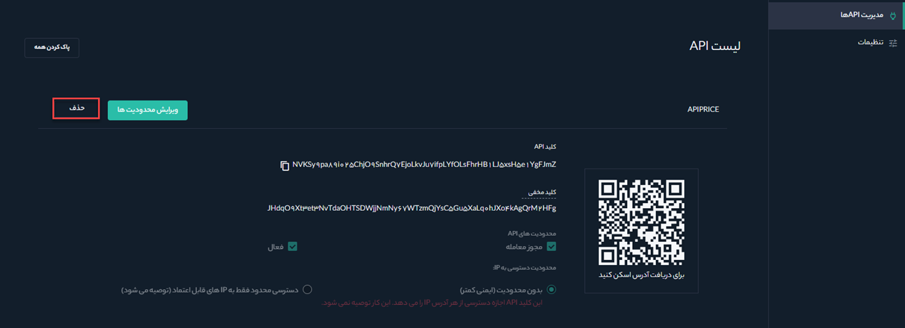
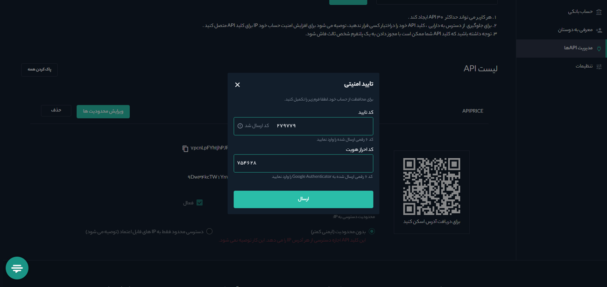

# نحوه حذف API
**1.** برای حذف یک API وارد حساب کاربری خود شوید و بر روی **[مدیریت APIها]** کلیک کنید.

**2.** لیستی از APIهایی که تاکنون ایجاد کرده‌اید نمایش داده می‌شود. برای حذف API موردنظر بر روی **[حذف]** کلیک کنید.

**3.** کد دریافت‌شده در موبایل را در قسمت **[کد تأیید]** و رمز دریافت‌شده از Google Authenticator را در **[کد احراز هویت]** وارد و بر روی  **[ارسال]** کلیک کنید.

**4.** API با موفقیت حذف شد.

