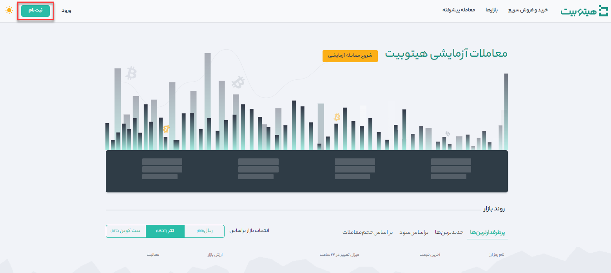
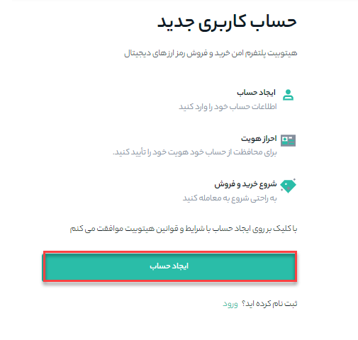
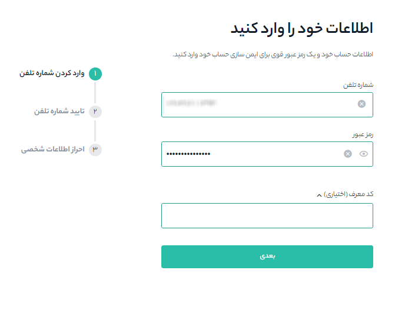
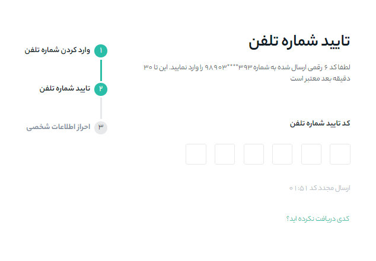
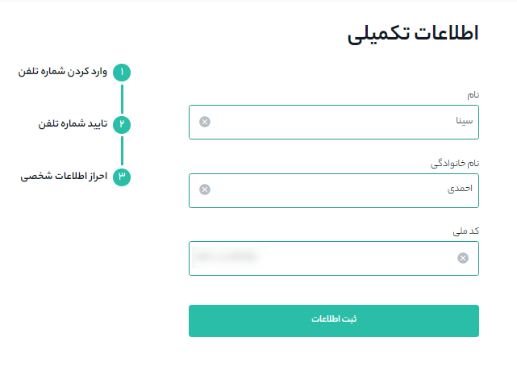
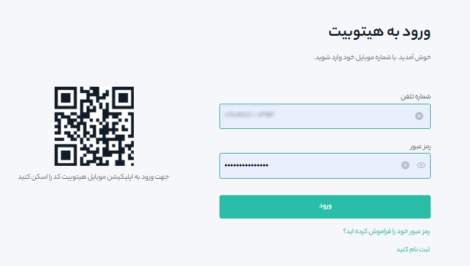

# ثبت‌نام در سایت هیتوبیت

با ثبت نام در هیتوبیت شما در سطح 1 حساب کاربری قرار می‌گیرید. اطلاعات مورد نیاز برای ثبت نام در هیتوبیت:

- شماره موبایلی که به نام خودتان باشد

- نام، نام خانوادگی و کد ملی

برای ثبت‌ نام به ترتیب مراحل زیر اقدام کنید:

**1.** وارد سایت  هیتوبیت شوید و روی **[ثبت‌نام]** کلیک کنید.

**2.**	بر روی ایجاد حساب کلیک کنید و به مرحله بعد بروید.

**2.**	شماره‌تلفن همراه، رمز عبوری که می‌خواهید برای حساب خود بذاربد را وارد کنید. در صورتیکه کد معرف (اختیاری) دارید در قسمت مربوطه وارد کنید. 

> توجه داشته باشید: 

-	برای امنیت حساب، رمز عبور باید بیش از 8 کاراکتر شامل حداقل 1 کاراکتر بزرگ و 1 عدد تشکیل شده باشد. 

-	اگر توسط یکی از دوستانتان معرفی شده‌اید، کد معرف دوست خود را وارد کنید. لازم به ذکر است پس از ثبت‌نام، معرف قابل تعریف و یا تغییر نیست.  

**3.**	تأیید امنیتی را کامل کنید.

**4.**	سیستم یک کد تأیید به تلفن همراه شما پیامک می‌کند. 30 دقیقه فرصت دارید کد تأیید 6 رقمی را وارد کنید. اگر کدی دریافت نکردید، روی **[ارسال مجدد]** کلیک کنید.

**5.**	نام، نام خانوادگی و کد ملی خود را وارد کنید.

**6.**	تبریک می‌گوییم، شما با موفقیت در هیتوبیت ثبت‌نام کردید.

**7.**	برای افزایش امنیت حساب خود، از صفحه داشبورد روی [احراز هویت دوعاملی](https://github.com/HitoBitCo/FAQDocs/edit/main/Account-Functions/Identity-Verification/How-to-Complete-Identity-Verification/How-to-Complete-Identity-Verification.md) کلیک کنید تا احراز هویت دوعاملی (2FA)، از جمله تأیید تلفن و احراز هویت گوگل فعال شود.

