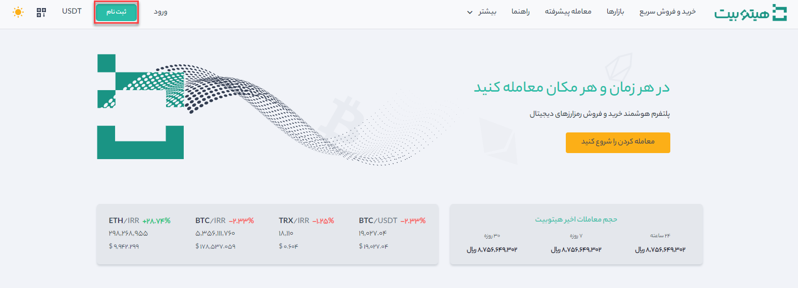
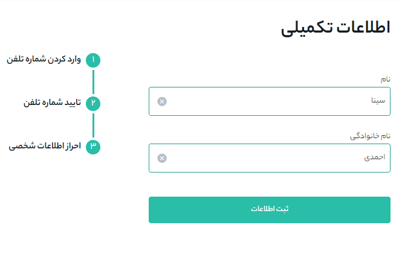

# ثبت‌نام در سایت هیتوبیت

با ثبت‌نام در هیتوبیت شما در سطح صفر حساب کاربری قرار می‌گیرید. برای ثبت‌نام در هیتوبیت اطلاعات زیر موردنیاز است:

- شماره موبایلی که به نام خودتان باشد

- نام و نام خانوادگی

برای ثبت‌‌نام به‌ترتیب مراحل زیر اقدام کنید:

**1.** وارد سایت  هیتوبیت شوید و روی **[ثبت‌نام]** کلیک کنید.

**2.**	بر روی ایجاد حساب کلیک کنید و به مرحله بعد بروید.

**3.**	شماره‌تلفن همراه و رمز عبور مورد نظر خود را وارد کنید. در صورتی که کد معرف (اختیاری) دارید آن را در قسمت مربوطه وارد کنید. 

>برای امنیت حساب، رمز عبور باید بیش از 8 کاراکتر، شامل حداقل یک کاراکتر بزرگ و یک عدد باشد.

>اگر توسط یکی از دوستانتان معرفی شده‌اید، کد معرف دوست خود را وارد کنید. لازم به ذکر است پس از ثبت‌نام، معرف قابل‌تعریف و یا تغییر نیست.

**4.**	تأیید امنیتی را کامل کنید. 

**5.**	سیستم یک کد تأیید به تلفن همراه شما پیامک می‌کند. 30 دقیقه فرصت دارید کد تأیید 6 رقمی را وارد کنید. اگر کدی دریافت نکردید، روی **[ارسال مجدد]** کلیک کنید.

**6.**	نام و نام خانوادگی خود را وارد کنید. 

**7.**	تبریک می‌گوییم، شما با موفقیت در هیتوبیت ثبت‌نام کردید.

**8.**	برای افزایش امنیت حساب خود، [احراز هویت دوعاملی](https://github.com/HitoBitCo/FAQDocs/edit/main/Account-Functions/Identity-Verification/How-to-Complete-Identity-Verification/How-to-Complete-Identity-Verification.md) (2FA) را فعال کنید تا تأیید تلفن و احراز هویت گوگل فعال شود.

