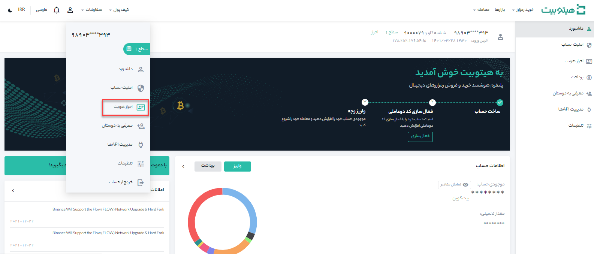
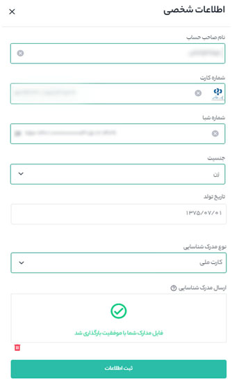

# چطور حساب کاربری را از سطح 1 به سطح 2 ارتقاء دهیم؟

محدودیت‌های معاملاتی در هیتوبیت بر اساس سطح دسترسی کاربر تعیین می‌شود و با ارتقاء سطح کاربری خود دسترسی‌های معاملاتی بیشتری نسبت به سطح قبلی خواهید داشت. پس از ثبت نام در هیتوبیت و ورود به سطح 1 حساب کاربری، می‌توانید برای احراز هویت سطح 2 اقدام کنید.

مدارکی که برای ارتقاء به سطح 2 نیاز دارید شامل:

-	شماره کارت بانکی
 
-	شماره شبا

-	یکی از مدارک کارت ملی یا شناسنامه یا پاسپورت بعنوان مدرک شناسایی

برای شروع طبق مراحلی که در ادامه ذکر شده است عمل کنید.

**1.** در سایت هیتوبیت بعد از ورود به حساب کاربریتان، وارد **[احراز هویت]** شوید.

**2.**  در قسمت سطح 2 بر روی **[شروع کنید]** کلیک کنید و اطلاعات خود را مطابق عکس تکمیل نمایید. لازم بذکر است، کارت بانکی باید به نام صاحب حساب هیتوبیت باشد.

> در صورتی که کاربری کارت ملی ندارد، میتواند از تصویر شناسنامه جدید عکس‌دار (حاوی شماره ملی) یا پاسپورت استفاده کند.

**3.**  در انتها بر روی ثبت اطلاعات کلیک کرده و منتظر نتیجه تایید مدارک و ارتقاء به سطح 2 باشد. 
