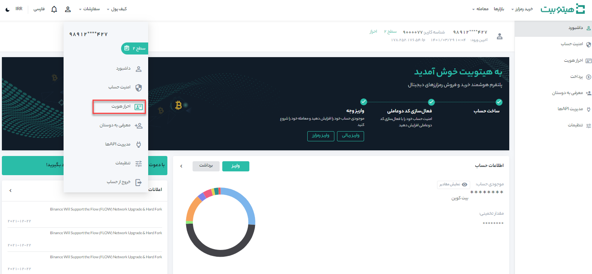
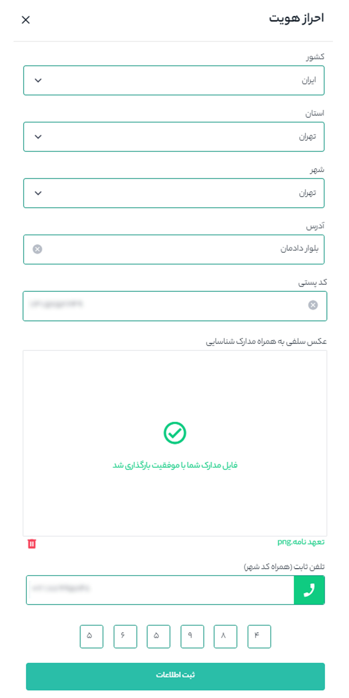

# چطور حساب کاربری را از سطح 2 به سطح 3 ارتقاء دهیم؟

محدودیت‌های معاملاتی در هیتوبیت بر اساس سطح دسترسی کاربر تعیین می‌شوند. با ارتقاء سطح کاربری خود دسترسی‌های معاملاتی بیشتری نسبت به سطح قبلی خواهید داشت. پس از ارتقاء حساب کاربری به سطح 2 می‌توانید برای ارتقاء به سطح 3 اقدام کنید. 
اطلاعاتی که برای ارتقاء به سطح 3 نیاز دارید شامل:

-	نام کشور، استان، شهر، آدرس محل سکونت، کد پستی، تلفن ثابت، بارگذاری تصویر کارت بانکی، کارت ملی و تعهد نامه مطابق دستورالعمل هیتوبیت می‌باشد.

برای شروع طبق مراحلی که در ادامه ذکر شده است عمل کنید.

**1.** در سایت هیتوبیت بعد از ورود به حساب کاربریتان، وارد احراز هویت شوید.

**2.**  در قسمت سطح 3 بر روی شروع کنید کلیک کنید و اطلاعات خود را مطابق عکس و توضیحاتی که در ادامه آماده است تکمیل نمایید.

**1.** راهنمای گرفتن عکس تایید هویت:

1.متن تعهدنامه را بر روی برگه‌ای واضح و خوانا با خودکار یادداشت کنید.

متن تعهدنامه:

اینجانب (نام و نام‌خانوادگی) ... به کد ملی .... ضمن مطالعه و تأیید قوانین استفاده از خدمات پلتفرم هیتوبیت، متعهد می‌شوم حساب کاربری خود را در اختیار اشخاص غیر قرار ندهم در صورت تخلف، مسئولیت آن را اعم از مالی، قضایی و حقوقی به صورت کامل بر عهده می گیرم.

تاریخ

امضاء

> متن تعهد نامه باید دست نویس باشد

> از نوشتن متن با خودکار ماژیکی و رنگ های قرمز و سبز خودداری کنید

2. کارت ملی و کارت بانکی که قبلا اطلاعاتشان را در هیتوبیت ثبت کرده‌اید را مطابق تصویر در دست بگیرید.

کارت ملی را در دست چپ و کارت بانکی را بر روی کاغذ تعهدنامه بچسبانید و در دست راست بگیرید. می‌توانید تاریخ انقضا و CVV2 کارت بانکی را با برچسبی بپوشانید، اما نام دارنده و شماره کارت بانکی باید کاملا واضح باشد.

3. از فردی بخواهید مطابق تصویر از شما عکس بگیرد (تصویر نباید سلفی گرفته شود). هر دو دست و چهره کامل در عکس بیافتد و واضح باشد. می‌توانید قبل از گرفتن عکس لنزهای دوربین را تمیز کنید تا عکس با کیفیت بالا و بدون تاری باشد. 

> دقت داشته باشید که دست‌هایتان هیچ اطلاعات مهمی را نپوشانده باشد

> عکس نباید با دوربین سلفی گرفته شود و تصویر نباید به حالت آینه‌ای و برعکس باشد.
 
**2.**  تلفن ثابت:

برای تایید شماره تلفن ثابتی که ثبت کرده‌اید، با شماره تماس گرفته می‌شود و یک کد 5 رقمی خوانده می‌شود. کد را در جایی یادداشت کرده و در قسمت مربوطه وارد کنید. لازم بذکر است اگر به تلفن ثابت دسترسی ندارید، از آدرس و شماره تماس آشنایان یا بستگان خود استفاده نمایید.

> لطفا دقت داشته باشید تلفن ثابتی که وارد می‌کنید باید شماره تماس آدرسی باشد که وارد کرده‌اید.

**3.**  در انتها بر روی ثبت اطلاعات کلیک کرده و منتظر نتیجه تعیید مدارک و ارتقاء به سطح 3 باشد. 

