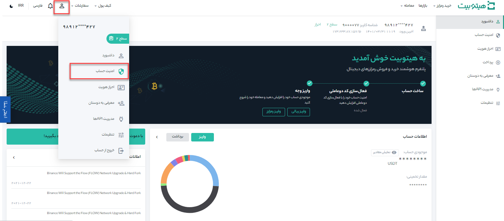
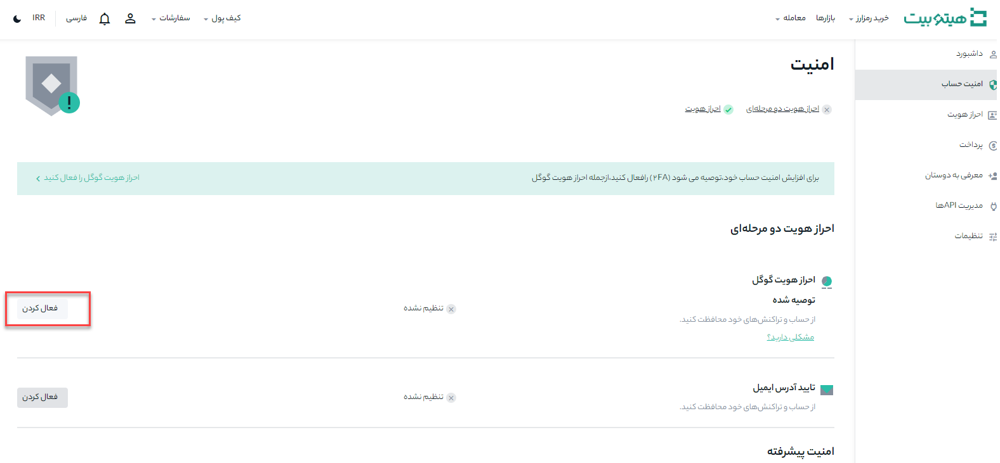
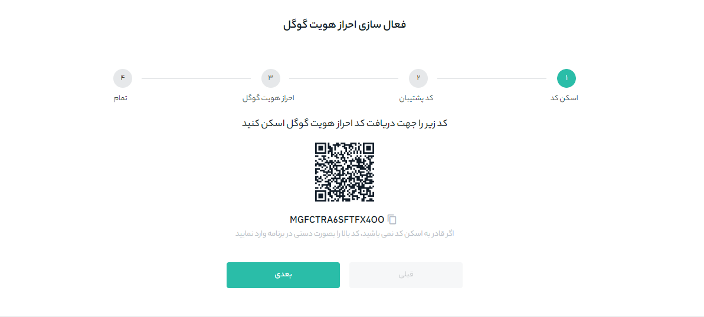
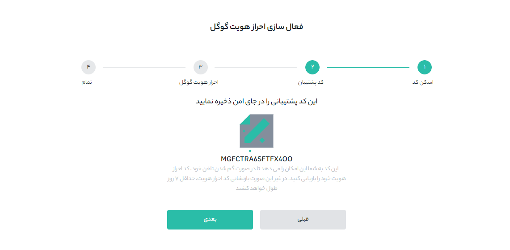
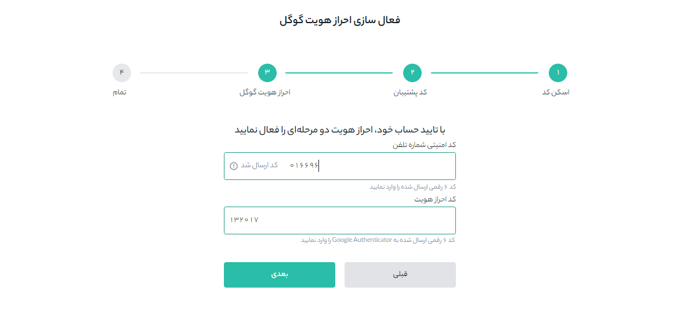
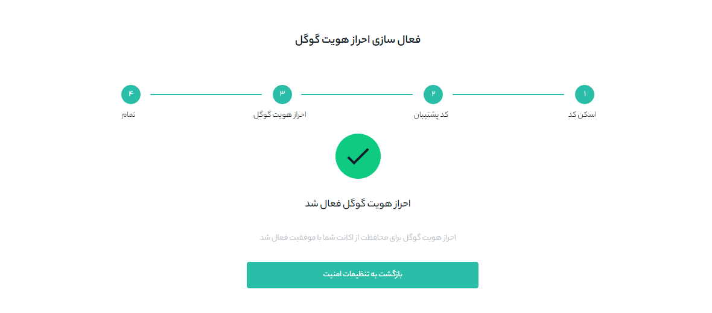

# فعال‌سازی شناسایی دو عاملی با احراز هویت گوگل 

یکی از راه‌های افزایش امنیت حساب‌های کاربری استفاده از کد دو عاملی گوگل است. شناسایی دوعاملی مکانیزمی شبیه رمز پویا دارد. یعنی  هر بار هنگام ورود، می‌بایست علاوه بر رمز عبور خود، کد تایید دو مرحله‌ای را نیز وارد نمایید. این روش جهت افرایش میزان امنیت حساب کاربری و جلوگیری از دستیابی افراد سودجو به حساب‌های کاربری استفاده می‌شود. شما برای دسترسی به این کد می‌توانید از نسخه اپلیکیشن Google Authenticator یا افزونه‌های کروم و فایرفاکس Authenticator استفاده کنید. 

## چگونه می‌توانم به شناسه دوعاملی دسترسی داشته باشم؟

**1.**	در ابتدا برنامه Google Authenticator را دانلود و بر روی دستگاه تلفن همراه خود نصب کنید.

**2.**	وارد حساب هیتوبیت خود شوید و از منوی پروفایل وارد **[امنیت حساب]** شوید.

**3.**	روی دکمه **[فعال‌کردن]** در مقابل  **[احراز هویت گوگل]** کلیک کنید.

**4.**	در ادامه دستورالعمل‌های گام‌به‌گام را برای فعال‌کردن Google Authenticator دنبال کنید.

-	**مرحله اسکن کد:** پس از فعال کردن احراز هویت دو عاملی، یک کد QR روی صفحه‌نمایش خود خواهید دید. برنامه Google Authenticator را باز کنید و روی دکمه [+] در سمت راست پایین صفحه ضربه بزنید تا کد QR را اسکن کنید. پس از اسکن بر روی **[Next]** کلیک کنید.

> اگر نمی‌توانید کد QR را اسکن کنید، مقدار کد پشتیبان را وارد کنید.

-	**مرحله کد پشتیبان:**  کد پشتیبان را روی کاغذ یادداشت و در جای مطمئن نگهداری کنید. این کد به شما این امکان را می‌دهد که در صورت بروز هر گونه مشکلی برای تلفن همراه شما، Google Authenticator خود را بازیابی کنید.

- **مرحله احراز هویت گوگل:** با زدن دکمه **[دریافت کد]**، کدی را که برای تلفن همراه شما پیامک می‌شود در قسمت **[کد امنیتی شماره تلفن]** و کدی را که با برنامه 2FA دریافت می‌کنید در قسمت **[کد احراز هویت]** وارد کنید. پس از تکمیل این قسمت‌ها بر روی **[بعدی]** کلیک کنید.

- **مرحله اتمام:** در این مرحله شما با موفقیت Google Authenticator را برای محافظت از حساب خود فعال کرده‌اید و پیام **احراز هویت گوگل فعال شد** بر روی صفحه نشان داده می‌شود.

## سؤالات رایج:

### **1.**	وقتی "اتصال ناموفق" است، چه کاری می‌توانم انجام دهم؟

-	مطمئن شوید که برنامه Google Authenticator را نصب کرده‌اید.
- ساعت تلفن همراه و رایانه خود را یکسان کنید.
-	مطمئن شوید که رمز پیامک شده و کد دو عاملی گوگل را درست وارد کرده‌اید.
-	اطمینان حاصل کنید که تنظیمات تاریخ/زمان در تلفن همراه شما روی "خودکار" قرار گرفته است.

### **2.**	دسترسی به برنامه Google Authenticator قبلی خود را از دست دادم. چگونه می‌توانم دوباره آن را فعال کنم؟

1- اگر کد 16 رقمی ایجاد شده در هنگام فعال‌کردن Google Authenticator را یادداشت کرده‌اید، می‌توانید به‌سادگی با واردکردن کلید پشتیبان در برنامه، Google Authenticator خود را دوباره فعال کنید.

2- اگر کلید پشتیبان را ذخیره نکرده‌اید، حساب Google Authenticator خود را بازیابی کنید و دوباره حساب Google Authenticator جدید ایجاد کنید. لطفاً به نحوه [بازیابی احراز هویت گوگل](https://github.com/HitoBitCo/FAQDocs/blob/main/Account-Functions/Two-factor-Authentication/How-to-Reset-Google-Authentication/How-to-Reset-Google-Authentication.md) مراجعه کنید.

### **3.**	وقتی "خطای کد 2FA" را نشان می‌دهد، چه کاری می‌توانم انجام دهم؟

-	زمان را روی تلفن همراه خود (برای همگام‌سازی برنامه Google Authenticator) و رایانه خود (که می‌خواهید از آن وارد شوید) یکسان کنید.
-	به صفحه ورود هیتوبیت با حالت ناشناس در Google Chrome بروید.
-	کش و کوکی‌های مرورگر خود را پاک کنید.
-	سعی کنید از اپلیکیشن Hitobit وارد شوید.
اگر هیچ یک از پیشنهادهای بالا نمی‌تواند مشکل شما را حل کند، باید Google Authenticator خود را بازیابی کنید. لطفاً به نحوه [بازیابی احراز هویت گوگل](https://github.com/HitoBitCo/FAQDocs/blob/main/Account-Functions/Two-factor-Authentication/How-to-Reset-Google-Authentication/How-to-Reset-Google-Authentication.md) مراجعه کنید.
