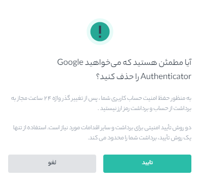

# نحوه بازیابی احراز هویت گوگل

## با انجام مراحل زیر می‌توانید احراز هویت گوگل خود را تغییر داده یا غیرفعال کنید:

**1.**	به‌حساب خود وارد شده و از منوی حساب کاربری روی **[امنیت حساب]** کلیک کنید.

**2.**	روبروی **[احراز هویت گوگل]**، دو گزینه **[تغییر]** و **[حذف]** وجود دارد که هرکدام از این دو مراحل عملیاتی خود را دارد:

> توجه داشته باشید که پس از انجام این تغییر، **برداشت‌ها** به مدت 24 ساعت غیرفعال می‌شود.

**1-2**. اگر گزینه **[تغییر]** را انتخاب کردید احراز هویت گوگل موجود خود را بازیابی می‌کنید. ادامه فرآیند بازیابی احراز هویت گوگل را به صورت زیر انجام دهید:

- ابتدا متن را بادقت بخوانید و روی **[تأیید]** کلیک کنید.

- **مرحله حذف احراز هویت فعلی:** برای حذف احراز هویت گوگل فعلی خود لازم است با زدن دکمه **[دریافت کد]**، کدی را که برای تلفن همراه شما پیامک می‌شود را در قسمت **[کد امنیتی شماره تلفن]** و کدی را که با برنامه 2FA دریافت می‌کنید را در قسمت **[کد احراز هویت]** وارد کنید. پس از تکمیل قسمت‌ها بر روی **[حذف و ادامه]** کلیک کنید.

- **مرحله اسکن کد جدید:** QR را با برنامه احراز هویت گوگل خود اسکن کنید. اگر نمی‌توانید آن را اسکن کنید، کدی که پایین QR کد قرار دارد را بصورت دستی کپی و در در برنامه وارد کنید. سپس روی **[بعدی]** کلیک کنید.
 

 
- **مرحله کد پشتیبان جدبد:** در این قسمت یک کد پشتیبان خواهید دید که باید این عبارت را در جایی امن نوشته و نزد خود حفظ نمایید. این کلید به شما این امکان را می‌دهد که در صورت عدم دسترسی به برنامه در آینده، احراز هویت گوگل خود را بازیابی کنید.

- **مرحله احراز هویت جدید:** در این مرحله مجدد کد امنیتی که برای شما ارسال می‌شود را در قسمت **[کد امنیتی شماره تلفن]** و کدی را که با برنامه 2FA دریافت می‌کنید را در قسمت **[کد احراز هویت]** وارد کنید. پس از تکمیل قسمت‌ها روی **[بعدی]** کلیک نمایید.

**مرحله اتمام:** در صورت موفق بودن مراحل پیغام **احراز هویت گوگل فعال شد** ظاهر خواهد شد.

**2-2**. اگر روی **[حذف]** کلیک کردید احراز هویت گوگل فعلی شما لغو خواهد شد و می‌توانید در آینده مجددا یک احراز هویت گوگل جدید فعال نمایید. ادامه فرآیند حذف احراز هویت گوگل را به صورت زیر انجام دهید:

 
- متن را بادقت بخوانید و روی **[تأیید]** کلیک کنید.

- **غیرفعال کردن احراز هویت گوگل:** برای غیرفعال کردن احراز هویت گوگل فعلی خود لازم است با زدن دکمه **[دریافت کد]**، کدی را که برای تلفن همراه شما پیامک می‌شود را در قسمت **[کد امنیتی شماره تلفن]** و کدی را که با برنامه 2FA دریافت می‌کنید را در قسمت **[کد احراز هویت]** وارد کنید. پس از تکمیل قسمت‌ها بر روی **[حذف]** کلیک کنید.

- احراز هویت گوگل شما با موفقیت حذف شد.

## اگر به‌حساب هیتوبیت خود وارد شده‌اید اما دسترسی به احراز هویت گوگل خود را از دست داده‌اید یا فعال نمی‌باشد، می‌توانید با دنبال‌کردن مراحل زیر، احراز هویت گوگل خود را بازیابی کنید:

**1.**	روی **[تغییر]** یا **[حذف]** در کنار **[احراز هویت گوگل]** کلیک کنید.

**2.**	متن را بادقت بخوانید و روی **[تأیید]** کلیک کنید.

> لطفاً توجه داشته باشید که پس از انجام این تغییر، برداشت‌ها به مدت 24 ساعت غیرفعال می‌شود.
> 
**3.**	در صفحه تأیید 2FA روی **[تأیید امنیتی موجود نیست؟]** کلیک کنید.

**4.**	کادر کنار **[احراز هویت گوگل در دسترس نیست]** را علامت بزنید و روی **[تایید بازیابی]** کلیک کنید.

**5.**	باید این عمل را با سایر دستگاه‌های (تلفن همراه، رایانه،...) موجود 2FA تأیید کنید و روی **[ارسال]** کلیک کنید.

**6.**	همچنین باید تأییدیه‌های اضافی را تکمیل کنید. برای تکمیل دستورالعمل‌ها را دنبال کنید:

-	پاسخ به سؤالات امنیتی
-	تأیید هویت
-	تأیید چهره

**7.**	پس از تکمیل تأییدیه‌ها، ما درخواست شما را دراسرع‌وقت بررسی خواهیم کرد. لطفاً صبور باشید. 

> لطفاً توجه داشته باشید روند تایید بر اساس وضعیت حساب کاربران، متفاوت می‌باشد.

## اگر نمی‌توانید به برنامه احراز هویت گوگل خود دسترسی پیدا کنید و نمی‌توانید به‌حساب Hitobit خود وارد شوید، می‌توانید با دنبال‌کردن مراحل زیر، احراز هویت گوگل خود را بازنشانی کنید:

**1.**	به صفحه ورود هیتوبیت بروید و با آدرس ایمیل و رمز عبور حساب هیتوبیت وارد شوید. در صفحه تأیید امنیتی، روی **[تأیید امنیتی موجود نیست؟]** کلیک کنید.

**2.**	کادر کنار **[احراز هویت گوگل در دسترس نیست]** را علامت بزنید و روی **[تایید بازنشانی]** کلیک کنید.

**3.**	باید این عمل را با سایر دستگاه‌های موجود 2FA تأیید کنید و روی **[ارسال]** کلیک کنید.

**4.**	همچنین باید تأییدیه‌های اضافی را تکمیل کنید. برای تکمیل دستورالعمل‌ها را دنبال کنید:

-	به سؤالات امنیتی جواب بدهید
-	تأیید هویت
-	تأیید چهره

**5.**	پس از تکمیل تأییدیه‌ها، ما درخواست شما را دراسرع‌وقت بررسی خواهیم کرد. لطفاً صبور باشید.

> لطفاً توجه داشته باشید روند تایید بر اساس وضعیت حساب کاربران، متفاوت می‌باشد.

