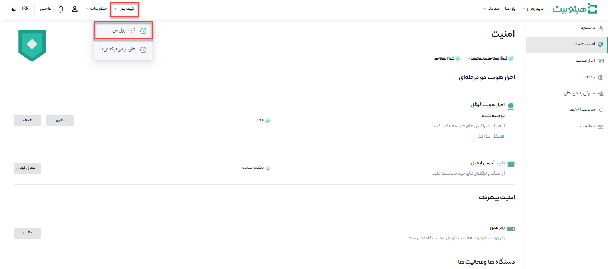
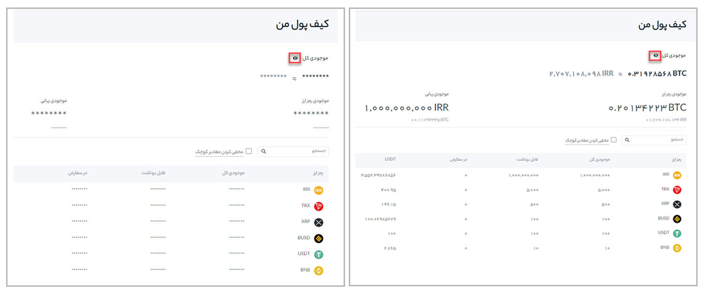

# چطور می‌توان به اطلاعات کیف پول خود دسترسی داشت؟

**1.**	وارد حساب Hitobit خود شوید و از منوی کیف پول روی **[کیف پول من]** کلیک کنید.

**2.**	در این صفحه می‌توانید موجودی کیف پول‌ هیتوبیت خود را بررسی کنید و تراکنش‌های واریز، برداشت و پرداخت را انجام دهید. همچنین می‌توانید **[موجودی تخمینی]** کیف پول‌ خود را هم به صورت ریالی و هم رمزارز مشاهده کنید. 
 
برای نمایش یا پنهان کردن موجودی کیف پول خود، روی **[آیکن چشم]** کلیک کنید.

