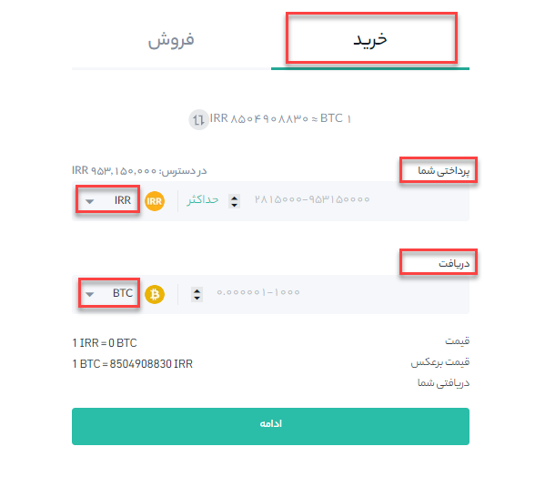
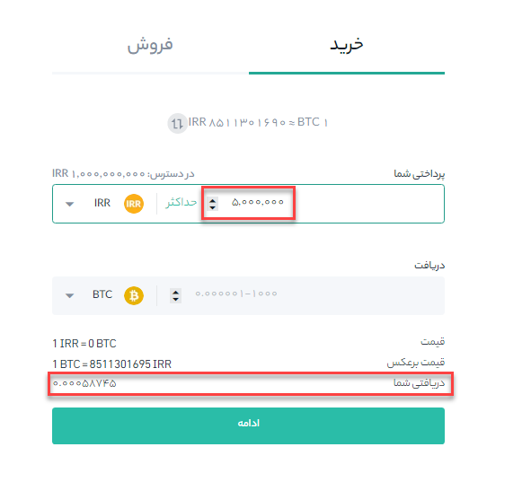

# مراحل خرید رمزارز با کارت بانکی

**1.**	وارد حساب هیتوبیت خود شوید، وارد **[خرید رمز ارز]** شده و سپس بر روی **[خرید و فروش سریع]** کلیک کنید.

**2.**	وارد قسمت **[خرید]** شوید. 

- واحد پول پرداختی را از قسمت **[پرداخت شما]** و  نوع ارزی که می‌خواهید بخرید را از **[دریافت]** مشخص کنید(در تصویر واحد پول پرداختی IRR و نوع ارز ریپل می‌باشد).

- در 2 حالت می‌توانید خرید را انجام دهید:

 1- خرید بر اساس مبلغ مشخص: در این صورت لازم است مبلغ مورد نظر را در قسمت **[پرداختی شما]** وارد کنید و تعداد ارز بصورت خودکار در پایین صفحه رو به روی **[دریافتی شما]** نمایش داده می‌شود (مطابق عکس).
 

 
 2- خرید بر اساس تعداد ارز: در این صورت لازم است تعداد ارز مورد نظر برای خرید را در قسمت **[دریافت]** وارد کنید و مبلغی که لازم است پرداخت کنید در پایین صفحه رو به روی **[شما به این مبلغ پرداخت می‌کنید]** نشان داده می‌شود(مطابق عکس).
 

**3.**	پس از تکمیل مقادیر لازم بر روی دکمه **[ادامه]** کلیک کنید.

## سؤالات متداول:

### 1.	اگر در مدت زمان مشخص شده خرید خود را نهایی نکنم، سفارش خرید لغو می‌شود؟

بله اگر سفارش را در مهلت مقرر تکمیل نکنید، باطل می‌شود و باید تراکنش جدیدی ارسال کنید.

### 2.	اگر خریدم با شکست مواجه شد، آیا می‌توانم مبلغ پرداخت شده را پس بگیرم؟

اگر برای تراکنش‌های ناموفق پس از پرداخت، وجه کسر شده باشد مبلغ پرداختی شما به کارت بازگردانده می‌شود.

### 3.	پس از تکمیل سفارش، رمزارز خریداری شده را کجا می توانم ببینم؟

برای بررسی اینکه آیا ارز دیجیتال واریز شده است، می توانید از منوی کیف پول به صفحه کیف پول من بروید.

### 4.	کجا می توانم سابقه خرید خود را مشاهده کنم؟

برای مشاهده تاریخچه سفارش خود می توانید روی تاریخچه تراکنش‌ها کلیک کنید.

### 5.	در زمان سفارش پیام "به سقف مجاز روزانه رسیده اید" نمایش داده میشود، چگونه می توانم سقف مجاز روزانه را افزایش دهم؟

برای ارتقاء سطح احراز هویت  و افزایش حد مجاز حساب خود، می توانید به بخش [احراز هویت] بروید.

