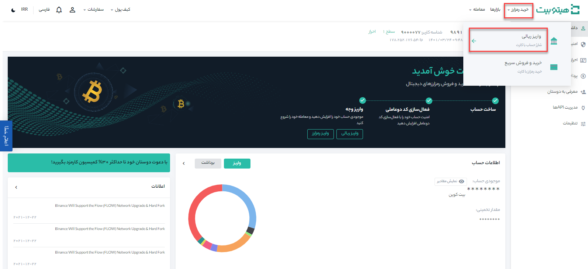

# نحوه واریز ریالی با کارت بانکی

**1.** وارد حساب هیتوبیت خود شده و به صفحه **[کیف پول من]** بروید.

**2.**  بر روی **[واریز]** کلیک کنید.

**3.**	وارد **[واریز ریالی]** شوید.

**4.** نوع ارز و مبلغ مورد نظر را وارد کنید و پس از تکمیل مقادیر بر روی **[ادامه]** کلیک کنید تا وارد صفحه پرداخت (شاپرک) شوید.

**5.**	در صورت موفق بودن وضعیت واریز، رسید آن برای شما صادر شده و مبلغ به موجودی ریالی شما اضافه می‌شود. در این مرحله می‌توانید جفت‌های معاملاتی موجود را در صفحه  بررسی کنید و معامله را شروع کنید.

