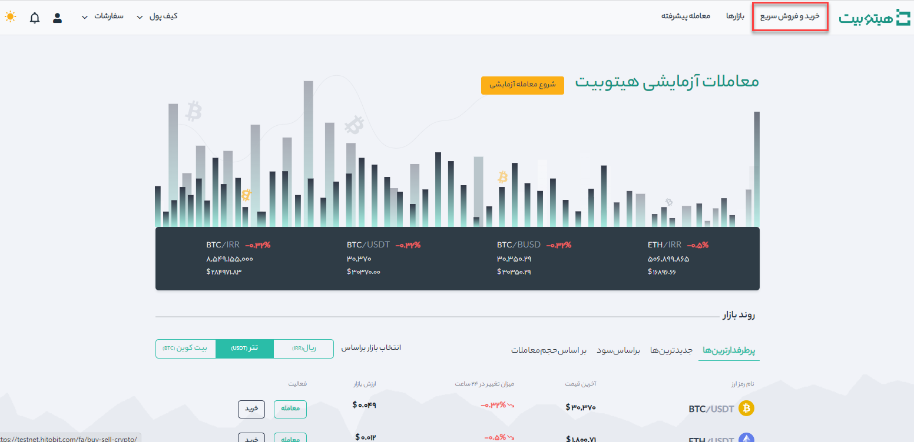

# نحوه فروش ریالی رمزارز و انتقال مستقیم به کارت بانکی

شما می‌توانید ارزهای دیجیتال خود را به صورت ریالی بفروشید و مستقیماً به کارت بانکی خود منتقل کنید.

**1.**	وارد حساب هیتوبیت خود شوید و روی **[خرید و فروش سریع]** کلیک کنید.

**2.**	روی **[فروش]** کلیک کنید.

 - نوع ارزی که می‌خواهید بفروشید را از قسمت پرداختی شما و واحد پول دریافتی را از قسمت دریافت مشخص کنید(در تصویر نوع ارز TRX و واحد پول دریافتی IRR می‌باشد).

 - می‌توانید فروش را بر اساس تعداد ارز **یا** مبلغ مشخص کنید. تعداد ارز را در قسمت **پرداختی شما** و مبلغ را در قسمت **دریافت** وارد کنید (در این تصویر 40 TRX برای فروش تعیین شده است). 

- پس از تکمیل مقادیر لازم، مبلغ دریافتی شما در پایین صفحه نمایش داده می‌شود.
  

**3.**	در انتها روی دکمه **[ادامه]** کلیک کنید.

**4.**	روش پرداخت خود را انتخاب کنید برای انتخاب از بین کارت‌های موجود یا افزودن کارت جدید، روی **[مدیریت کارت]** کلیک کنید.

**5.**	جزئیات پرداخت را بررسی کنید و سفارش خود را در عرض 1 دقیقه تأیید کنید. پس از 1 دقیقه، قیمت و مقدار کریپتویی که دریافت می‌کنید دوباره محاسبه می‌شود. برای مشاهده آخرین قیمت بازار می‌توانید روی **[Refresh]** کلیک کنید.
