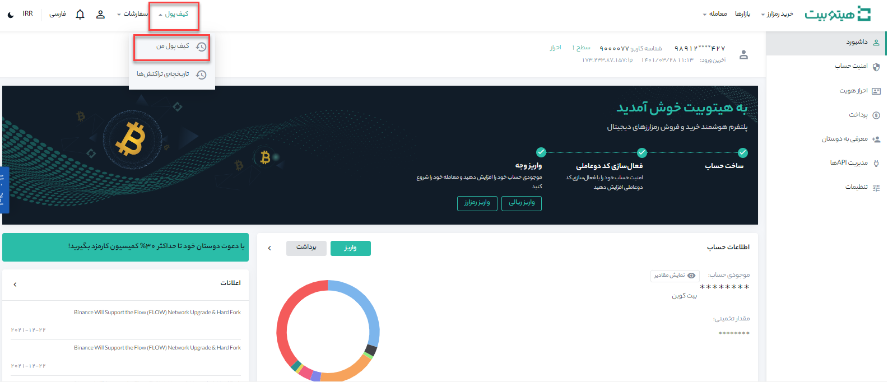
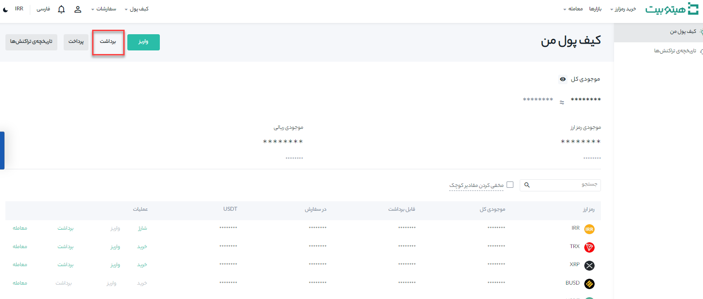
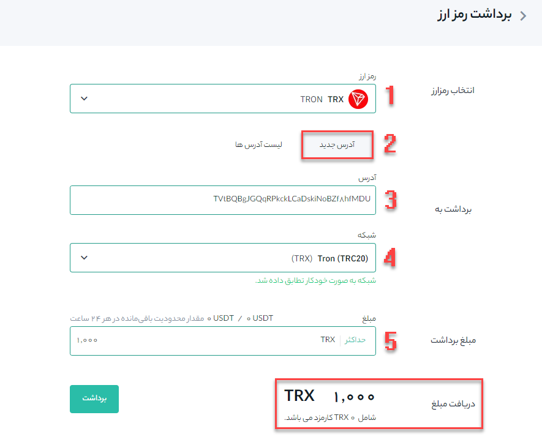

# نحوه برداشت از هیتوبیت

در این مثال نحوه انتقال رمزارز TRX (tron)از حساب هیتوبیت شما به یک پلتفرم یا کیف پول خارجی را به شما نشان می‌دهیم:

**1.**	وارد حساب هیتوبیت خود شوید و از منوی کیف پول روی **[کیف پول من]** کلیک کنید.

**2.**	روی **[برداشت]** کلیک کنید.

**3.**	بصورت پیش فرض صفحه بر روی **[برداشت رمزارز]** باز می‌شود. ارز دیجیتالی را که می‌خواهید برداشت کنید انتخاب نمایید. در این مثال، ما TRX را برداشت خواهیم کرد.

**1.** رمز ارز مورد نظر را انتخاب کنید. ( در این مثال TRX انتخاب شده است) 

**2.**	بر روی حالت **[آدرس جدید]**، آدرس گیرنده را وارد کنید.

**3.**	در صورتی که سیستم از شبکه آدرس شما مطمئن باشد شبکه را بصورت خودکار وارد می‌کند و در غیر اینصورت لازم است شبکه مربوطه را بصورت دستی انتخاب کنید.

> لطفاً مطمئن شوید که شبکه انتخاب شده با آدرس‌های شبکه وارد شده مقصد مطابقت دارد تا از ضرر و زیان احتمالی جلوگیری شود.

**4.**	مبلغ برداشت را وارد کنید، در این لحظه می‌توانید کارمزد تراکنش مربوطه و مبلغ نهایی دریافتی را مشاهده کنید..

**5.** در انتها س از تکمیل مقادیر بر روی **[برداشت]** کلیک کنید.

> توجه: اگر هنگام انتقال، اطلاعات اشتباه وارد کنید یا شبکه اشتباهی را انتخاب کنید، دارایی‌های شما برای همیشه از بین می‌رود. لطفاً قبل از انتقال از صحت اطلاعات اطمینان حاصل کنید.
