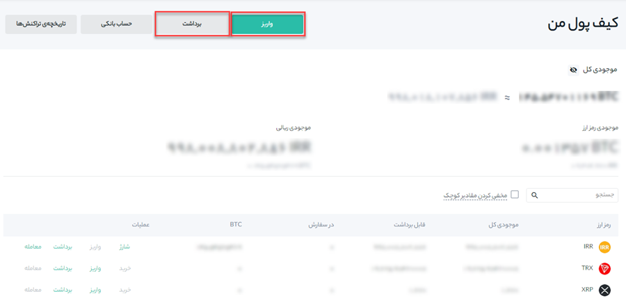

# واریز و برداشت ارزهای دیجیتال  در هیتوبیت
	1. برای واریز رمزارزها پس از ورود به حساب کاربری خود بر روی منوی **[کیف پول]** و سپس **[کیف پول من]** کلیک کنید.
    

   2. گزینه **[واریز]** را انتخاب و سپس ارز مورد نظر و شبکه خود را وارد کنید.

   

 برای اطلاعات بیشتر مقاله [نحوه واریز رمزارز به هیتوبیت](https://github.com/HitoBitCo/FAQDocs/blob/main/Crypto-Deposit-Withdrawal/Crypto-Deposit/How-to-Deposit-Crypto-to-Hitobit/How-to-Deposit-Crypto-to-Hitobit.md) مطالعه کنید.

 4.	برای برداشت رمزارزها پس از ورود به حساب کاربری خود بر روی منوی **[کیف پول]** و سپس **[کیف پول من]** کلیک کنید.

 5. گزینه برداشت را انتخاب و رمزارز، آدرس، شبکه گیرنده و مقدار برداشت را وارد کنید.

> توجه داشته باشید که همیشه قبل از سفارش واریز ارز دیجیتال، از صحت آدرس کیف پولی که به آن پرداخت می‌کنید، مطمئن شوید. برای اطلاعات بیشتر مقاله  [نحوه برداشت از هیتوبیت](https://github.com/HitoBitCo/FAQDocs/blob/main/Crypto-Deposit-Withdrawal/Crypto-Withdrawal/How-to-Withdraw-from-Hitobit/How-to-Withdraw-from-Hitobit.md) را مطالعه کنید.

## سؤالات متداول

### 1.	چقدر طول می‌کشد تا دارایی من به کیف پول منتقل شود؟

پس از تأیید درخواست شما در هیتوبیت، مدتی طول می‌کشد تا تراکنش در بلاک‌چین نیز تأیید شود. زمان تأیید بسته به بلاک‌چین و ترافیک شبکه فعلی آن متفاوت است.

### 2.	چگونه می‌توان سابقه تراکنش‌های خود را بررسی کرد؟

می‌توانید وضعیت واریز یا برداشت خود را از **[کیف پول من]** - **[تاریخچه تراکنش‌ها]** بررسی کنید.

