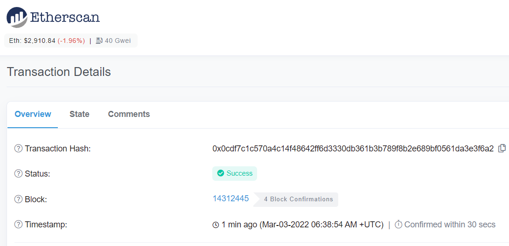
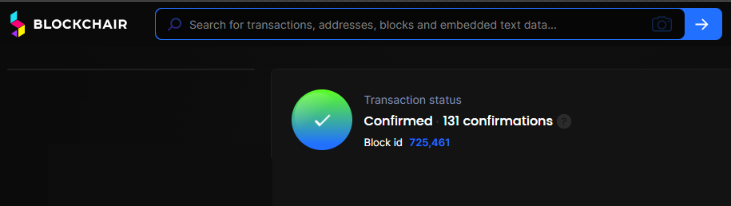

# نحوه بررسی وضعیت تراکنش ارزهای دیجیتال در بلاک‌چین

هنگامی که رمزارزها را واریز یا برداشت می‌کنید، گاهی اوقات نمی‌توانید دارایی را در حساب مربوطه دریافت کنید. در شرایطی مانند این، باید وضعیت تراکنش در بلاک‌چین را با استفاده از شناسه تراکنش (TxID) بررسی کنید.
به‌عنوان‌مثال، اگر از طریق هیتوبیت واریز یا برداشت می‌کنید، می‌توانید وضعیت تراکنش را مستقیماً در پلتفرم هیتوبیت بررسی کنید. به‌حساب هیتوبیت خود وارد شوید و به کیف پول - تاریخچه‌ی تراکنش‌ها بروید. برای مشاهده وضعیت تراکنش خود می‌توانید روی رکورد تراکنش و پیوند TxID کلیک کنید.
بر اساس شبکه‌ای که برای تراکنش انتخاب کرده‌اید، به صفحه کاوشگر بلاک‌چین مربوطه هدایت می‌شوید. به‌عنوان‌مثال، اگر از شبکه اتریوم (ERC20) برای تراکنش خود استفاده کنید، به سایت Etherscan هدایت خواهید شد.
مثال‌های زیر بررسی وضعیت انتقال معمولی برخی از رمز ارزها در شبکه‌های رایج را مشاهده می‌کنید که به شما کمک می‌کند از دلایل دریافت نشدن دارایی مطلع شوید.

## 1.	اتریوم (ERC20)

**1.1.**	اگر وضعیت "Fail" باشد، به این معنی است که تراکنش ناموفق بوده است.
در صورت نیاز می‌توانید با فرستنده یا پلتفرمی که درخواست برداشت را ثبت کرده‌اید تماس بگیرید. به خاطر داشته باشید گیرنده یا پلتفرمی که به آن واریز می‌کنید نمی‌تواند در این شرایط به شما کمک کند.

برای مثال، اگر در حال واریز به هیتوبیت هستید و وضعیت تراکنش «Fail» را در بلاک‌چین نشان می‌دهد، لطفاً با پلتفرمی که انتقال را آغاز کرده‌اید، تماس بگیرید. اما اگر از هیتوبیت برداشت می‌کنید و با شکست مواجه می‌شوید، می‌توانید برای دریافت کمک با پشتیبانی تماس بگیرید.

**1.2.**	اگر وضعیت "Dropped & Replaced" باشد، به این معنی است که تراکنش با تراکنش جدیدی با کارمزد گس بالاتر به دلیل ازدحام شبکه جایگزین شده است.

می‌توانید برای دریافت TxID جدید با پلتفرمی که از آن برداشت می‌کنید یا با فرستنده تراکنش تماس بگیرید.

**1.3.**	اگر وضعیت "موفقیت" باشد، به این معنی است که تراکنش کامل شده است.
می‌توانید بررسی کنید که آیا وجه به‌حساب گیرنده رسیده است یا خیر. اگر در حال واریز به هیتوبیت هستید و وضعیت بلاک‌چین "موفقیت" را نشان می‌دهد، اما وجوه دریافت نشده است، می‌توانید درخواست با پشتیبانی ارسال کنید.

 
 
## 2.	شبکه بیت‌کوین

اگر تراکنش به طور کامل در بلاک چین بیت کوین تأیید نشد، می توانید حداقل تعداد تأییدیه های مورد نیاز از بلاک چین را بررسی کنید (لطفاً توجه داشته باشید که تعداد تأییدیه های مورد نیاز ممکن است تغییر کند). لطفا صبورانه منتظر بمانید تا تایید شود.
پس از تایید کامل تراکنش، می توانید وجوه موجود در حساب گیرنده یا پلتفرمی را که به آن واریز می کنید بررسی کنید.
 
 
 
## 3.	 ترون 

اگر وضعیت تراکنش "تأیید شده" باشد اما نتیجه "شکست" باشد، به این معنی است که تراکنش انجام شده است، اما وجوه را نمی توان به آدرس گیرنده واریز کرد. لطفاً برای دریافت کمک با فرستنده یا پلتفرمی که از آن برداشت می‌کنید تماس بگیرید.
اگر وضعیت تراکنش "تأیید شده" باشد و نتیجه "موفقیت" را نشان دهد، به معنای موفقیت آمیز بودن تراکنش است. می‌توانید بررسی کنید که آیا وجه به‌حساب گیرنده یا به پلتفرمی که به آن واریز می‌کنید رسیده است .

 

