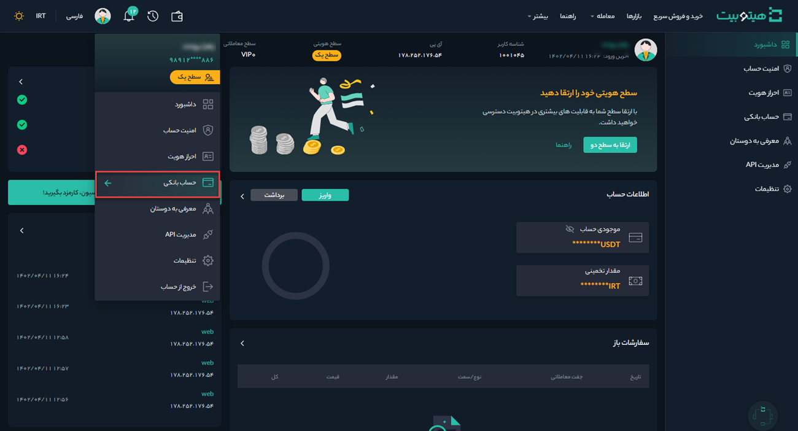
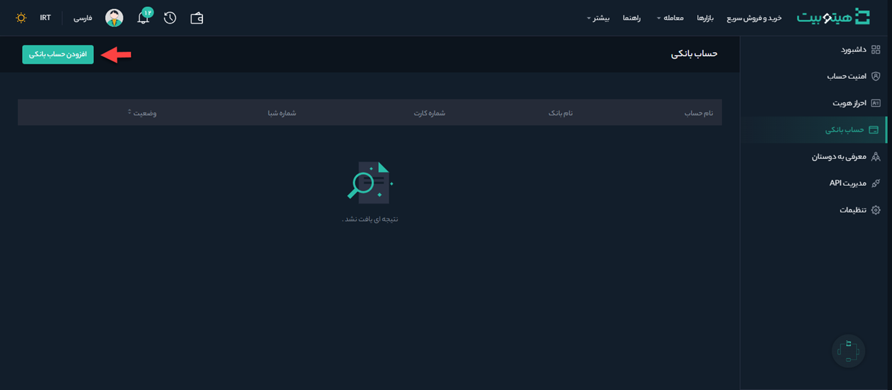
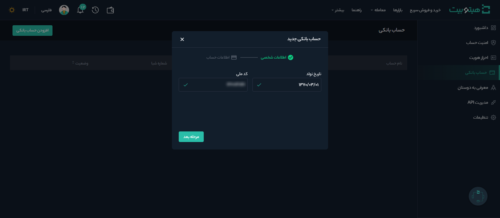
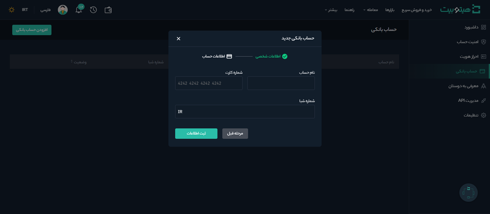

# افزودن حساب بانکی
برای واریز تومانی و برداشت از کیف پول هیتوبیت نیاز است که کارت بانکی خود را به حساب کاربری‌تان در هیتوبیت اضافه کنید. به‌منظور افزودن کارت بانکی به هیتوبیت به‌صورت زیر عمل کنید:
 
1. وارد حساب کاربری خود شوید و از منوی پروفایل بر روی **[حساب بانکی]** کلیک کنید.

2. در صفحه حساب بانکی بر روی **[افزودن حساب بانکی]** کلیک کنید.

3. در کادر بازشده، اطلاعات شخصی شامل تاریخ تولد و کد ملی را وارد و بر روی **[مرحله بعد]** کلیک کنید.

4. در این مرحله اطلاعات حساب بانکی خود را وارد و بر روی **[ثبت اطلاعات]** کلیک کنید.

5. شماره کارت واردشده با اطلاعات هویتی کاربر تطبیق داده می‌شود. در صورت صحت اطلاعات وارد شده، حساب بانکی تأیید می‌شود.