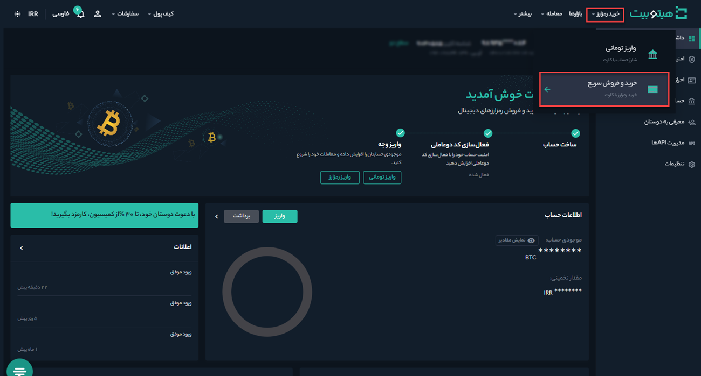
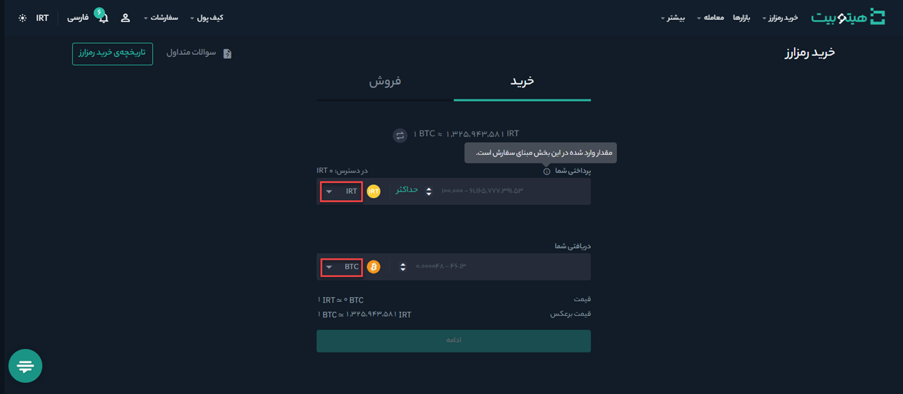
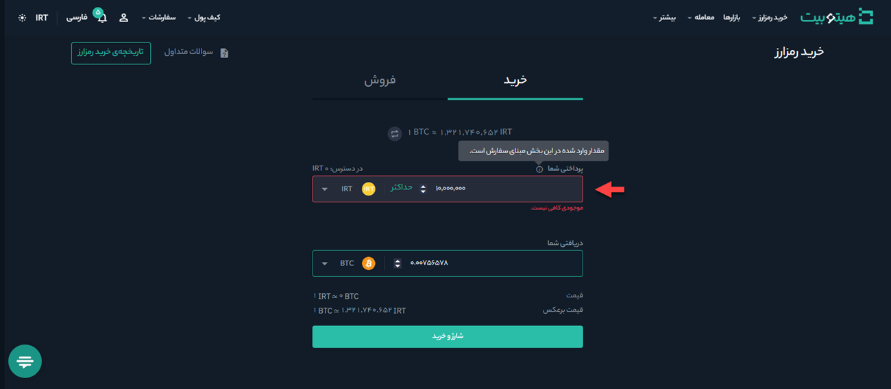
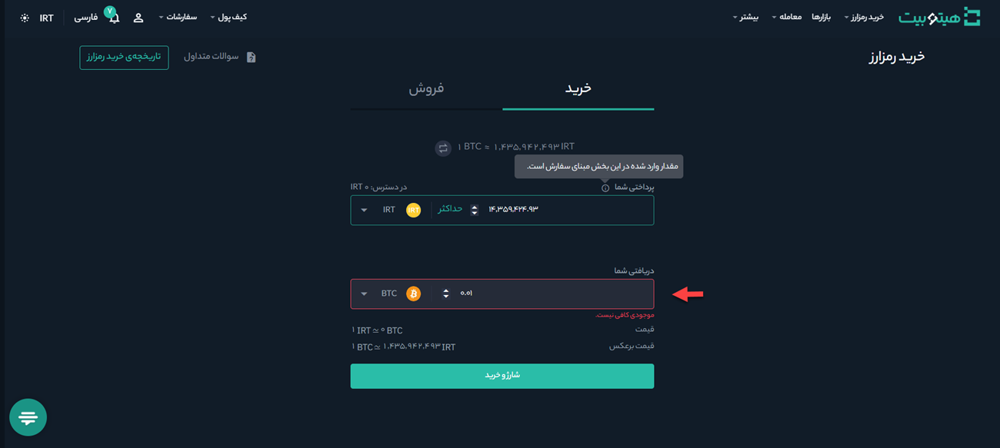

# خرید رمزارز با کارت بانکی
**1.**	وارد حساب کاربری خود شوید و در منوی **[خرید رمزارز]** بر روی **[خریدوفروش سریع]** کلیک کنید.

**2.** در سربرگ **[خرید]** واحد پرداختی را در کادر  **[پرداختی شما]** و رمزارزی که می‌خواهید خریداری کنید در کادر **[دریافتی شما]**   انتخاب کنید.

**3.** خرید رمزارز را می‌توانید به دو روش انجام دهید:

 - **خرید بر اساس مبلغ مشخص:** در این حالت مبلغ مورد نظر را در قسمت **[پرداختی شما]** وارد کنید. مقدار رمزارزی که به‌ازای آن دریافت خواهید کرد  به‌صورت خودکار در کادر **[دریافتی شما]** نمایش داده می‌شود.
 

 
 - **خرید بر اساس مقدار رمزارز:** در این حالت مقدار رمزارز موردنظر برای خرید را در قسمت **[دریافتی شما]** وارد کنید. مبلغی که لازم است پرداخت کنید در کادر   **[پرداختی شما]** نشان داده می‌شود.
 

**3.**	پس از تکمیل مقادیر لازم بر روی دکمه **[ادامه]** کلیک کنید.
 در صورتی که موجودی برای خرید رمزارز کافی نباشد پیغام «موجودی کافی نیست» نمایش داده می‌شود. در این حالت برای خرید رمزارز باید با کلیک بر روی دکمه **[شارژ و خرید]** حساب خود را شارژ کنید.

