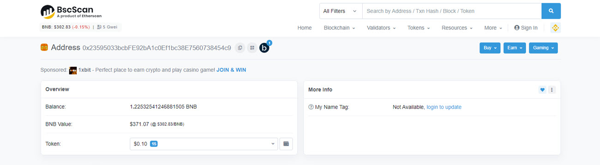

# نحوه بررسی وضعیت واریز و برداشت در شبکه‌های مختلف      

هنگامی که رمزارزها را واریز یا برداشت می‌کنید، گاهی اوقات نمی‌توانید دارایی خود را در حساب مربوطه دریافت کنید. در چنین شرایطی، باید وضعیت تراکنش در بلاک چین را با استفاده از شناسه تراکنش (TxID) بررسی کنید.

به‌عنوان مثال، اگر از طریق هیتوبیت واریز یا برداشت می‌کنید، می‌توانید وضعیت تراکنش را به‌طور مستقیم در پلتفرم هیتوبیت بررسی کنید. برای این منظور به حساب هیتوبیت خود وارد شوید و به **[کیف پول]** - **[تاریخچه‌ی تراکنش‌ها]** بروید. برای مشاهده وضعیت تراکنش خود روی رکورد تراکنش و لینک TxID کلیک کنید.
بر اساس شبکه‌ای که برای تراکنش انتخاب کرده‌اید، به صفحه کاوشگر بلاک چین مربوطه هدایت می‌شوید. مثلاً اگر از شبکه اتریوم (ERC20) برای تراکنش خود استفاده کنید، به سایت اتر اسکن Etherscan هدایت خواهید شد.

در مثال‌های زیر بررسی وضعیت انتقال معمولی برخی از رمزارزهای رایج را مشاهده می‌کنید که به شما کمک می‌کند از دلایل دریافت نشدن دارایی آگاهی کسب کنید.

## 1.	اتریوم (ERC20)

اگر وضعیت **Fail** باشد، به این معنی است که تراکنش ناموفق بوده است.
در صورت نیاز می‌توانید با فرستنده یا پلتفرمی که درخواست برداشت را ثبت کرده‌است تماس بگیرید. با این حال گیرنده یا پلتفرمی که به آن واریز می‌کنید نمی‌تواند در این شرایط به شما کمک کند.

برای مثال، اگر در حال واریز به هیتوبیت هستید و وضعیت تراکنش **Fail** را در بلاک چین نشان می‌دهد، با پلتفرمی که درخواست واریز به هیتوبیت را در آن ثبت کرده‌اید، تماس بگیرید. اما اگر از هیتوبیت برداشت می‌کنید و با شکست مواجه می‌شوید، می‌توانید برای دریافت کمک با پشتیبانی تماس بگیرید.

اگر وضعیت **Dropped & Replaced** باشد، به این معنی است که تراکنش به‌دلیل ترافیک شبکه با تراکنش جدیدی با کارمزد گس بالاتر جایگزین شده است.

برای دریافت TxID جدید، می‌توانید با پلتفرمی که از آن برداشت می‌کنید یا با فرستنده تراکنش تماس بگیرید.

اگر وضعیت **Success** باشد، به این معنی است که تراکنش انجام شده است.

امکان پیگیری انتقال وجه به حساب گیرنده وجود دارد. اگر در حال واریز به هیتوبیت هستید و وضعیت بلاک چین **Success** را نشان می‌دهد، اما دارایی دریافت نشده است با پشتیبانی تماس بگیرید.

 
 
## 2.	شبکه بیت‌کوین

اگر تراکنش به‌طور کامل در بلاک چین بیت کوین تأیید نشد، می‌توانید حداقل تعداد تأییدیه‌های مورد نیاز از بلاک چین را بررسی کنید (توجه داشته باشید که تعداد تأییدیه‌های مورد نیاز ممکن است تغییر کند). در این لحظه باید منتظر بمانید تا تراکنش تایید شود.
پس از تایید کامل تراکنش، می‌توانید وجوه موجود در حساب گیرنده یا پلتفرمی را که به آن واریز می‌کنید بررسی کنید.
 
 
 
## 3.	 ترون 

اگر وضعیت تراکنش **CONFIRMED** باشد اما نتیجه **Fail** باشد، به این معنی است که تراکنش انجام شده است، اما دارایی را نمی‌توان به آدرس گیرنده واریز کرد. در چنین شرایطی برای پیگیری با فرستنده یا پلتفرمی که از آن برداشت می‌کنید تماس بگیرید.
اگر وضعیت تراکنش **CONFIRMED** باشد و نتیجه **Success** را نشان دهد، به معنای موفقیت‌آمیز بودن تراکنش است. در پایان می‌توانید پیگیری کنید که آیا دارایی به حساب گیرنده یا به پلتفرمی که به آن واریز می‌کنید رسیده است.

 

## 4. بایننس اسمارت چین
برای بررسی وضعیت تراکنش‌های زنجیره هوشمند بایننس (BSC) از کاوشگر BscSacan استفاده می‌شود. تیم اتر اسکن  این کاوشگر را توسعه داده است، به همین دلیل رابط کاربری آن بسیار شبیه به اتر اسکن است و به‌گونه‌ای طراحی شده است که برای افراد مبتدی قابل استفاده باشد. 
### جستجوی تراکنش‌ها در BscScan
جستجوی تراکنش در BscScan تفاوت چندانی با سایر کاوشگرهای بلاک چین ندارد. برای اینکه بتوانید تراکنش‌های خود را پیگیری کنید می‌توانید ادرس کیف پول یا شناسه تراکنش مورد نظر خود را در کادر جستجو وارد کنید.

زمانی که آدرس  کیف پول وارد کادر جستجو می‌شود موجودی بایننس کوین و ارزش دلاری آن نمایش داده می‌شود.

همچنین فهرست تراکنش‌های مربوط به کیف پول نیز در این صفحه نمایش داده می‌شود. برای مشاهده جزئیات بیشتر هر تراکنش،  بر روی آن کلیک کنید.

### جستجوی تراکنش‌ها با شناسه یا هش 
روش متداول جستجوی تراکنش در BscScan، استفاده از هش تراکنش است. با ورود هش تراکنش به BscScan جزئیات تراکنش از جمله وضعیت آن ارائه می‌شود. در صورت موفقیت‌آمیز بودن تراکنش پیغام **Success** نمایش داده می‌شود.

اگر تراکنش معلق باشد پیغام **Pending** نمایش داده می‌شود.

در صورت عدم موفقیت تراکنش پیغام **Fail** نمایش داده می‌شود.

