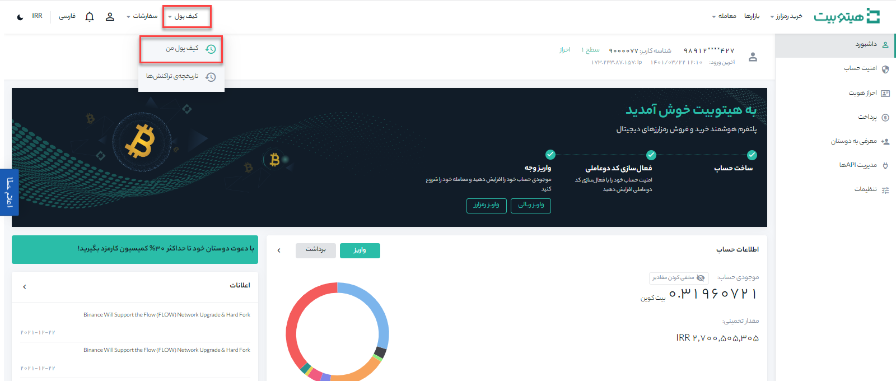
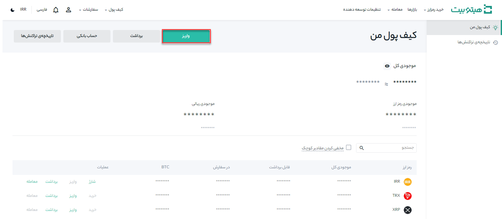
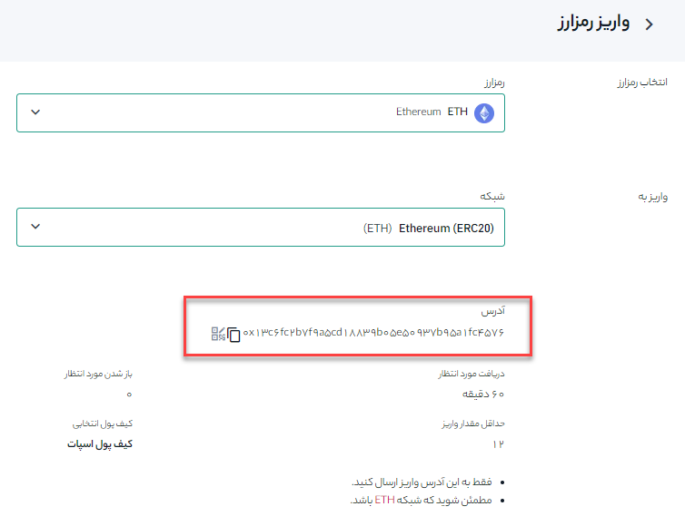

# راهنمای گام‌به‌گام واریز رمز ارز به هیتوبیت 

اگر در پلتفرم یا کیف پول دیگری ارز دیجیتال دارید، می‌توانید آنها را برای معامله به کیف پول هیتوبیت خود منتقل کنید.

## نحوه واریز رمزارز به هیتوبیت

**1.** از منوی **[کیف پول]**، وارد **[کیف پول من]** شوید.

**2.** بر روی **[واریز]** کلیک کنید.

**3.** در قسمت **[انتخاب رمزارز]**، رمزارز مورد نظر خود و در قسمت **[واریز به]**  شبکه مقصد را انتخاب کنید.

**4.** واریز رمزارزها از طریق **آدرس واریز** انجام می‌شود. پس از تکمیل مقادیر، آدرس واریز را در پایین صفحه مشاهده خواهید کرد. آدرس را در پلتفرم یا کیف پولی که از آن برداشت می‌کنید کپی کرده تا رمزارز را به کیف پول هیتوبیت خود منتقل کنید.

> توجه داشته باشید برای برخی از رمزارزها باید یک MEMO  یا TAG نیز اضافه کنید.

>  اگر شبکه اشتباهی را انتخاب کنید، سرمایه خود را از دست خواهید داد، بنابراین در انتخاب شبکه دقت نمایید.	

## انتخاب شبکه:

- BEP2 به زنجیره بیکن BNB (زنجیره بایننس سابق) اشاره دارد.
- BEP20 به زنجیره هوشمند بایننس (BSC) اشاره دارد.
- ERC20 به شبکه اتریوم اشاره دارد.
- TRC20 به شبکه TRON اشاره دارد.
- BTC به شبکه بیت‌کوین اشاره دارد.

**1.**	برای مثال می‌خواهیم، USDT را از پلتفرم دیگری برداشت و به هیتوبیت واریز کنیم. از آنجا که ما از یک آدرس ERC20 (بلاک چین اتریوم) برداشت می‌کنیم، شبکه واریز ERC20 را انتخاب می‌کنیم.

- انتخاب شبکه به گزینه‌های ارائه شده توسط کیف پول خارجی/صرافی که از آن برداشت می‌کنید بستگی دارد. اگر پلتفرم خارجی فقط از ERC20 پشتیبانی می‌کند، باید شبکه واریز ERC20 را انتخاب کنید.

- ارزان‌ترین شبکه را انتخاب نکنید. یکی را انتخاب کنید که با پلتفرم خارجی سازگار است. به‌عنوان‌مثال، شما فقط می‌توانید توکن‌های ERC20 را به یک آدرس ERC20 دیگر و توکن‌های BSC را به یک آدرس BSC دیگر ارسال کنید.

**2.**	برای کپی کردن آدرس واریز کیف پول هیتوبیت خود کلیک کنید و آن را در فیلد آدرس در پلتفرمی که می‌خواهید رمزارز را از آن برداشت کنید، جای‌گذاری کنید.
همچنین، می‌توانید روی نماد کد QR کلیک کنید تا یک کد QR از آدرس دریافت کنید و آن را به پلتفرمی که خارج می‌کنید وارد کنید.

**3.**	پس از تأیید درخواست برداشت، مدتی طول می‌کشد تا تراکنش تأیید شود. زمان تأیید بسته به بلاک چین و ترافیک شبکه فعلی آن متفاوت است.
پس از پردازش انتقال، دارایی  در مدت کوتاهی  به حساب هیتوبیت شما واریز می‌شود.

**4.**	برای مشاهده وضعیت واریز خود به **[تاریخچه تراکنش‌ها]** مراجعه کنید در این قسمت جزئیات مربوط به تراکنش‌های اخیر خود را مشاهده خواهید کرد.

## سؤالات متداول

### 1.	تگ/یادداشت چیست و چرا باید هنگام واریز رمزارز آن را وارد کنم؟

تگ یا یادداشت یک شناسه منحصر به فرد است که به هر حساب برای شناسایی سپرده و اعتبار حساب اختصاص داده می‌شود. هنگام سپرده‌گذاری رمزارزهای خاص، مانند BNB، XEM، XLM، XRP، KAVA، LUNA، ATOM، BAND، EOS و غیره، باید برچسب یا یادداشت مربوطه را وارد کنید تا انتقال با موفقیت انجام شود.

### 2.	چقدر طول می‌کشد تا دارایی من منتقل شود؟

پس از تأیید درخواست شما در هیتوبیت، مدتی طول می‌کشد تا تراکنش در بلاک چین تأیید شود. زمان تأیید بسته به بلاک چین و ترافیک شبکه فعلی آن متفاوت است. 
به‌عنوان‌مثال، اگر USDT را واریز می‌کنید، هیتوبیت از شبکه‌های ERC20، BEP2 و TRC20 پشتیبانی می‌کند. می‌توانید شبکه موردنظر را از پلتفرمی که از آن برداشت می‌کنید انتخاب کنید، مبلغ برداشت را وارد کنید. در این لحظه کارمزد تراکنش‌های مربوطه را مشاهده خواهید کرد.
دارایی در مدت کوتاهی پس از تأیید شبکه تراکنش به‌حساب هیتوبیت شما واریز می‌شود.

> توجه داشته باشید که اگر آدرس واریز را اشتباه وارد کرده باشید یا یک شبکه پشتیبانی نشده را انتخاب کرده باشید، دارایی شما از بین خواهد رفت. همیشه قبل از تأیید تراکنش جزییات تراکنش را به‌دقت بررسی کنید.

### 3.	 چگونه می‌توان سابقه تراکنش‌های خود را بررسی کرد؟

می‌توانید وضعیت واریز یا برداشت خود را از **[کیف پول]** - **[تاریخچه تراکنش‌ها]** بررسی کنید.

