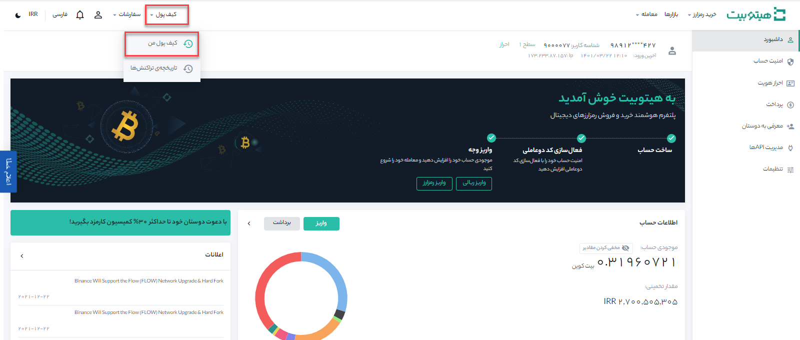
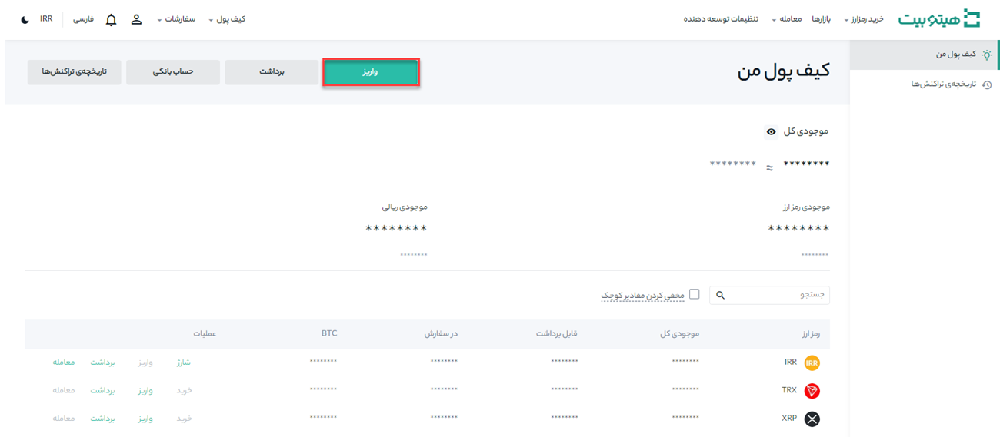
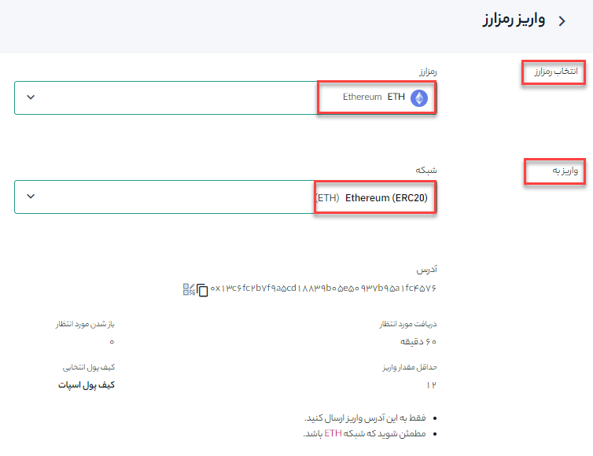
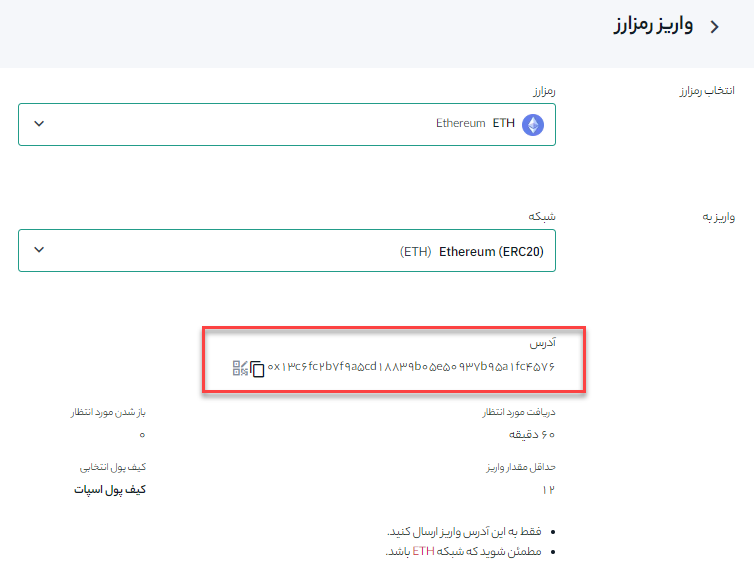

# واریز رمز ارز به هیتوبیت 

اگر در پلتفرم یا کیف پول دیگری ارز دیجیتال دارید، می‌توانید آنها را برای معامله به کیف پول هیتوبیت خود منتقل کنید.

## نحوه واریز رمزارز به هیتوبیت

**1.** وارد حساب کاربری خود شوید و از منوی **[کیف پول]** بر روی **[کیف پول من]** کلیک کنید.

**2.** بر روی **[واریز]** کلیک کنید.

**3.**  رمزارز مورد نظر خود را  در **[انتخاب رمزارز]**    و شبکه مقصد را در **[واریز به]** انتخاب کنید.

**4.** پس از انتخاب رمزارز و شبکه مقصد، آدرس واریز را در پایین صفحه مشاهده خواهید کرد. آن را کپی و در فیلد آدرس پلتفرم یا کیف پولی که از آن برداشت می‌کنید جای‌گذاری کنید تا رمزارز را به کیف پول هیتوبیت خود منتقل کنید. همچنین می‌توانید روی نماد کد QR کلیک کنید تا یک کد QR از آدرس دریافت و آن را در پلتفرمی که از آن برداشت می‌کنید وارد کنید.

> **توجه**      برای برخی از رمزارزها باید شناسه‌ای به نام   ممو (Memo)  یا  تگ (Tag)  را نیز اضافه کنید.	

## انتخاب شبکه
مواردی که در ادامه مطرح شده است نشان می‌دهد که هر نماد اختصاری به کدام شبکه اشاره می‌کند:

- BEP2 به زنجیره بیکن BNB (زنجیره بایننس سابق) اشاره دارد.
- BEP20 به زنجیره هوشمند بایننس (BSC) اشاره دارد.
- ERC20 به شبکه اتریوم اشاره دارد.
- TRC20 به شبکه TRON اشاره دارد.
- BTC به شبکه بیت‌کوین اشاره دارد.

> **توجه** 
اگر شبکه مقصد را اشتباه انتخاب کنید، دارایی خود را از دست خواهید داد، بنابراین در انتخاب شبکه دقت نمایید.

برای مثال فرض کنید می‌خواهیم USDT را از پلتفرم دیگری برداشت و به هیتوبیت واریز کنیم. از آنجا که ما از یک آدرس  ERC20 (بلاک چین اتریوم) برداشت می‌کنیم، شبکه واریز را ERC20  انتخاب می‌کنیم.

- انتخاب شبکه به گزینه‌های ارائه‌شده توسط کیف پول خارجی یا صرافی که از آن برداشت می‌کنید بستگی دارد. اگر پلتفرم خارجی فقط از ERC20 پشتیبانی می‌کند، باید شبکه واریز ERC20 را انتخاب کنید.

- شبکه‌ای را انتخاب کنید که با پلتفرم خارجی سازگار است و به‌دنبال انتخاب ارزان‌ترین شبکه نباشید. به‌عنوان مثال، شما فقط می‌توانید توکن‌های ERC20 را به یک آدرس ERC20 و توکن‌های BSC را به یک آدرس BSC ارسال کنید.

