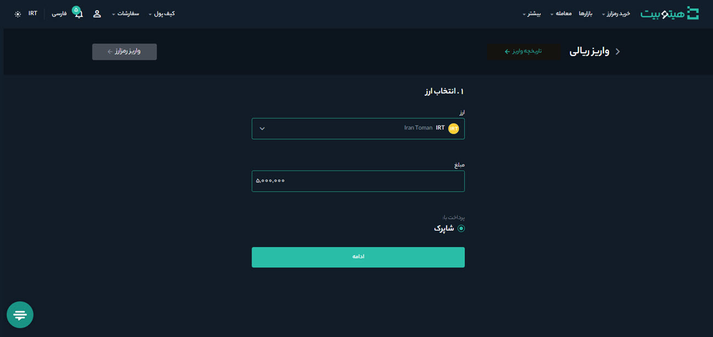
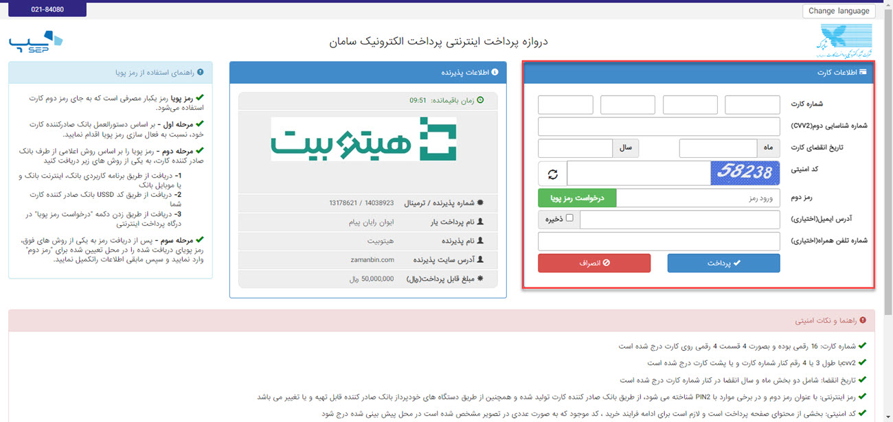

# شارژ حساب از طریق درگاه آنلاین
برای شارژ حساب کاربری از طریق درگاه آنلاین مطابق مراحل زیر اقدام کنید:

**1.** وارد حساب کاربری خود شوید و از منوی **[خرید رمز ارز]**   بر روی **[واریز ریالی]** کلیک  کنید.

**2.** در قمست انتخاب ارز، گزینه تومان به‌صورت پیش‌فرض انتخاب شده است و شما باید مبلغ مورد نظر خود را به تومان وارد کنید. سپس بر روی **[ادامه]** کلیک کنید تا وارد صفحه پرداخت شوید.

**3.** اطلاعات کارت بانکی خود را وارد و بر روی پرداخت کلیک کنید. در صورتی که واریز با موفقیت انجام شود رسید آن  صادر و مبلغ به موجودی ریالی شما اضافه می‌شود. در این مرحله می‌توانید برای خرید رمزارز اقدام کنید.

