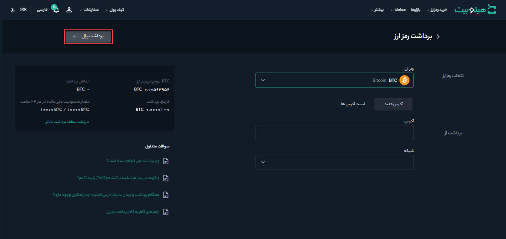
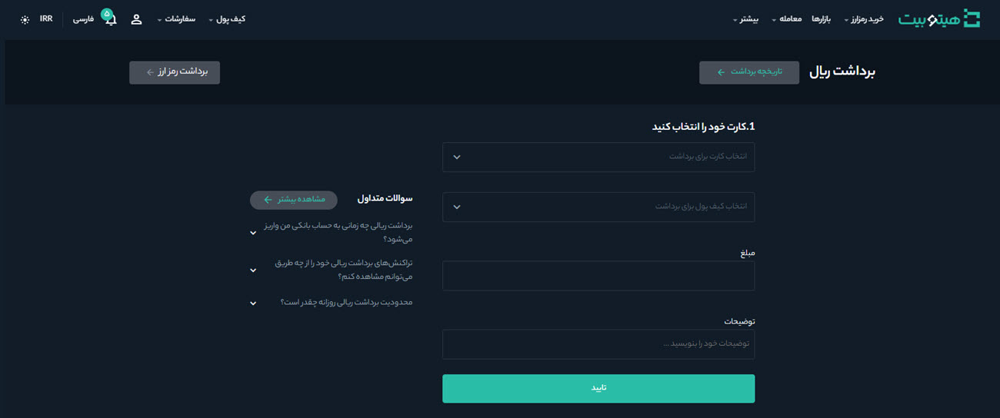
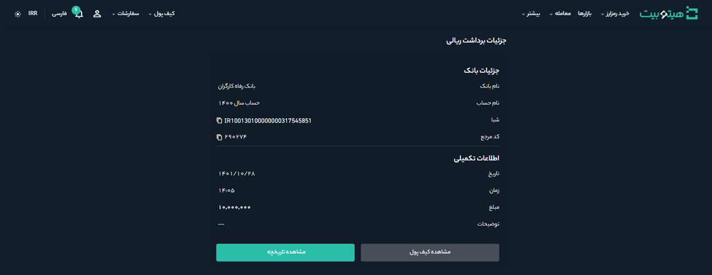

# برداشت تومانی از کیف پول در هیتوبیت
برای برداشت تومانی از کیف پول هیتوبیت مطابق مراحل زیر عمل کنید:

**1.** وارد حساب کاربری خود شوید و از منوی **[کیف پول]** بر روی **[کیف پول من]** کلیک کنید.

**2.** بر روی **[برداشت]** کلیک کنید.

**3.** بر روی **[برداشت تومانی]** کلیک کنید.

**4.** کارت و کیف پول خود را انتخاب و مبلغی را که می‌خواهید برداشت کنید در **[مبلغ]**  وارد کنید.

**5.** درصورت نیاز توضیحات خود را درباره تراکنش در بخش **[توضیحات]** درج کنید.

**6.**  در پایان بر روی **[تأیید]** کلیک کنید.

**7.** در صورت موفقیت تراکنش، مبلغ آن به حساب شما واریز و رسید حاوی جزئیات برداشت تومانی صادر می‌شود.

