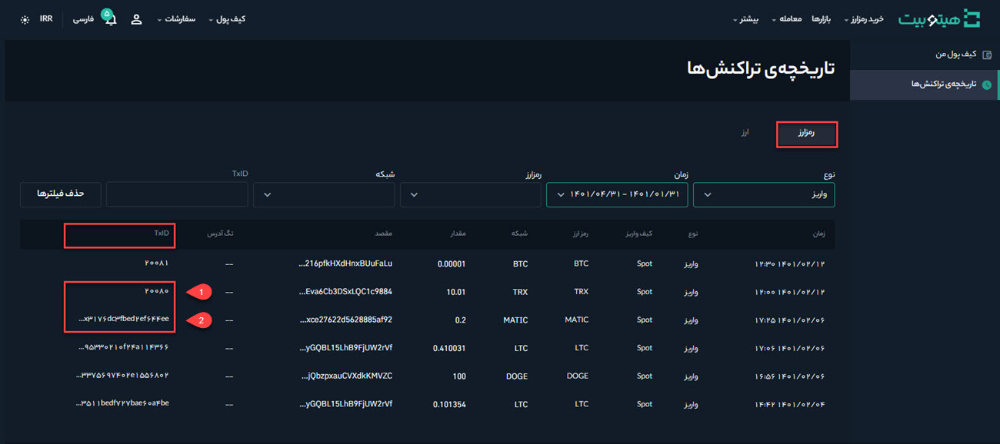

# نحوه یافتن شناسه تراکنش من (TxID)
اگر واریزی به هیتوبیت انجام داده‌اید ولی دارایی نشان داده نمی‌شود، می‌توانید وضعیت تراکنش را با استفاده از شناسه تراکنش (TxID)  در پلتفرمی که از آن درخواست برداشت کرده‌اید بررسی کنید.

## شناسه تراکنش (TxID) چیست؟

شناسه تراکنش (TxID) یا هش تراکنش یک رشته منحصربه‌فرد از کاراکترها است که به هر تراکنش تأییدشده در بلاک چین اضافه می‌شود. به‌عبارت دیگر، TxID یک شماره شناسایی است که هر تراکنش روی بلاک چین را برچسب‌گذاری می‌کند. با TxID می‌توانید تراکنش‌ها  را پیگیری و همچنین تاریخچه واریز و برداشت خود را جستجو کنید.

## چگونه TxID خود را پیدا کنم؟

برای پیدا کردن TxID مراحل زیر را انجام دهید:

**1.** وارد حساب کاربری خود شوید، از قسمت **[کیف پول]**، بر روی **[تاریخچه‌‌ی تراکنش‌ها]** کلیک کنید.

**2.** بر روی **[رمزارز]** کلیک کنید. در این صفحه می‌توانید تاریخچه تمام واریزها و برداشت‌های گذشته خود را جست و جو و TxID را در ستون انتهایی مشاهده کتید.

در صورتی که تراکنش داخلی باشد، TxID مانند شماره 1 و اگر  تراکنش خارجی باشد، TxID مانند شماره 2 خواهد بود.   

هنگامی که برای مسائل مربوط به واریز یا برداشت با  هیتوبیت تماس می‌گیرید، می‌توانید TxID تراکنش را در اختیار پشتیبانی ما قرار دهید تا بهتر بتوانیم به شما کمک کنیم. 
همچنین می‌توانید روی TxID کلیک کنید تا وضعیت تراکنش مربوطه را در کاوشگر بلاک چین ببینید.

> **توجه**   دارایی شما پس از تأیید تراکنش توسط نودها، به بلاک مربوطه منتقل می‌شود. اگر شبکه شلوغ باشد، ممکن است زمان بیشتری طول بکشد تا دارایی منتقل شود.

