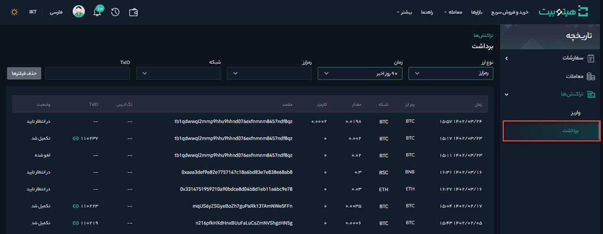

# نحوه پیدا کردن شناسه تراکنش من (TxID)
اگر واریزی به هیتوبیت انجام داده‌اید ولی دارایی نشان داده نمی‌شود، می‌توانید وضعیت تراکنش را با استفاده از شناسه تراکنش (TxID)  در پلتفرمی که از آن درخواست برداشت کرده‌اید بررسی کنید.

## شناسه تراکنش (TxID) چیست؟

شناسه تراکنش (TxID) یا هش تراکنش یک رشته منحصربه‌فرد از کاراکترها است که به هر تراکنش تأییدشده در بلاک چین اضافه می‌شود. به‌عبارت دیگر، TxID یک شماره شناسایی است که هر تراکنش روی بلاک چین را برچسب‌گذاری می‌کند. با TxID می‌توانید تراکنش‌ها  را پیگیری و همچنین تاریخچه واریز و برداشت خود را جستجو کنید.

## چگونه TxID خود را پیدا کنم؟

برای پیدا کردن TxID مراحل زیر را انجام دهید:

**1.** وارد حساب کاربری خود شوید و از منوی **[تاریخچه]**، بر روی **[تراکنش‌ها]** کلیک کنید.

**2.** تاریخچه تراکنش‌ها به تفکیک واریز و برداشت قابل مشاهده  است. با کلیک بر روی **[واریز]** و **[برداشت]** به‌ترتیب لیست  تراکنش‌های واریز و برداشت فهرست می‌شود. 

**3.** تراکنش‌ها را می‌توان بر اساس نوع ارز، زمان، رمزارز، شبکه و شناسه تراکنش فیلتر کرد.

> **توجه**  
> - هنگامی که برای مسائل مربوط به واریز یا برداشت با هیتوبیت 
تماس می‌گیرید، می‌توانید شناسه تراکنش (TxID) را در اختیار پشتیبانی ما قرار دهید تا بهتر بتوانیم به شما کمک کنیم. 
همچنین می‌توانید روی شناسه تراکنش (TxID) کلیک کنید تا وضعیت تراکنش مربوطه را در کاوشگر بلاک چین ببینید.
> - دارایی شما پس از تأیید تراکنش توسط نودها، به بلاک مربوطه منتقل می‌شود. اگر شبکه شلوغ باشد، ممکن است زمان بیشتری طول بکشد تا دارایی منتقل شود.
