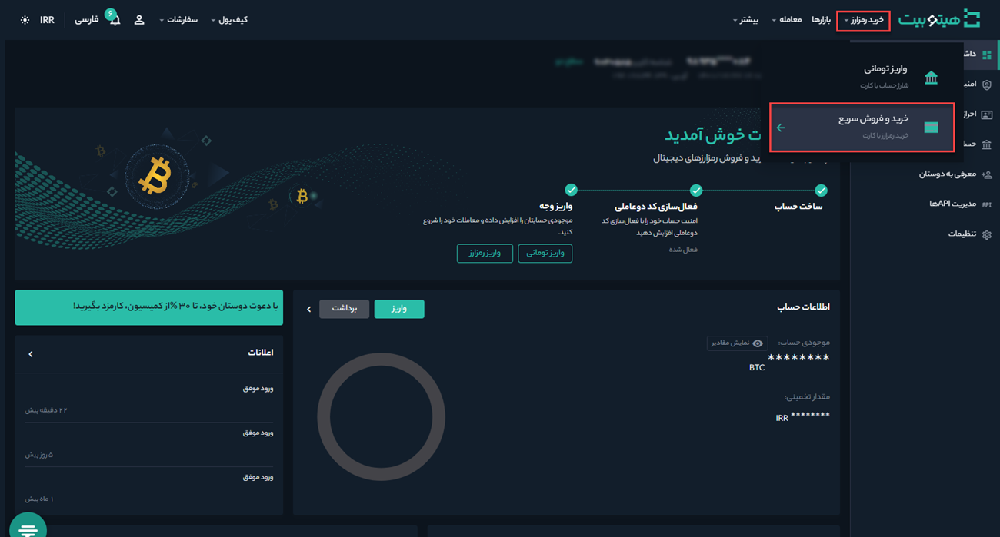
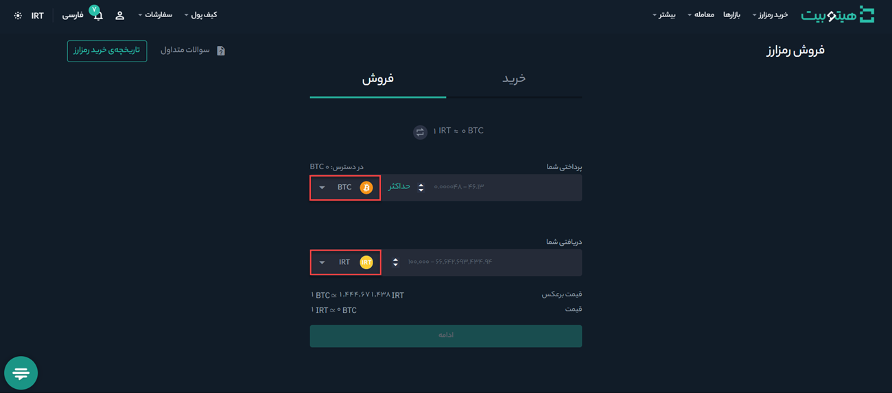
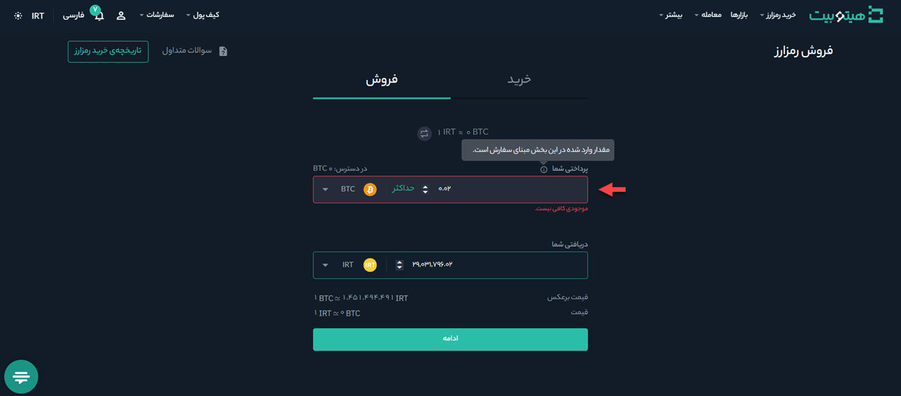
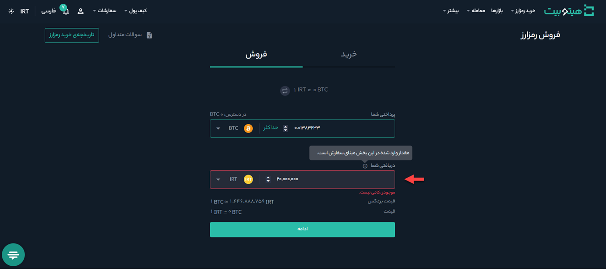

# نحوه فروش تومانی رمزارز و انتقال مستقیم به کارت بانکی

شما می‌توانید رمزارزهای خود را به‌صورت تومانی بفروشید و مبلغ آن را به‌طور مستقیم به کارت بانکی خود منتقل کنید. برای این منظور مطابق مراحل زیر عمل کنید:

**1.**	وارد حساب کاربری خود شوید و در منوی **[خرید رمزارز]** بر روی **[خریدوفروش سریع]** کلیک کنید.

**2.**  در سربرگ **[فروش]** نوع رمزارزی را که می‌خواهید بفروشید در کادر **[پرداختی شما]**   و واحد دریافتی را در کادر **[دریافتی شما]** مشخص کنید.

**3.** فروش رمزارز را می‌توانید به دو روش انجام دهید:
- **فروش بر اساس مقدار رمزارز**:  در این حالت مقدار رمزارز موردنظر برای فروش را در کادر **[پرداختی شما]** وارد کنید. مبلغی که دریافت می‌کنید در کادر   **[دریافتی شما]** نشان داده می‌شود.

 - **فروش بر اساس مبلغ مشخص:** در این حالت مبلغ موردنظر خود را در کادر **[دریافتی شما]** وارد کنید. مقدار رمزارزی که به‌ازای آن باید پرداخت کنید    به‌صورت خودکار در کادر **[پرداختی شما]** نمایش داده می‌شود.

**4.** پس از تکمیل مقادیر لازم بر روی دکمه **[ادامه]** کلیک کنید. توجه داشته باشید در صورتی که موجودی رمزارز برای فروش کافی نباشد پیغام «موجودی کافی نیست» نمایش داده می‌شود.
