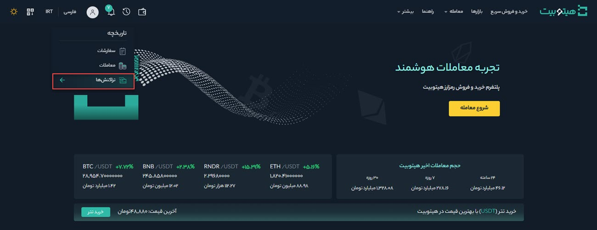

# مشاهده و بررسی تاریخچه واریز و برداشت  
برای مشاهده تاریخچه تراکنش‌ها مراحل زیر را انجام دهید:

**1.** وارد حساب کاربری خود شوید و از منوی کیف پول بر روی **[تاریخچه تراکنش‌ها]** کلیک کنید.

**2.**  در این صفحه تاریخچه تراکنش‌های رمزارزی و تومانی با استفاده از فیلترهای ارائه‌شده قابل جستجو است.

**3.** برای مشاهده تراکنش‌های رمزارزی بر روی سربرگ **[رمزارز]** کلیک کنید. 

**4.** تراکنش می‌تواند واریز یا برداشت باشد، آن را در **[نوع]** انتخاب کنید.

**5.** بازه زمانی موردنظر خود را در **[زمان]** انتخاب کنید.

**6.** رمزارزی که می‌خواهید تاریخچه تراکنش‌های آن را مشاهده کنید در **[رمزارز]** انتخاب کنید.

**7.** شبکه رمزارز را در **[شبکه]** انتخاب کنید.

**8.** برای جستجوی تراکنش با استفاده از شناسه تراکنش   آن را در **[TxID]** وارد کنید.

**9.** برای مشاهده تراکنش‌های تومانی بر روی سربرگ **[ارز]** کلیک کنید.    

**10.**  در تراکنش‌های تومانی 3 پارامتر نوع، زمان و ارز وجود دارد که مانند توضیحات بخش تراکنش‌های رمزارزی قابل انتخاب است.

**11.** به‌منظور تنظیم پارامترهای جدید برای جستجو 
 و ایجاد فیلتر جدید، بر روی **[حذف فیلترها]** کلیک کنید.
 