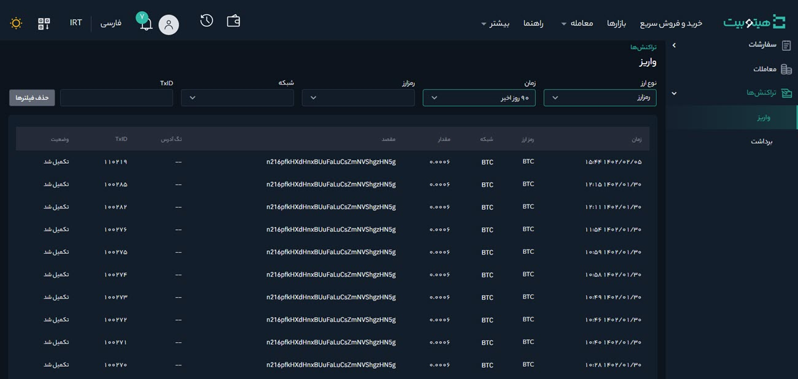

# مشاهده و بررسی تاریخچه واریز و برداشت  
برای مشاهده تاریخچه تراکنش‌ها مراحل زیر را انجام دهید:

**1.** وارد حساب کاربری خود شوید و از منوی **[تاریخچه]** بر روی **[تراکنش‌ها]** کلیک کنید.

**2.** در این صفحه تاریخچه تراکنش‌ها بر اساس نوع آنها یعنی واریز یا برداشت، قابل مشاهده است.

**3.**  می‌توانید تراکنش‌های خود را بر اساس پارامترهای زیر فیلتر کنید:

- تراکنش می‌تواند تومانی یا رمزارزی باشد، آن را در **[نوع ارز]** مشخص کنید.

- بازه زمانی موردنظر خود را در **[زمان]** انتخاب کنید.

- رمزارزی که می‌خواهید تاریخچه تراکنش‌های آن را مشاهده کنید در **[رمزارز]** انتخاب کنید.

- شبکه رمزارز را در **[شبکه]** انتخاب کنید.

- برای جستجوی تراکنش با استفاده از شناسه تراکنش   آن را در **[TxID]** وارد کنید.
    
**4.** به‌منظور تنظیم پارامترهای جدید برای جستجو 
 و ایجاد فیلتر جدید، بر روی **[حذف فیلترها]** کلیک کنید.
 
