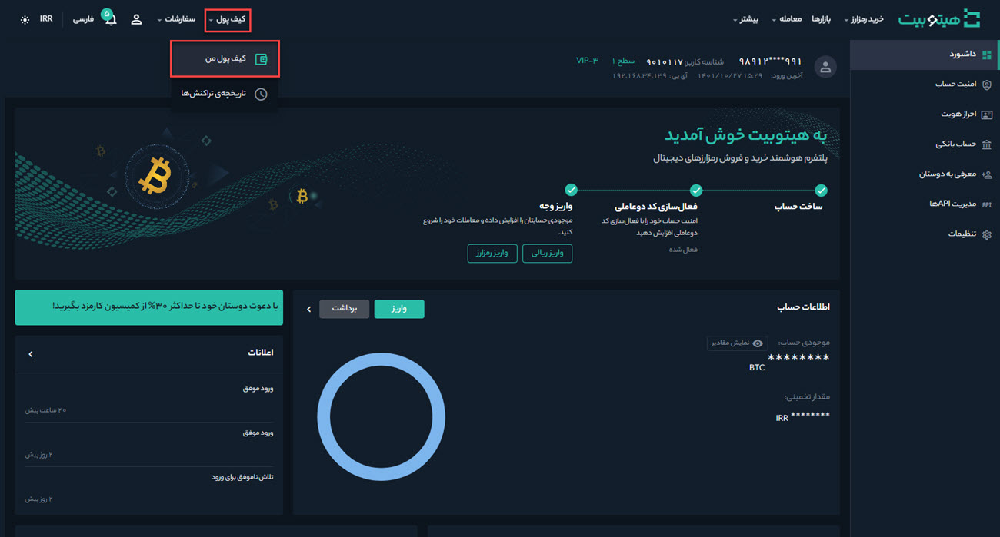
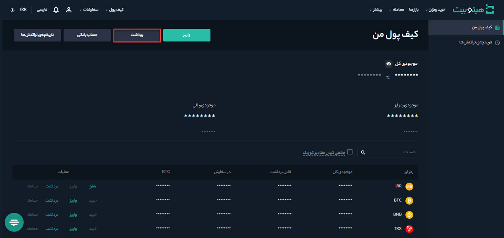

# برداشت رمزارز از هیتوبیت

برای برداشت رمزارز از حساب هیتوبیت و واریز آن به یک پلتفرم یا کیف پول خارجی، مطابق مراحل زیر عمل کنید:

**1.**	وارد حساب کاربری خود شوید و از منوی کیف پول روی **[کیف پول من]** کلیک کنید.

**2.**	بر روی **[برداشت]** کلیک کنید.        .

**3.**  رمزارزی که می‌خواهید برداشت کنید در **[انتخاب رمزارز]** انتخاب کنید. در این مثال، ما  بیت کوین (BTC)  برداشت خواهیم کرد.

**4.** بر روی سربرگ **[آدرس جدید]** کلیک کنید و آدرس  گیرنده را در **[آدرس]** وارد کنید.

**5.** اگر آدرس گیرنده را قبلاً به فهرست آدرس‌های خود اضافه کرده‌اید آن را از **[لیست آدرس‌ها]** انتخاب کنید. برای افزودن آدرس جدید بر روی **[مدیریت آدرس‌ها]** کلیک کنید.

**6.**	در صورتی که سیستم از شبکه آدرس شما مطمئن باشد شبکه را به‌صورت خودکار وارد می‌کند. در غیر این صورت لازم است شبکه مربوطه را بصورت دستی انتخاب کنید.

> **نکته**    مطمئن شوید که شبکه انتخاب‌شده با آدرس شبکه مقصد مطابقت دارد تا از زیان احتمالی جلوگیری شود.

**7.**	 مبلغ موردنظر را در **[مبلغ برداشت]** وارد کنید. با کلیک بر روی **[حداکثر]**،  بیشترین میزان رمزارزی که از حساب شما قابل برداشت است درج می‌شود.

**8.** پس از وارد کردن مبلغ برداشت، کارمزد تراکنش مربوطه و مبلغ نهایی نمایش داده می‌شود.

**9.** در انتها پس از تکمیل مقادیر، بر روی **[برداشت]** کلیک کنید.

**10.** برداشت‌های اخیر شما به‌همراه جزئیات آنها در انتهای صفحه قابل مشاهده است. با کلیک بر روی **[مشاهده همه]**، تاریخچه تراکنش‌ها در بازه زمانی موردنظر شما نمایش داده می‌شود.

> **توجه**  اگر هنگام برداشت، اطلاعات نادرستی را وارد کنید یا شبکه را اشتباه  انتخاب کنید، دارایی‌های شما برای همیشه از بین می‌رود. لطفاً قبل از برداشت، از صحت اطلاعات واردشده اطمینان حاصل کنید.
