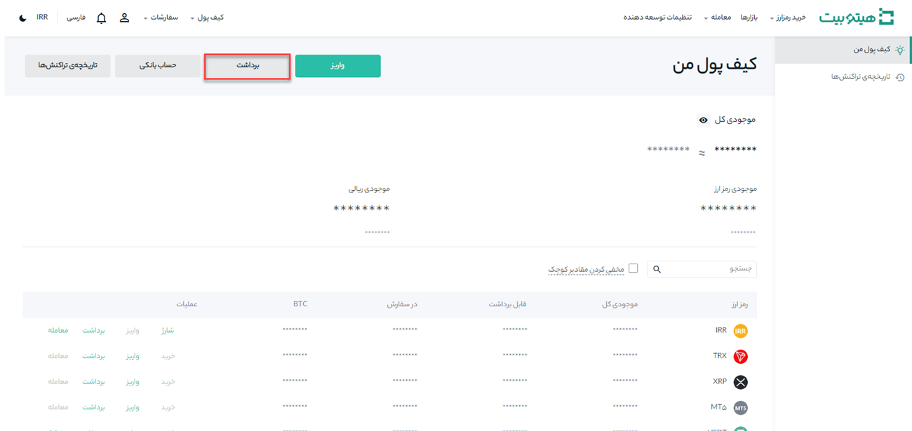
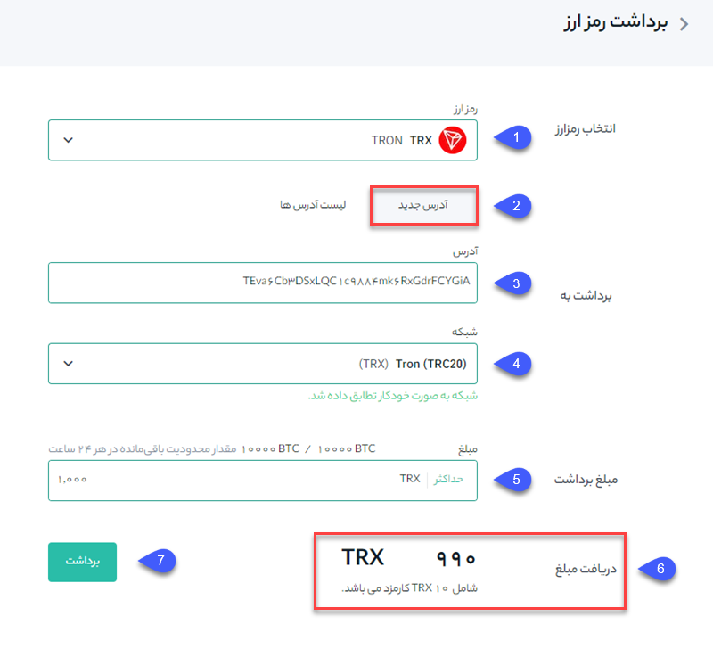

# نحوه برداشت از هیتوبیت

در این قسمت با یک مثال نحوه انتقال رمزارز ترون  (TRX) را از حساب هیتوبیت شما به یک پلتفرم یا کیف پول خارجی نشان می‌دهیم:

**1.**	وارد حساب هیتوبیت خود شوید و از منوی کیف پول روی **[کیف پول من]** کلیک کنید.

**2.**	روی **[برداشت]** کلیک کنید.

**3.**	به‌صورت پیش‌فرض صفحه بر روی **[برداشت رمزارز]** باز می‌شود. ارز دیجیتالی را که می‌خواهید برداشت کنید انتخاب نمایید. در این مثال، ما TRX را برداشت خواهیم کرد.

**1.** رمز ارز مورد نظر را انتخاب کنید. ( در این مثال TRX انتخاب شده است). 

**2.**	بر روی حالت **[آدرس جدید]** کلیک کنید.

**3.** در این قسمت آدرس گیرنده را وارد کنید.

**4.**	در صورتی که سیستم از شبکه آدرس شما مطمئن باشد شبکه را به‌صورت خودکار وارد می‌کند و در غیر این صورت لازم است شبکه مربوطه را بصورت دستی انتخاب کنید.

>  مطمئن شوید که شبکه انتخاب‌شده با آدرس شبکه واردشده مقصد مطابقت دارد تا از ضرر و زیان احتمالی جلوگیری شود.

**5.**	در این قسمت مبلغ برداشت را وارد کنید. 

**6.** پس از وارد کردن مبلغ برداشت، کارمزد تراکنش مربوطه و مبلغ نهایی قابل‌مشاهده است.

**7.** در انتها پس از تکمیل مقادیر بر روی **[برداشت]** کلیک کنید.

>  اگر هنگام انتقال، اطلاعات اشتباه وارد کنید یا شبکه اشتباهی را انتخاب کنید، دارایی‌های شما برای همیشه از بین می‌رود. لطفاً قبل از انتقال، از صحت اطلاعات اطمینان حاصل کنید.
