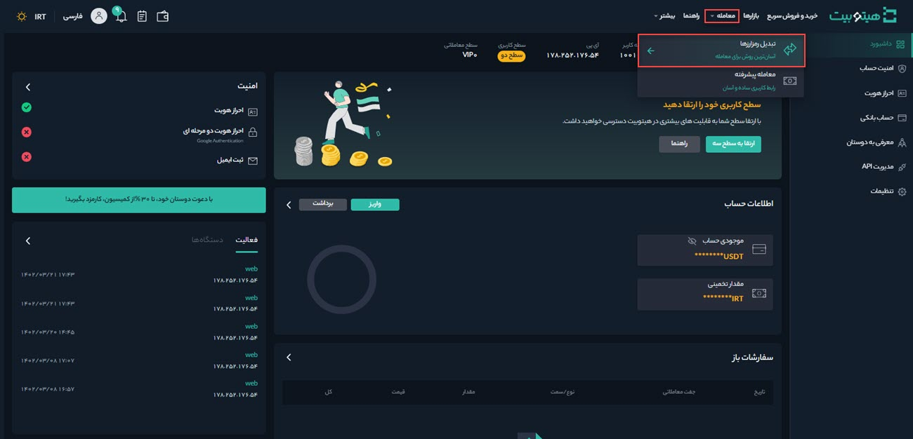
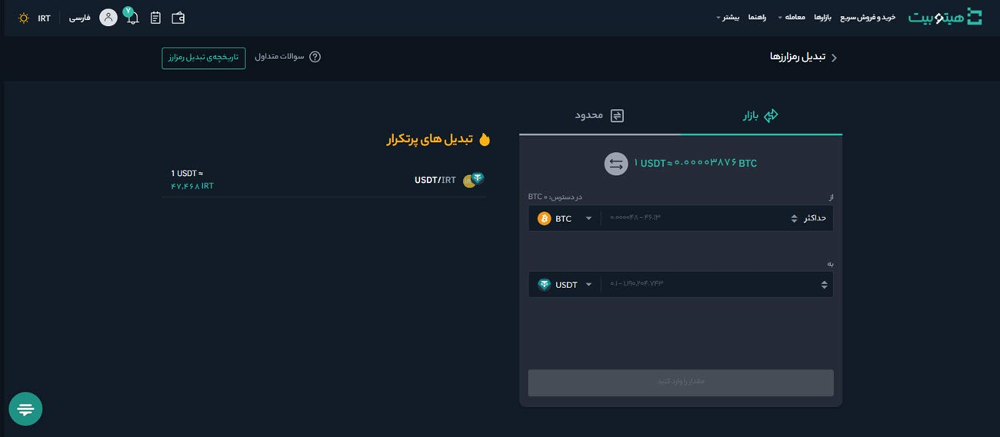

# نحوه استفاده از تبدیل رمزارزها در هیتوبیت

تبدیل رمزارزها سرویسی است که در آن کاربران می‌توانند رمزارزی را که در اختیار دارند در عرض چند ثانیه به رمزارز دیگری تبدیل کنند.
 برای تبدیل رمزارزها به‌صورت زیر عمل کنید: 
1. وارد حساب کاربری خود شوید و از منوی **[معامله]** بر روی تبدیل رمزارزها کلیک کنید.  

2. برای انجام معامله و تبدیل رمزارز می‌توانید از طریق بخش **بازار** یا **محدود** رمزارز موردنظرتان را با چند اقدام ساده و در عرض چند ثانیه تبدیل کنید. همچنین در این بخش تبدیل‌های پرتکرار قابل‌مشاهده است.

