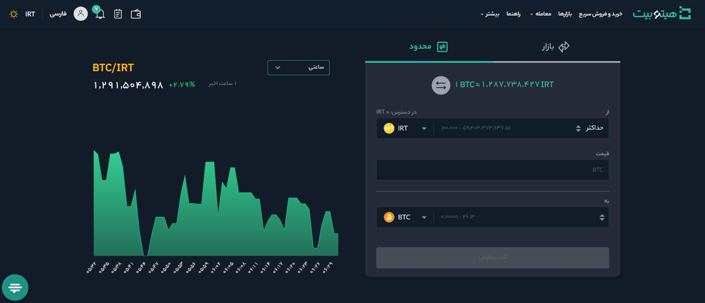

# تبدیل محدود
برای انجام معامله و تبدیل رمزارز می‌توانید از  بخش **[محدود]** به‌صورت زیر اقدام کنید:

1. رمزارزی که دارید را در قسمت **از**، قیمت تبدیل رمزارز را در قسمت **قیمت** و رمزارز مورد نظر خود را که می‌خواهید به آن تبدیل کنید در قسمت **به** انتخاب کنید.

2.  مقدار رمزارزی را که می‌خواهید برای تبدیل استفاده کنید در قسمت  **از** وارد کنید. همچنین می‌توانید مقدار رمزارزی را که می‌خواهید به دست آورید در قسمت **به** وارد کنید. 
3. قیمت کل بصورت خودکار برای شما در پایین صفحه نمایش داده می‌شود. در این حالت، قیمت تبدیل رمزارز توسط کاربر مشخص می‌شود.
4. پس از مشخص کردن تعداد و قیمت موردنظر بر روی **[ثبت سفارش]** کلیک کنید تا سفارش شما ثبت شود.

