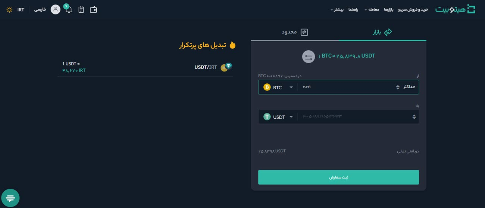

# تبدیل بازار
برای انجام معامله و تبدیل رمزارز می‌توانید از  بخش **[بازار]** به‌صورت زیر اقدام کنید:

1. رمزارزی که دارید  در قسمت **از** و رمزارزی را که می‌خواهید به آن تبدیل کنید در قسمت **به** انتخاب کنید. در تصویر BTC به USDT تبدیل شده است.

2. مقدار رمزارزی را که می‌خواهید تبدیل کنید در قسمت  **از** وارد کنید. همچنین می‌توانید مقدار رمزارزی را که می‌خواهید به‌دست آورید در  قسمت **به** وارد کنید.

3. قیمت کل بصورت خودکار برای شما در پایین صفحه نمایش داده می‌شود. در این حالت، سیستم بهترین قیمت بازار را در نظر می‌گیرد.

4. پس از مشخص کردن مقدار موردنظر بر روی **[ثبت سفارش]** کلیک کنید. سفارش شما در لحظه ثبت انجام می‌شود.

> **توجه** 
> - با انتخاب **[حداکثر]**، مقدار رمزارز انتخاب‌شده که در دسترس است  در فیلد **از** وارد می‌شود.

