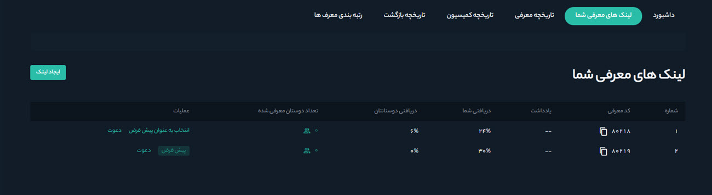

# کسب درآمد از طریق معرفی دوستان

دعوت از دوستان به هیتوبیت این امکان را به شما می‌دهد که کسب درآمد کنید. هر بار که دوستانتان در هیتوبیت معامله می‌کنند شما می‌توانید تا 30 درصد کمیسیون دریافت کنید. در ادامه با نحوه کسب درآمد از طریق معرفی دوستان آشنا می‌شوید.

**1.**	وارد حساب هیتوبیت خود شوید و از منوی پروفایل بر روی **[معرفی به دوستان]** کلیک کنید.

**2.**	در کارت پیش‌فرض درصد دریافتی شما و دوستانتان، شناسه معرفی و لینک معرفی نمایش داده می‌شود.
 نرخ پیش‌فرض پاداش شما 30 درصد است، به این معنی که شما 30 درصد از کارمزدهای معاملاتی افرادی را که معرفی کرده‌اید دریافت می‌کنید.

 **3.** مقدار پاداش دریافتی قابل‌تغییر است. برای تعیین درصد پاداش مورد نظر خود و تنظیم یادداشت در آن، از قسمت **[داشبورد]** روی **[ایجاد لینک]** کلیک کنید.

**4.** در این بخش می‌توانید میزان درصد دریافتی خودتان و دوستانتان را تنظیم کنید. با وارد کردن یک عدد بین 0 تا 100 در کادر **[درصد]**  مشخص می‌کنید که چه میزان از 30 درصد کمیسیون به دوستانتان اختصاص یابد. همچنین این امکان وجود دارد که یک یادداشت برای لینک اضافه کنید. با فعال‌کردن تیک **[انتخاب به‌عنوان کد معرفی پیش‌فرض]** می‌توانید نرخ تعریف‌شده را به‌عنوان نرخ پیش‌فرض خود تنظیم کنید. در نهایت روی **[تأیید]** کلیک کنید.

**5.**	پس از تعیین نرخ کمیسیون، روی نماد **[کپی]** در کنار شناسه معرفی یا لینک معرفی خود کلیک کنید و با  اشتراک‌گذاری آن، دوستان خود را دعوت کنید.

**6.** برای اشتراک‌گذاری لینک با دوستان، می‌توانید از کد QR خود استفاده و تصویر را در اندازه‌های مختلف دانلود کنید.

**7.** با کلیک روی گزینه **[دعوت دوستان]** می‌توانید به‌طور مستقیم لینک معرفی خودتان را در شبکه‌های
اجتماعی مختلف به اشتراک بگذارید.

**8.**	زمانی که دوستان شما در هیتوبیت ثبت‌نام و معاملات خود را شروع کردند، کمیسیون معرفی، محاسبه و به حساب هیتوبیت شما منتقل می‌شود. 
**9.** با کلیک بر روی **[لینک‌های معرفی شما]**   فهرست تمام کدهای معرفی که ایجاد کرده‌اید، یادداشت‌های تنظیم‌شده بر روی هرکدام، درصد دریافتی خود و دوستانتان در هر کد  و تعداد دوستان معرفی‌شده با استفاده از هر کد نمایش داده می‌شود. در این بخش هم  با کلیک بر روی **[دعوت]** امکان اشتراک‌گذاری لینک دعوت از دوستان در شبکه‌های اجتماعی وجود دارد.

**10.** در **[در تاریخچه معرفی]** فهرستی از حساب‌های کاربری که معرفی کرده‌اید به‌همراه تاریخ ثبت نام آنها، کد معرفی، مقدار کمیسیون 
 معامله رمزارزی و تومانی و همچنین میزان ترید حساب کاربری نمایش داده می‌شود. 
**11.** در **[تاریخچه کمیسیون]** فهرستی از سودهای دریافتی شما از معاملات کاربرانی که معرفی کرده‌اید به‌همراه تاریخ معامله، رمزارز معامله‌شده، شناسه کاربر و شناسه سفارش نمایش داده می‌شود. 
**12.**  اگر کاربری شما را معرفی کرده باشد، در **[تاریخچه بازگشت]**  فهرستی از سودهای دریافتی او از معاملات شما، تاریخ معامله، رمزارز معامله‌شده، شناسه کاربر و شناسه سفارش نمایش داده می‌شود. 
**13.** معرف‌هایی که با توجه به رقم محاسبه‌شده **[دست‌آورد شما]** در **[داشبورد]**، بیشترین درآمد را داشته‌اند در **[رتبه‌بندی معرف‌ها]** نمایش داده می‌شوند.

