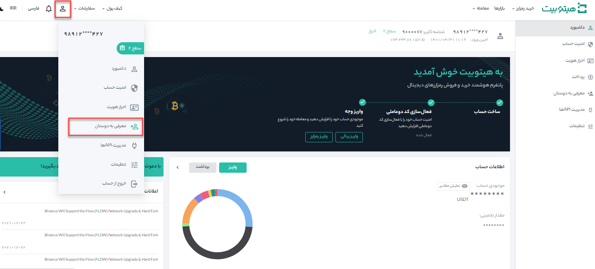
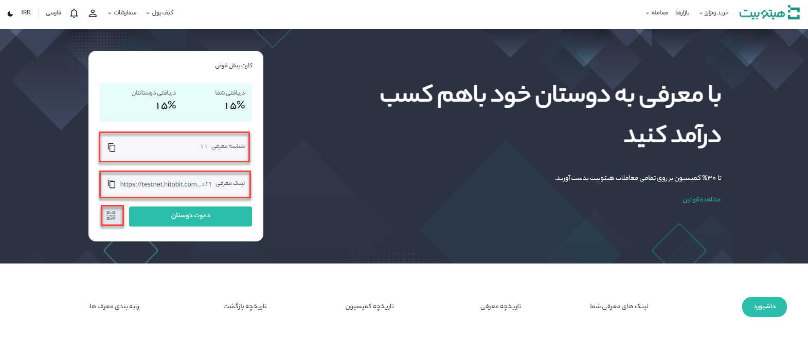
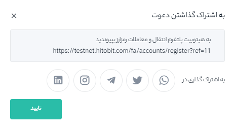
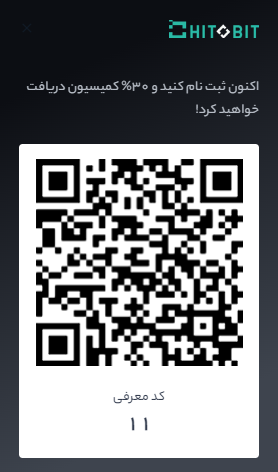

# طرح درآمدی معرفی دوستان

زمانی که دوستانتان از طریق کد معرف شما در هیتوبیت ثبت نام و شروع به معامله می‌کنند، بخشی از کارمزد معاملات دوستان معرفی شده را به‌عنوان پاداش معرفی دریافت خواهید کرد.

## سؤالات متداول

### چگونه می‌توانم از طریق معرفی جوایز خود را دریافت کنم؟

**1.** وارد حساب هیتوبیت خود شوید و روی **[معرفی به دوستان]** در صفحه اصلی کلیک کنید.

کد معرفی خود را کپی و از طریق شبکه‌های اجتماعی برای دوستان خود ارسال کنید.

**2.**	دوست معرفی شده توسط شما باید کد معرف شما در زمان ثبت‌نام در هیتوبیت وارد نماید.

**3.**	دوست شما باید حتما در هیتوبیت معامله انجام دهد.

**4.**	زین پس به ازای هر معامله، بخشی از کارمزد معاملات دوست خود را به‌عنوان پاداش دریافت  می‌کنید.

می‌توانید جزئیات میزان پاداش خود را در صفحه **[معرفی به دوستان]** حساب کاربری خود مشاهده نمایید.

### جزئیات پاداش‌های حساب خود را چگونه مشاهده کنم؟

پس از ورود به‌حساب هیتوبیت خود، می‌توانید دوستان معرفی شده و جوایز خود را در صفحه **[معرفی به دوستان]** مشاهده کنید.

### چرا پاداش‌های معرفی من نمایش داده نمی‌شود؟

**1.**	فقط کاربرانی که با لینک یا کد معرفی شما ثبت‌انم می‌کنند به‌عنوان دوستان شما شناسایی می‌شوند.

**2.**	دوستان دعوت شده شما تاکنون هیچ معامله‌ای در هیتوبیت انجام نداده‌اند.

**3.**	پاداش معرفی به حساب‌های کاربری جعلی (اسپم) اختصاص داده نمی‌شود.

اگر هیچ یک از دلایل بالا براش شماصدق نمی‌کند، با ثبت تیکت درخواست خود را اعلام نمایید. تیم پشتیبانی پس از بررسی و در صورت تایید، پاداش معرفی را به‌حساب شما واریز می‌کند.
