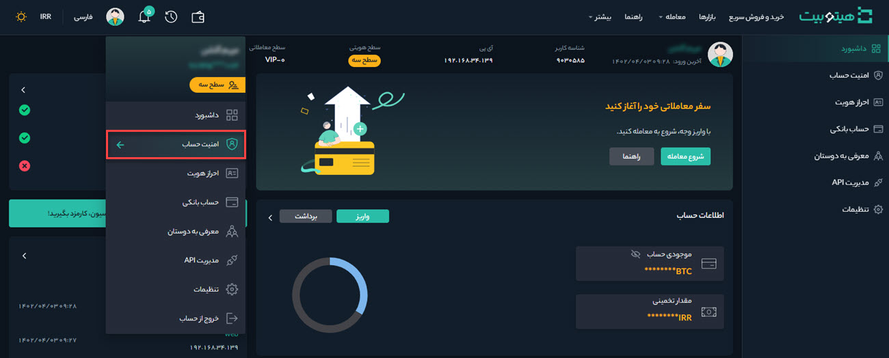
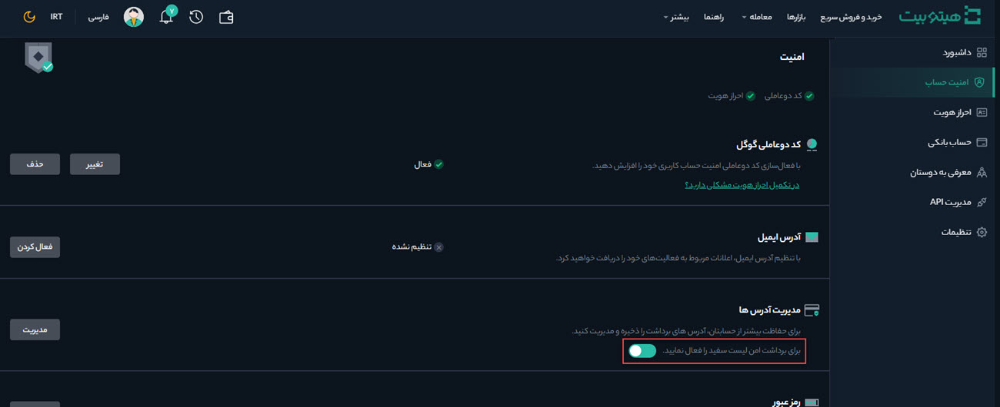
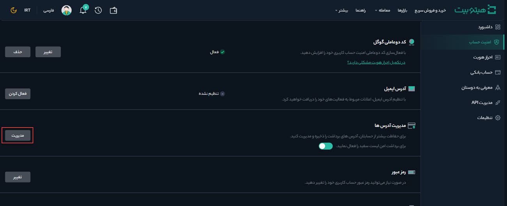
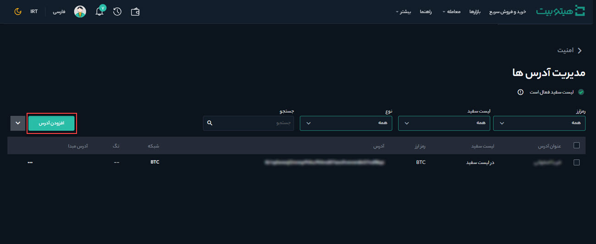
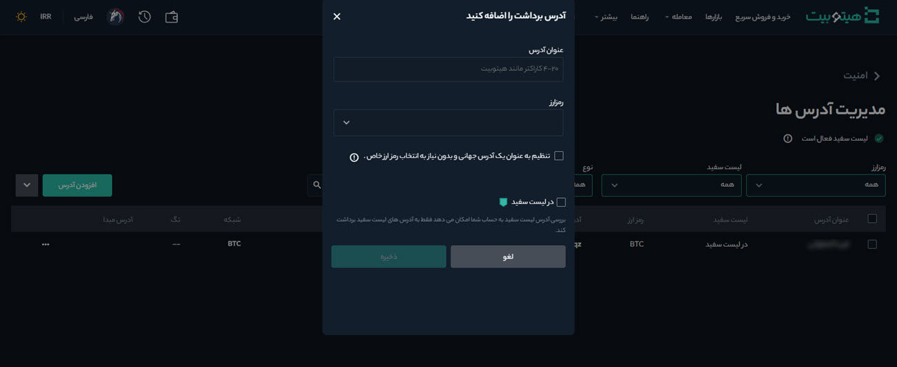

# مدیریت آدرس‌ها
برای حفاظت بیشتر از حساب کاربری خود می‌توانید آدرس‌های برداشت را ذخیره کنید. به این منظور مطابق مراحل زیر عمل کنید:
1. وارد حساب کاربری خود شوید و از منوی پروفایل وارد امنیت حساب شوید.

2. در بخش مدیریت آدرس‌ها، برای برداشت امن لیست سفید را فعال کنید.

3. بر روی دکمه **[مدیریت]** کلیک کنید تا وارد بخش مدیریت آدرس‌ها شوید.

4. بر روی دکمه **[افزودن آدرس]** کلیک کنید.

5. در صفحه‌ای که باز می‌شود عنوان آدرس را در 4 تا 20 کاراکتر وارد کنید. همچنین رمزارز مورد نظر، آدرس، شبکه و آدرس مبدأ را در فیلدهای مربوط به آن پر کنید.

6. با فعال کردن  چک باکس **[در لیست سفید]** برداشت فقط از آدرس‌های لیست سفید انجام می‌شود.

7. در پایان بر روی دکمه **[ذخیره]** کلیک کنید.