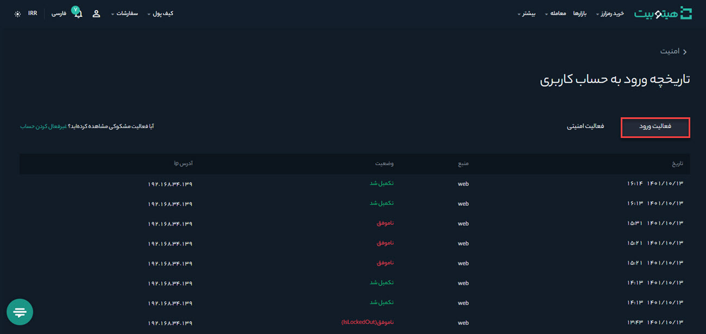

#  مدیریت ورود به حساب کاربری و تاریخچه آن
برای مشاهده تاریخچه ورود به حساب کاربری و مدیریت آن به صورت زیر عمل کنید:

**1.**	وارد حساب کاربری خود شوید و از منوی پروفایل بر روی **[امنیت حساب]** کلیک کنید.

**2.** در قسمت تاریخچه ورود به حساب کاربری بر روی **[بیشتر]**  کلیک کنید.

**3.**   صفحه تاربخچه ورود به حساب کاربری مطابق تصویر زیر باز می‌شود. پس از کلیک بر روی سربرگ **[فعالیت ورود]**   موارد زیر قابل‌مشاهده است:  
-  تاریخ ورود  به حساب در **[تاریخ]**  نمایش داده می‌شود.
- ورود از طریق وب یا اپلیکیشن در  **[منبع]** نشان داده می‌شود.
- اگر ورود موفق باشد عبارت  **تکمیل شد** و در صورت ورود ناموفق، عبارت **ناموفق** در **[وضعیت]** نمایش داده می‌شود.
- آدرس آی‌پی که با آن وارد شده‌اید در **[آدرس ip]** نشان داده می شود.

**4.**   ،با کلیک بر روی سربرگ **[فعالیت امنیتی]**، فهرست فعالیت‌های امنیتی  در بازه زمانی موردنظر با جزئیات زیر قابل‌مشاهده است:
- تاریخ فعاليت در **[تاریخ]** نمایش داده می‌شود.
- ورود از طریق وب یا اپلیکیشن در **[منبع]** نمایش داده می‌شود.
- نوع فعالیت در **[فعالیت]** نمایش داده می‌شود.
- اگر فعالیت با موفقیت انجام شود عبارت **تکمیل شد** و در صورت عدم موفقیت عبارت **ناموفق** در **[وضعیت]** نمایش داده می‌شود.
- آدرس آی‌پی که با آن وارد شده‌اید در **[آدرس ip]** نشان داده می شود.

**5.** در صورت مشاهده فعالیت مشکوک در حساب کاربری، با کلیک بر روی **[غیرفعال کردن حساب]** می‌توانید آن را غیرفعال کنید.

برای مطالعه بیشتر به [غیرفعال کردن حساب](https://github.com/HitoBitCo/FAQDocs/blob/main/UserAccount/UserAccountSettings/DisableAccount.md) مراجعه کنید.