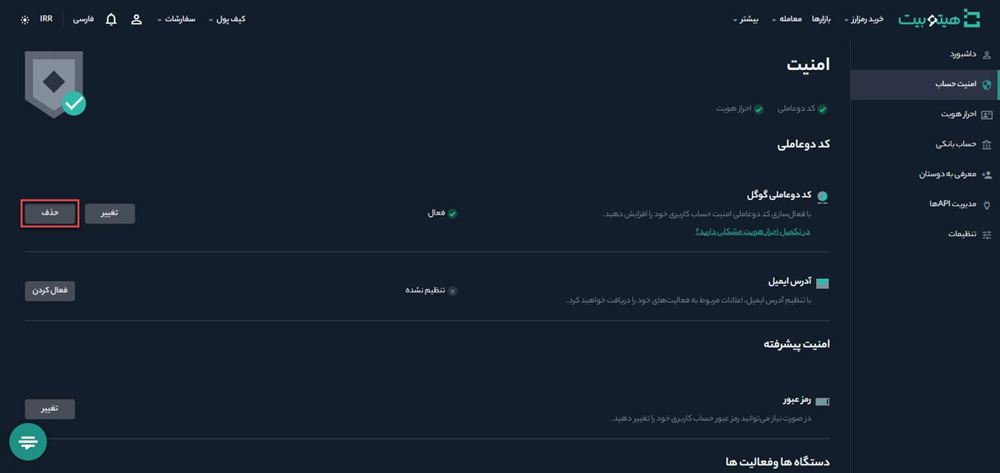
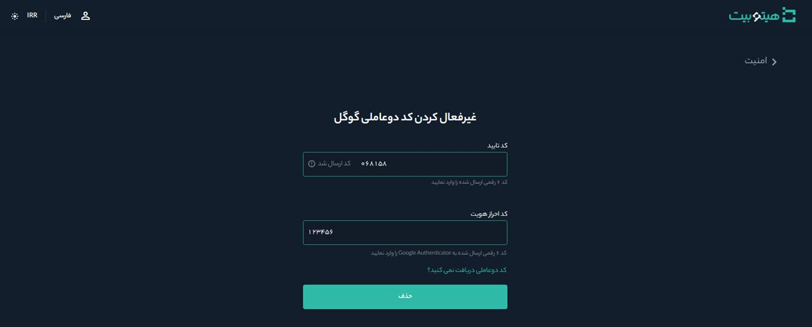

# غیرغعال‌سازی شناسایی دوعاملی
برای غیرفعال‌سازی شناسایی دوعاملی مراحل زیر را انجام دهید:

**1.**	وارد حساب کاربری خود شوید و از منوی پروفایل بر روی **[امنیت حساب]** کلیک کنید.

**2.** در قسمت **[کد دوعاملی گوگل ]** بر روی **[حذف]** کلیک کنید.

> **توجه**   پس از غیرفعال‌سازی شناسایی دوعاملی به‌مدت 24 ساعت امکان برداشت تومانی و رمزارز وجود ندارد.

**3.** متن را بادقت بخوانید و روی **[تأیید]** کلیک کنید.

**4.**  کد پیامک‌شده به تلفن همراهتان را در قسمت **[کد امنیتی شماره تلفن]** و کدی را که با Google Authenticator دریافت می‌کنید در قسمت **[کد احراز هویت]** وارد کنید. سپس بر روی **[حذف]** کلیک کنید.

**5.** شناسایی دوعاملی گوگل شما با موفقیت غیرفعال شد.

> **توجه**  
> - در صورتی که به Google Authenticator خود دسترسی نداشتید، برای دسترسی به کد احراز هویت، از کدی که در ابتدای فعال‌سازی شناسایی دوعاملی نزد خود نوشتید استفاده کنید.  
> - اگر به حساب هیتوبیت خود وارد شده‌اید، اما دسترسی به Google Authenticator  را از دست داده‌اید یا فعال نیست از این روش‌ها استفاده کنید:  
>    - از کد پشتیبان که در ابتدای فعال‌سازی شناسایی دوعاملی یادداشت    
 کردید استفاده کنید. 
>    - اگر به کد پشتیبان دسترسی ندارید، شناسایی دوعاملی گوگل خود را غیرفعال و دوباره آن را فعال کنید.
