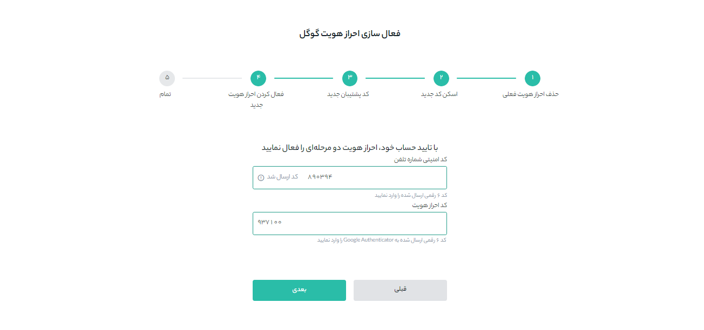
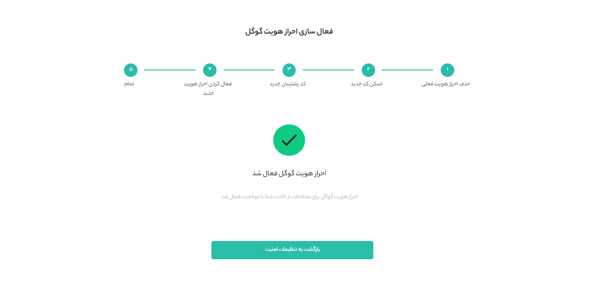

# بازیابی شناسایی دوعاملی 

در صورت بروز هرگونه مشکلی برای تلفن همراهتان می‌توانید شناسایی دوعاملی را بازیابی کنید. برای این منظور مراحل زیر را انجام دهید:

**1.**	وارد حساب کاربری خود شوید و از منوی پروفایل بر روی **[امنیت حساب]** کلیک کنید.

**2.**	برای بازیابی شناسایی دوعاملی فعلی، از بخش **[ کد دو عاملی گوگل]**  گزینه **[تغییر]**       را انتخاب کنید.

> **توجه**   پس از انجام این تغییر **برداشت‌ها** به مدت 24 ساعت غیرفعال می‌شود.

**3.**  متن را بادقت بخوانید و روی **[تأیید]** کلیک کنید.

**4.** برای حذف شناسایی دوعاملی گوگل فعلی، کدی را که برای تلفن همراه شما پیامک می‌شود در قسمت **[کد امنیتی شماره تلفن]** و کدی را که با Google Authenticator  دریافت می‌کنید در قسمت **[کد احراز هویت]** وارد کنید. سپس بر روی **[حذف و ادامه]** کلیک کنید.

**5.** کد QR را با برنامه Google Authenticator خود اسکن کنید. اگر نمی‌توانید آن را اسکن کنید، کدی را که پایین آن قرار دارد  بصورت دستی کپی و در برنامه وارد کنید. سپس روی **[بعدی]** کلیک کنید.
 

 
 **6.** در این قسمت یک کد پشتیبان مشاهده خواهید کرد که باید آن را در جایی امن نوشته و نزد خود نگهداری کنید. این کلید به شما این امکان را می‌دهد که در صورت عدم دسترسی به برنامه در آینده، شناسایی دوعاملی گوگل خود را بازیابی کنید.

**7.** در این مرحله دوباره یک کد امنیتی به تلفن همراه شما ارسال می‌شود؛ آن را در   **[کد امنیتی شماره تلفن]** وارد کنید. همچنین  کدی را که با برنامه Google Authenticator دریافت می‌کنید در قسمت **[کد احراز هویت]** وارد کنید. سپس روی **[بعدی]** کلیک کنید.

**8.** در صورت موفقیت در انجام مراحل، پیغام **احراز هویت گوگل فعال شد** نمايش داده می‌شود.

