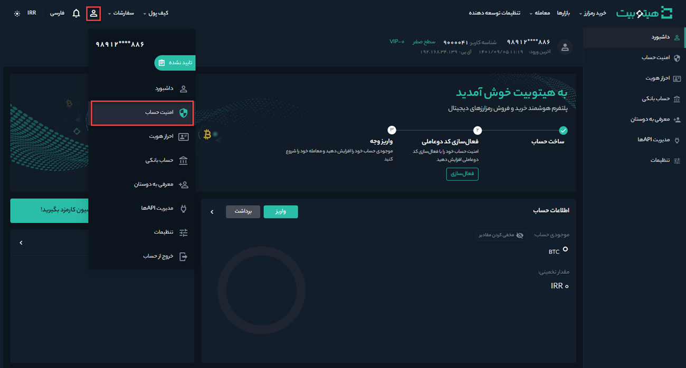
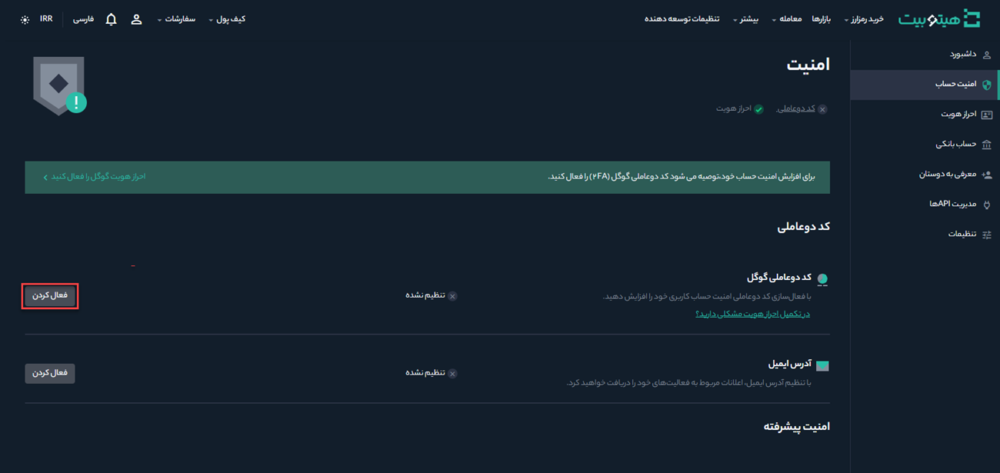
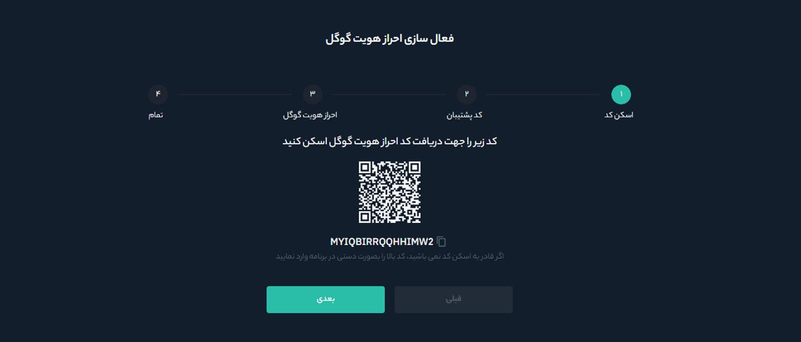
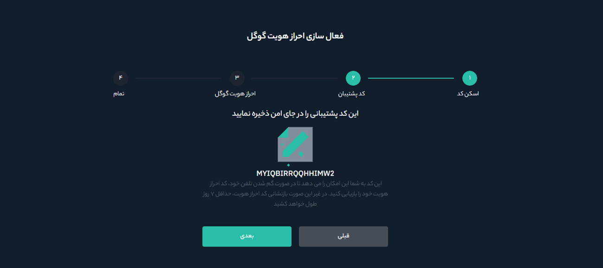
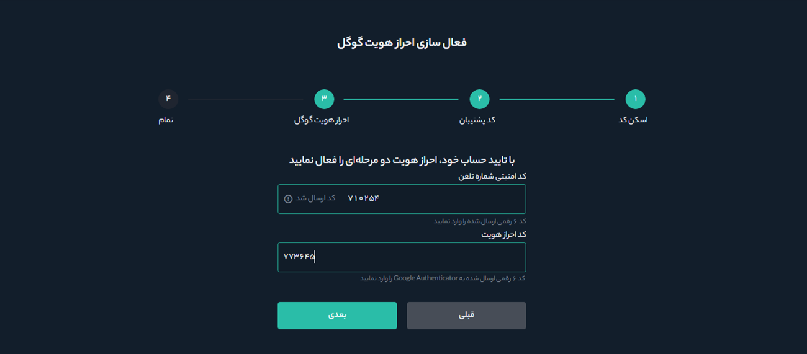
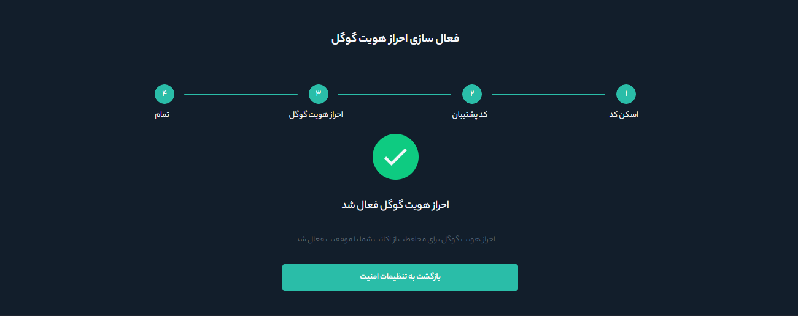

# فعال‌سازی کد دو عاملی گوگل 

یکی از راه‌های افزایش امنیت حساب‌های کاربری استفاده از کد دو عاملی گوگل است. کد دوعاملی مکانیزمی شبیه رمز پویا دارد. یعنی  هر بار هنگام ورود، می‌بایست علاوه بر رمز عبور خود، کد تایید دو مرحله‌ای را نیز وارد کنید. این روش برای افرایش میزان امنیت و جلوگیری از دستیابی افراد سودجو به حساب کاربری استفاده می‌شود. برای دسترسی به این کد می‌توانید از نسخه اپلیکیشن Google Authenticator یا افزونه‌های کروم و فایرفاکس Authenticator استفاده کنید. 

## دسترسی به کد دوعاملی گوگل

**1.**	در ابتدا برنامه Google Authenticator را دانلود و بر روی دستگاه تلفن همراه خود نصب کنید.

**2.**	وارد حساب هیتوبیت خود شوید و از منوی پروفایل بر روی **[امنیت حساب]** کلیک کنید.

**3.**	در قسمت **[کد دوعاملی]**  بر روی دکمه **[فعال‌کردن]** کلیک کنید.

**4.**	در ادامه دستورالعمل‌های زیر را برای فعال‌کردن Google Authenticator دنبال کنید.

-	**اسکن کد:** پس از فعال کردن کد دو عاملی، یک کد QR روی صفحه‌نمایش خود خواهید دید. برنامه Google Authenticator را باز کنید، روی دکمه [+] در سمت راست پایین صفحه ضربه بزنید و کد QR را اسکن کنید. پس از اسکن بر روی **[بعدی]** کلیک کنید.

> **توجه** اگر نمی‌توانید کد
 QR را اسکن کنید، مقدار کد پشتیبان را وارد کنید.

-	**نگهداری کد پشتیبان:**  کد پشتیبان را روی کاغذ یادداشت و در جای مطمئن نگهداری کنید. در صورت بروز هر گونه مشکلی برای تلفن همراهتان این کد به شما کمک می‌کند تا Google Authenticator خود را بازیابی کنید. پس از یادداشت کد بر روی **[بعدی]** کلیک کنید.

- **احراز هویت گوگل:**  کدی که برای تلفن همراه شما پیامک می‌شود  در   **[کد امنیتی شماره تلفن ]** و کدی را که با برنامه  Google Authenticator دریافت می‌کنید در  **[کد احراز هویت]** وارد کنید. پس از تکمیل این قسمت‌ها بر روی **[بعدی]** کلیک کنید.

- **اتمام:**  شما با موفقیت Google Authenticator را برای محافظت از حساب خود فعال کرده‌اید و پیام **احراز هویت گوگل فعال شد** بر روی صفحه نمایش داده می‌شود.

