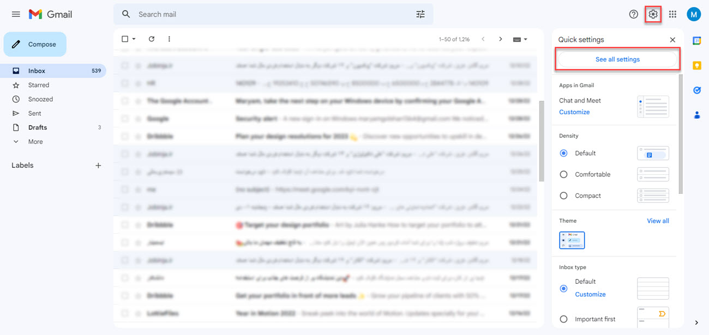
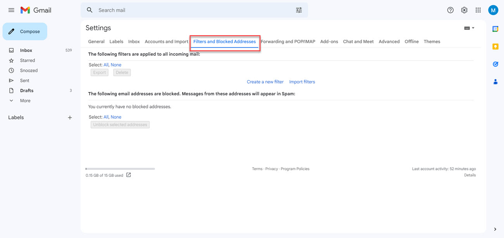
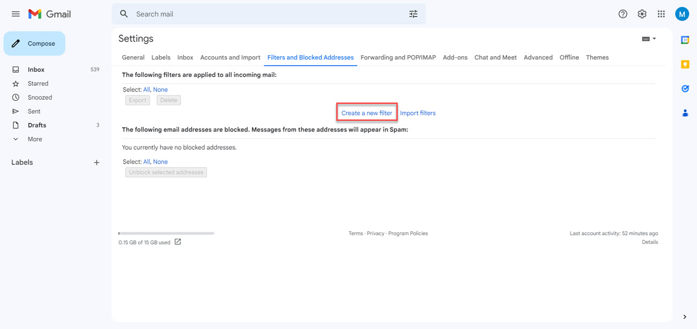
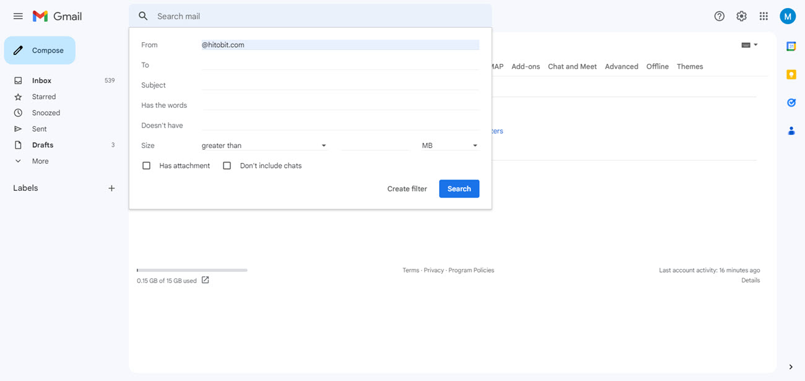
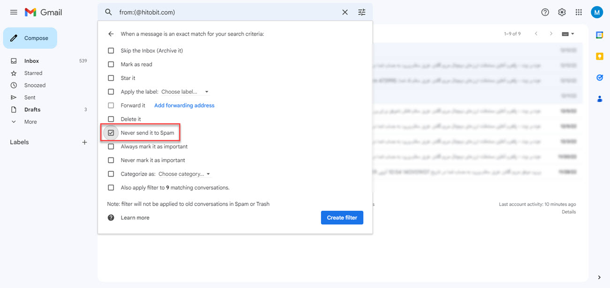

# نحوه اضافه کردن ایمیل‌های هیتوبیت به لیست سفید
لیست سفید فهرستی از آدرس‌های ایمیل امن است. با اضافه کردن آدرس‌های ایمیل موردنظر خود به لیست سفید از انتقال آنها به پوشه اسپم جلوگیری می‌کنید. 
در برخی مواقع ایمیل‌های مهم بدون آگاهی ما به پوشه اسپم 
فرستاده می‌شوند. این موضوع معمولاً زمانی اتفاق می‌افتد که شما فرستنده ایمیل را به فهرست مخاطبان خود اضافه نکرده‌اید و ارائه‌دهنده سرویس آن را در پایگاه داده شناسه‌های معتبر خود پیدا نمی‌کند.
برای اضافه کردن ایمیل‌های هیتوبیت به لیست سفید در جیمیل به‌صورت زیر اقدام کنید:

**1.**  وارد حساب کاربری ایمیل خود شوید و بر روی آیکون چرخ دنده کلیک و **[See all settings]** را انتخاب کنید.

**2.**    گزینه **[Filters and Blocked Address]** را انتخاب کنید.

**3.** بر روی **[Create a new filter]** کلیک کنید.

**4.** عبارت "hitobit.com@" را در فیلد **[From]** وارد  و بر روی **[Create filter]** کلیک کنید.

**5.** در صفحه‌ای که باز می‌شود گزینه **[Never send it to Spam]** را فعال کنید.

**6.** و بر روی **[Create filter]** کلیک کنید. اکنون ایمیل‌های ارسالی از هیتوبیت در لیست سفید قرار می‌گیرند.

