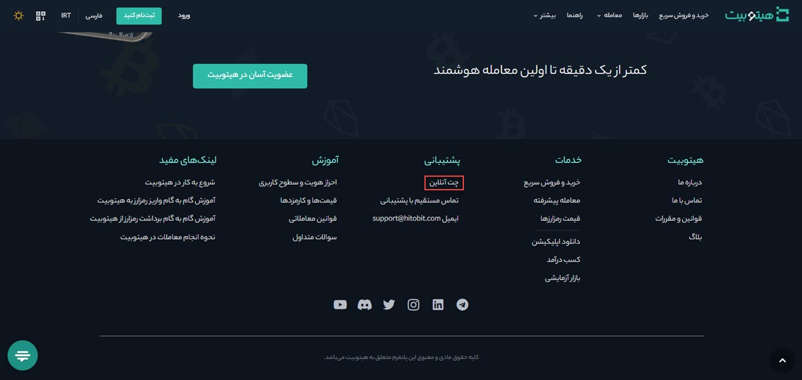
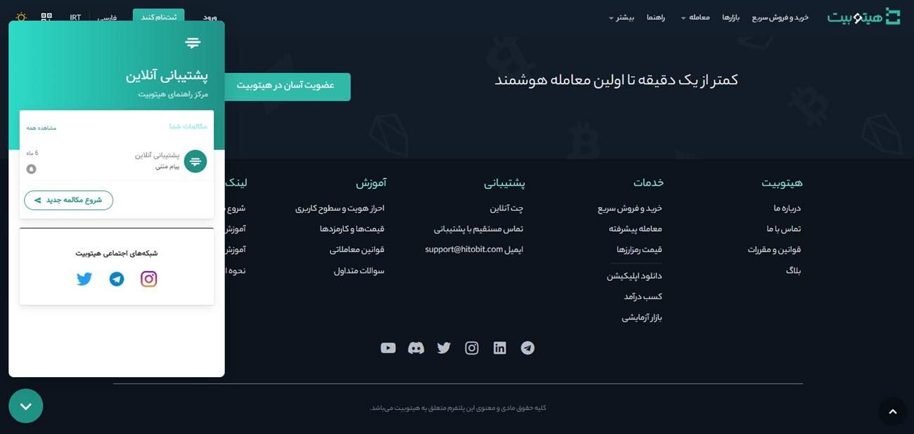
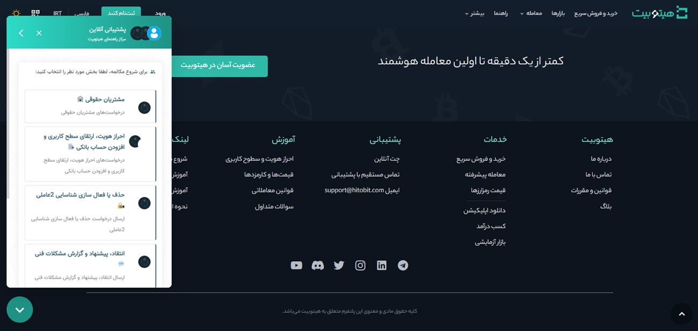
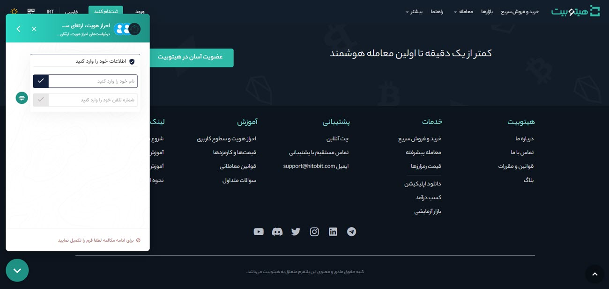

# برقراری ارتباط با واحد پشتیبانی
پشتیبانی هیتوبیت 7 روز هفته به‌صورت 24 ساعته پاسخگوی کاربران است. شما می‌توانید از طریق تماس مستقیم، چت آنلاین و ایمیل، با پشتیبانی ارتباط برقرار کرده و سوالات و مشکلات خود را مطرح کنید. پشتیبانی هیتوبیت در کوتاه‌ترین زمان ممکن به آنها پاسخ خواهد داد. 
یکی از سریع‌ترین راه‌های برقراری ارتباط با کارشناسان پشتیبانی، استفاده از چت آنلاین است. برای آغاز گفتگو در چت آنلاین به صورت زیر عمل کنید: 
1.	وارد سایت هیتوبیت شوید. انتهای صفحه، در قسمت پشتیبانی بر روی چت آنلاین کلیک کنید.

2.	در پنجره بازشده بر روی شروع مکالمه جدید کلیک کنید.

3.	 موضوع درخواست‌های پشتیبانی در دسته‌بندی‌های مختلفی شامل مشتریان حقوقی، احراز هویت، ارتقای سطح کاربری و افزودن حساب بانکی، حذف یا فعال‌سازی شناسایی دو عاملی، انتقاد، پیشنهاد و گزارش مشکلات فنی، گزارش موارد امنیتی، واریز و برداشت ریالی و رمزارزی و خرید و فروش رمزارز مشخص شده است. برای شروع مکالمه بخش مورد نظر خود را انتخاب کنید.

4. برای آغاز مکالمه نام و شماره تلفن خود را وارد کنید و بر روی دکمه آغاز گفتگو کلیک کنید.

