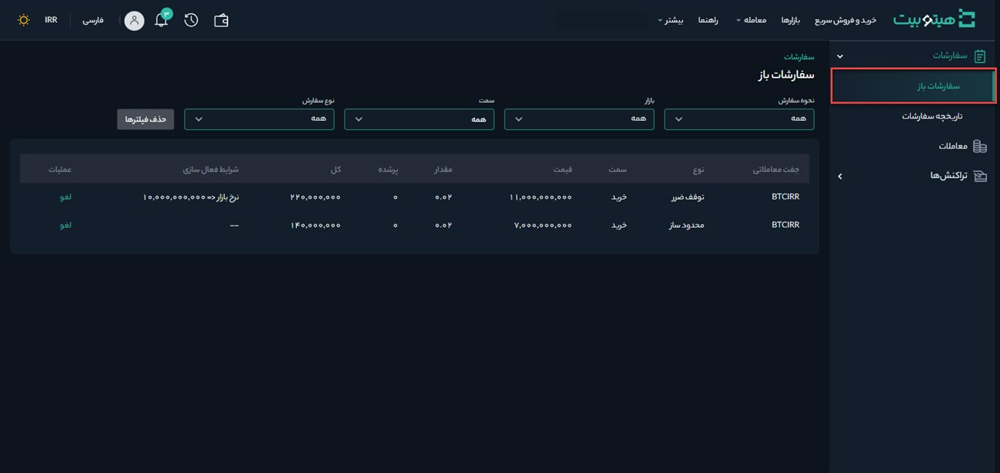

# بررسی وضعیت سفارش و لغو آن
برای بررسی وضعیت سفارشات به صورت زیر عمل کنید:

1. وارد حساب کاربری خود شوید و از منوی **[سفارشات]** بر روی **[سفارشات]** کلیک کنید.

2. برای مشاهده سفارش‌هایی که هنوز به‌طور کامل اجرا نشده‌اند بر روی **[سفارشات باز]**   کلیک کنید. در این قسمت اطلاعات سفارش‌های باز شامل جفت معاملاتی، طرف (خرید یا فروش)، نوع سفارش، قیمت، مقدار، بخش پرشده سفارش، کل مبلغ سفارش، شرایط فعال‌سازی و عملیات قابل‌اجرا بر روی سفارش نمایش داده می‌شود. همچنین شما می‌توانید وضعیت سفارشات باز را به تفکیک نوع آنها مشاهده کنید. 

3. برای لغو سفارش، در ستون عملیات بر روی **[لغو]** کلیک کنید.

لازم به ذکر است دسترسی به سفارشات باز در صفحه معاملات پیشرفته نیز امکان‌پذیر است.

