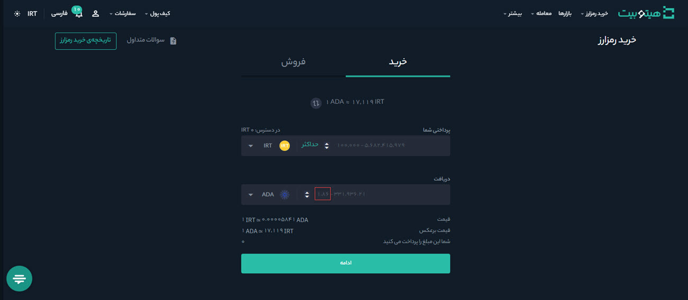

# حداقل میزان ثبت سفارش چیست؟
برای ثبت سفارش، حداقل مقداری وجود دارد که در هر صرافی و با توجه به رمزارزهای مختلف متفاوت است. در هیتوبیت نیز برای ثبت سفارش، یک حداقل مقدار مشخص شده است. به‌منظور آگاهی از این میزان برای هر رمزارز، به‌صورت زیر عمل کنید:

1. وارد حساب کاربری خود شوید و بر روی خریدوفروش سریع کلیک کنید.

2. پس از انتخاب رمزارز موردنظر و پیش از وارد کردن مقدار آن، در کادر دریافت عددی مشخص شده است که نشان‌دهنده حداقل میزان ثبت سفارش است.

