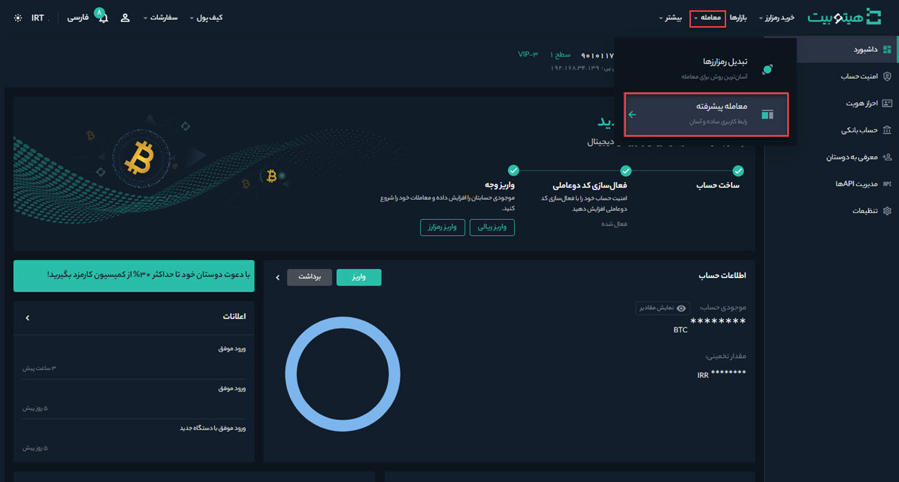
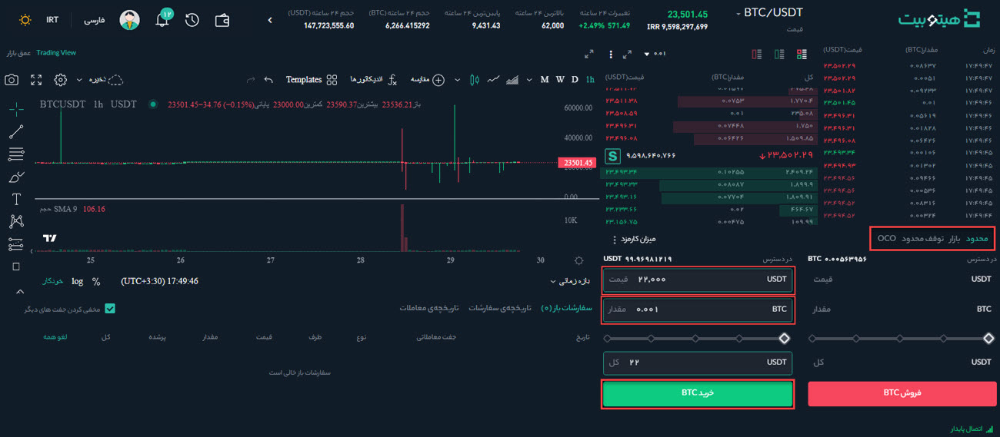

# سفارش محدود (Limit Order) چیست و چگونه می‌توان آن را ثبت کرد؟
در سفارش محدود (Limit Order) معامله‌گران مقدار رمزارز و قیمت موردنظر خود را تعیین می‌کنند. هنگامی که قیمت به مقدار مشخص‌شده برسد سفارش انجام می‌شود. 
برای ثبت سفارش محدود در هیتوبیت به‌صورت زیر عمل کنید:

**1.**	وارد حساب کاربری خود شوید و از منوی **[معامله]** وارد **[معامله پیشرفته]** شوید.

**2.** جفت ارز موردنظر خود را انتخاب کنید. به‌عنوان مثال فرض می‌کنیم می‌خواهید مقداری بیت کوین خریداری کنید.

**3.** نوع سفارش به‌صورت پیش‌فرض بر روی گزینه **[محدود]** قرار دارد. فرض کنید قیمت بیت کوین در بازار 35,000 دلار است، اما شما می‌خواهید با قیمت 34,000 دلار خرید کنید. برای این کار می‌توانید یک سفارش **[محدود]** ثبت کنید. زمانی که قیمت بازار به قیمت تعیین‌شده شما رسید، سفارش انجام خواهد شد.  
 به‌منظور ثبت سفارش محدود، در قسمت خرید قیمت و مقدار سفارش خود را وارد کنید. برای تکمیل تراکنش بر روی دکمه **[خرید BTC]** کلیک  کنید. لازم به ذکر است برای فروش بیت کوین هم باید همین مراحل را دنبال کنید.

