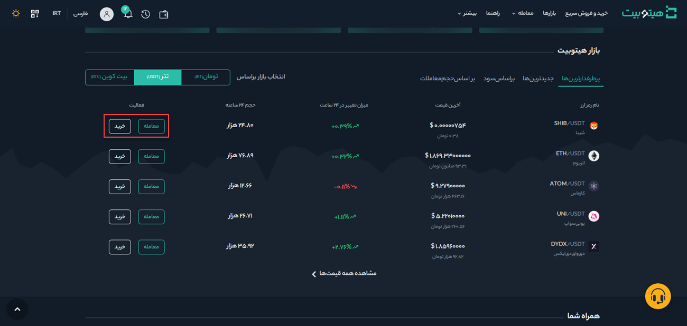
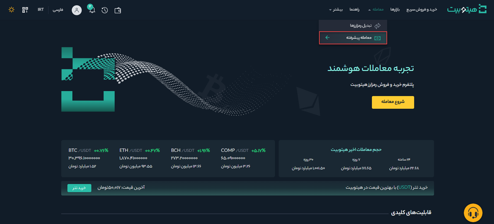

# کار با صفحه معاملات پیشرفته
یکی از روش‌های رایج معامله در بازار رمزارزها، معاملات اسپات است. در این معاملات، رمزارزها با قیمت لحظه‌ای بین خریدار و فروشنده  معامله می‌شوند و مبادله  دارایی بلافاصله انجام می‌شود.
همچنین کاربران می‌توانند معاملات خود را از قبل سفارش‌گذاری کنند تا در صورت رسیدن به یک قیمت خاص که به‌عنوان سفارش محدود شناخته می‌شود، معامله انجام شود.

## انجام معامله در هیتوبیت
برای انجام معامله در هیتوبیت به صورت زیر عمل کنید:

**1.** وارد حساب کاربری خود شوید. در انتهای صفحه اصلی رمزارزهای قابل معامله در هیتوبیت فهرست شده‌اند. با کلیک بر روی **[معامله]**، مستقیم وارد صفحه معاملاتی هر رمزارز می‌شوید. همچنین با کلیک بر روی **[خرید]** می‌توانید رمزارز موردنظر خود را خریداری کنید.

**2.** از منوی **[معامله]** وارد صفحه  **[معامله پیشرفته]** شوید.

**3.**	صفحه معاملات پیشرفته شامل  بخش‌های زیر است:

- حجم معاملات جفت‌های معاملاتی در 24 ساعت 

- لیست سفارش‌های فروش

- لیست سفارش‌های خرید

- چارت و عمق بازار

- نوع سفارش

- خرید ارز دیجیتال

- فروش ارز دیجیتال

- سفارش‌های باز

**4.**	 برای ثبت سفارش، از بالای صفحه سمت راست جفت ارز مورد نظر خود را انتخاب کنید. به‌عنوان مثال فرض می‌کنیم می‌خواهید مقداری بیت کوین خریداری کنید.

 

**5.** نوع سفارش به‌صورت پیش‌فرض بر روی گزینه **[محدود]** قرار دارد. فرض کنید قیمت بیت کوین در بازار 23,000 دلار است، اما شما می‌خواهید با قیمت 22,000 دلار خرید کنید. برای این کار می‌توانید یک سفارش **[محدود]** ثبت کنید. زمانی که قیمت بازار به قیمت تعیین‌شده شما رسید، سفارش انجام خواهد شد.   
 به‌منظور ثبت سفارش محدود، در قسمت خرید قیمت و مقدار سفارش خود را وارد کنید. برای تکمیل تراکنش بر روی دکمه **[خرید BTC]** کلیک  کنید. لازم به ذکر است برای فروش بیت کوین هم باید  همین مراحل را دنبال کنید.

**6.**  در صورتی که معامله‌گران بخواهند سریع سفارشی را ثبت کنند، می‌توانند نوع سفارش را به سفارش **[بازار]** تغییر دهند. با انتخاب  سفارش بازار، کاربران می‌توانند فوراً در قیمت فعلی بازار معامله کنند. 

**7.** نوار درصدهای نشان‌داده‌ شده در زیر فیلد **[مقدار]** (در حالت محدود) و فیلد **[کل]** (در حالت بازار)، به میزان درصدی از دارایی نگهداری شده شما که می‌خواهید با جفت ارز مقابل معامله کنید، اشاره دارد. نوار درصد را به سمت راست یا چپ بکشید تا مقدار موردنظر تغییر کند.

