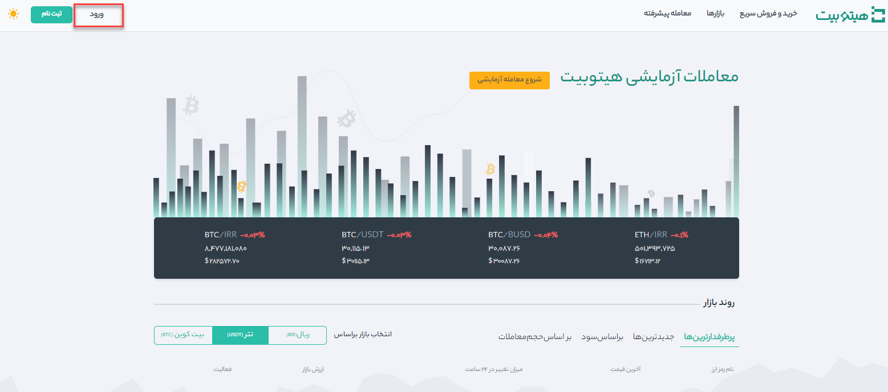
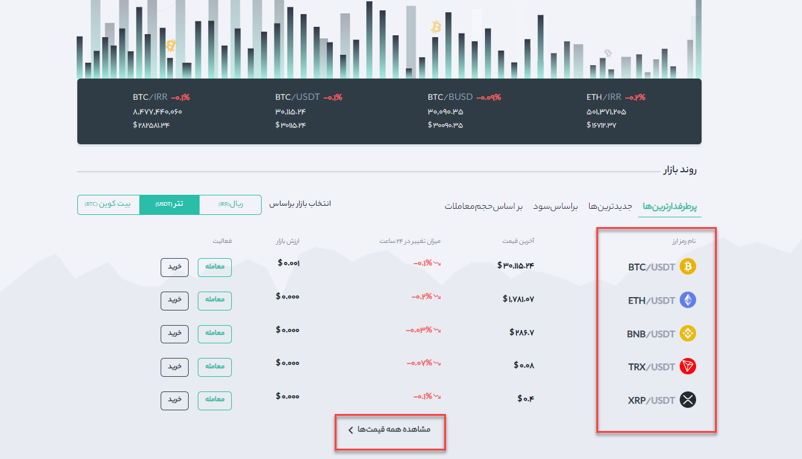
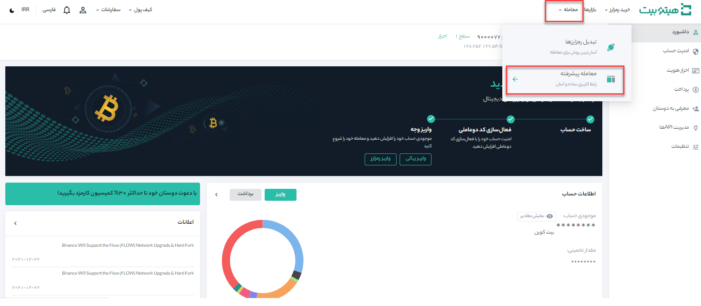
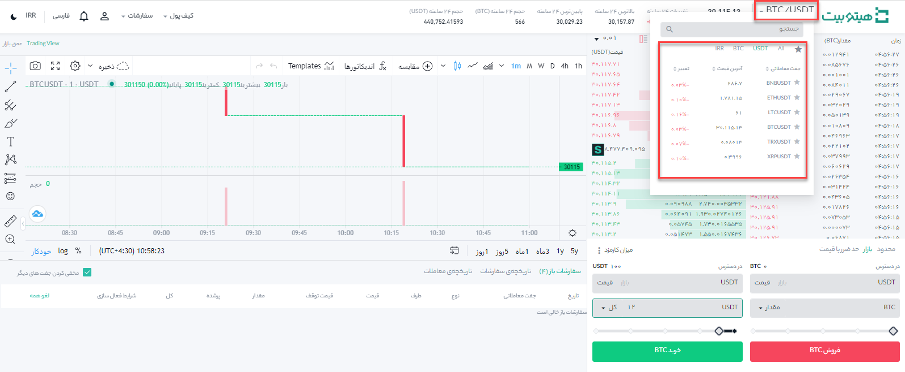
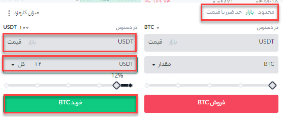
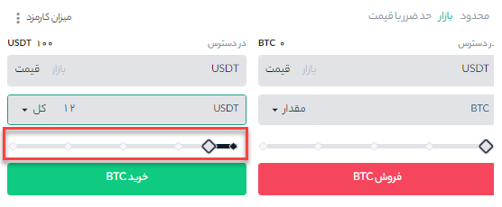

# نحوه انجام معاملات در هیتوبیت

معامله رمزارزها بین خریدار و فروشنده با نرخ فعلی بازار صورت می‌گیرد که به‌عنوان قیمت لحظه‌ای شناخته می‌شود. معامله بلافاصله پس از انجام سفارش انجام می‌شود.

همچنین کاربران می‌توانند معاملات خود را از قبل سفارش‌گذاری کنند تا در صورت رسیدن به یک قیمت خاص که به‌عنوان سفارش محدود شناخته می‌شود، سفارش انجام شود. می‌توانید از طریق رابط صفحه معاملاتی ما، معاملات خود را در هیتوبیت انجام دهید.

## انجام معامله در وب‌سایت هیتوبیت

**1.**	در وبسایت هیتوبیت از طریق دکمه **[ورود]** در بالای صفحه سمت چپ وارد حساب کاربری خود شوید.

**2.**	بر روی هر ارز دیجیتال که در صفحه اصلی کلیک کنید، مستقیماً به صفحه معاملاتی رمزارز مربوطه وارد می‌شوید (رمز ارزها در تصویر مشخص شده‌اند). همچنین، با کلیک بر روی **[مشاهده همه قیمت‌ها]** در پایین لیست، می‌توانید رمز ارزهای بیشتری را مشاهده کنید.

**3.**	صفحه **[معاملات پیشرفته]** شامل  بخش‌های مختلفی است از جمله:

- **حجم معاملات جفت معاملات در 24 ساعت** 

- **لیست سفارش‌های فروش**

- **لیست سفارش‌های خرید**

- **چارت و عمق بازار**

- **نوع سفارش**

- **خرید ارز دیجیتال**

- **فروش ارز دیجیتال**

- **سفارش‌های باز**

**4.**	بعنوان مثال، در ادامه به خرید مقداری BTC می‌پردازیم. 

- پس از ورود به هیتوبیت، از منوی **[معامله]** وارد صفحه  **[معامله پیشرفته]** شوید.

- از بالای صفحه سمت راست جفت ارز خود را انتخاب کنید.

 

- برای خرید BTC به قسمت **[خرید]** بروید و قیمت و مبلغ سفارش خود را وارد کنید و برای تکمیل تراکنش بر روی دکمه **[خرید]** کلیک کنید. لازم بذکر است، برای فروش BTC می‌توانید همین مراحل را دنبال کنید.

-	نوع سفارش خرید بصورت پیش‌فرض بر روی سفارش **[محدود]** است. در صورتیکه معامله‌گران بخواهند سریعاً سفارشی را ثبت کنند، می‌توانند نوع سفارش را به سفارش **[بازار]** تغییر دهند. با انتخاب  سفارش بازار، کاربران می‌توانند فوراً در قیمت فعلی بازار معامله کنند. بعنوان مثال، اگر قیمت BTC/USD در بازار  35000است، اما می‌خواهید با قیمت خاصی مثلاً 34000 خرید کنید، می‌توانید یک سفارش **[محدود]** ثبت کنید. زمانی که قیمت بازار به قیمت تعیین شده شما رسید، سفارش ثبت شده شما انجام خواهد شد.

- نوار درصدهای نشان‌داده‌ شده در زیر فیلد **[مقدار]** (در حالت محدود) و فیلد **[کل]** (در حالت بازار)، به میزان درصدی از دارایی نگهداری شده شما که می‌خواهید با جفت ارز مقابل معامله کنید، اشاره دارد. نوار درصد را به سمت راست / چپ بکشید تا مقدار موردنظر تغییر کند.

