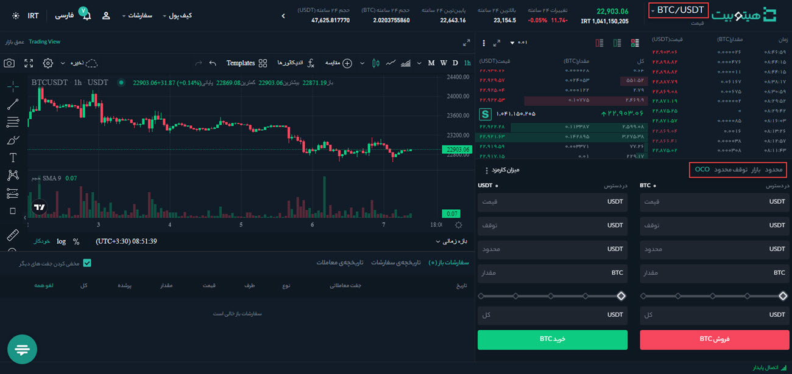
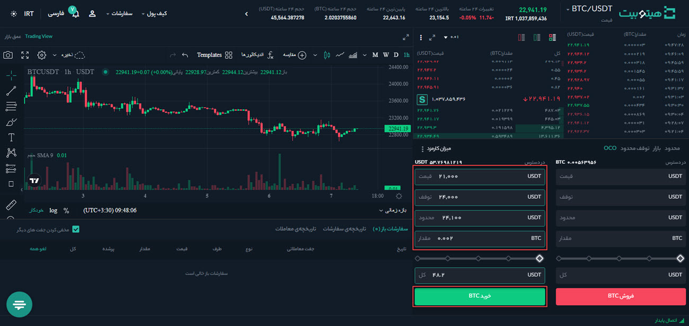
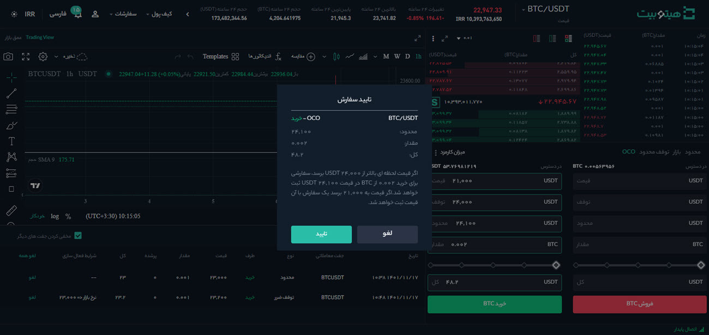
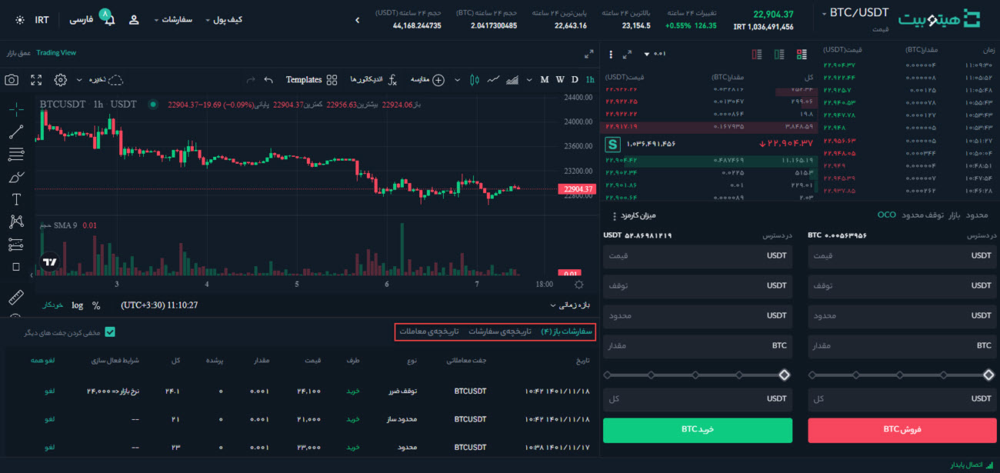

# سفارش OCO و نحوه ثبت آن

یک سفارش One-Cancels-the-Other (OCO) ترکیبی از دو سفارش  است که اگر یکی به‌طور کامل یا جزئی انجام شود، دیگری لغو می‌شود.
 سفارش  OCO شامل یک سفارش محدود (limit)  و یک سفارش توقف محدود (stop-limit) است. هر دو سفارش باید یکسان (هر دو خرید یا هر دو فروش) باشد. اگر معامله‌گر یکی از سفارش‌ها را لغو کند، کل سفارش OCO لغو می‌شود. 
برای مثال فرض کنید بیت کوین بین 22,700 دلار و مقاومت 24,000 دلار معامله می‌شود. اگر قیمت به 21,000 دلار کاهش یابد یا از 24,000 دلار بیشتر شود شما مایل به خرید هستید. برای این منظور می‌توانید سفارش OCO  را با یک سفارش limit با قیمت 21,000 دلار و یک سفارش stop-limit با قیمت شرط  24,000 دلار ایجاد کنید. سپس قیمت عادی را روی 24,100 دلار تنظیم کنید، در این صورت احتمالاً سفارش انجام خواهد شد. 

> **توجه**  هنگامی که یک سفارش به طور کامل یا جزئی تکمیل شود، دیگری به طور خودکار لغو می‌شود.

## نحوه ثبت سفارش OCO
1. وارد حساب کاربری خود شوید و از منوی **[معامله]** وارد صفحه **[معامله پیشرفته]** شوید.

2.    جفت ارز موردنظر خود را انتخاب کنید و در سمت راست صفحه پلتفرم معاملاتی، نوع سفارش را بر روی **[OCO]**  قرار دهید.

3. قیمت سفارش limit را در فیلد **[قیمت]**، قیمت شرط سفارش stop-limit را در فیلد **[توقف]**، قیمت عادی را در فیلد **[محدود]** و مقدار رمزارزی را که می‌خواهید خریداری کنید در فیلد **[مقدار]** وارد و در نهایت بر روی **[خرید]** کلیک کنید.

4. سفارش خود را پیش از ارسال به‌دقت بررسی و در صورت اطمینان بر روی **[تأیید]** کلیک کنید. لازم به ذکر است برای فروش نیز باید همین مراحل را دنبال کنید.

## بررسی سفارش‌های OCO

پس از ارسال سفارش، می‌توان آنها را در لیست **[سفارشات باز]** مشاهده و بررسی کرد.
همچنین  تاریخچه سفارش‌های OCO اجرا شده یا لغو شده در **[تاریخچه سفارشات]** قابل مشاهده است.

