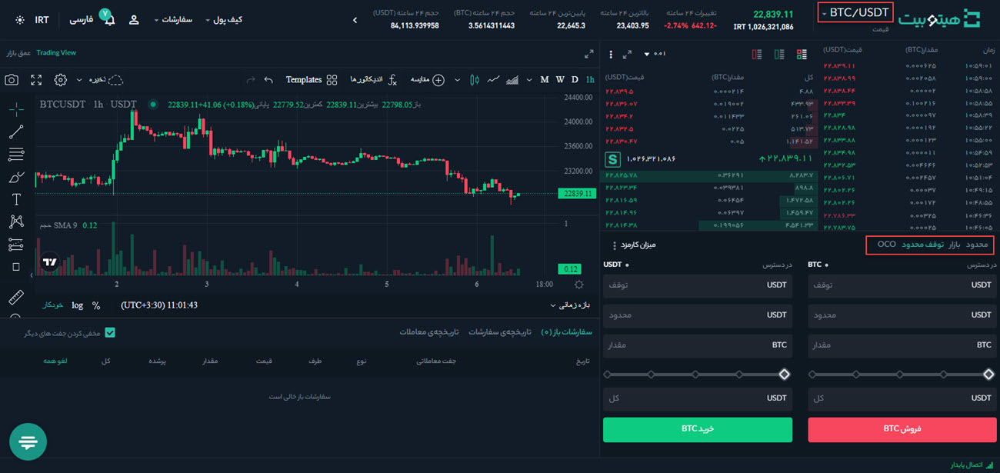
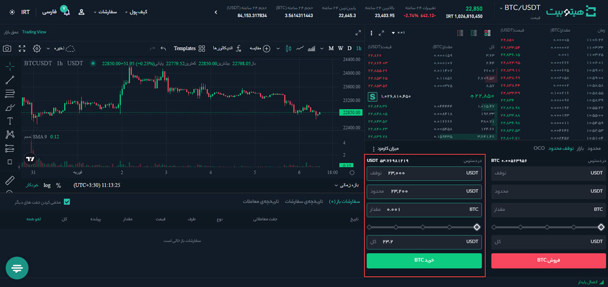
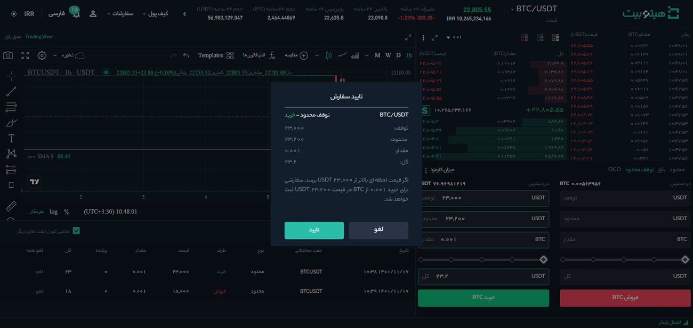
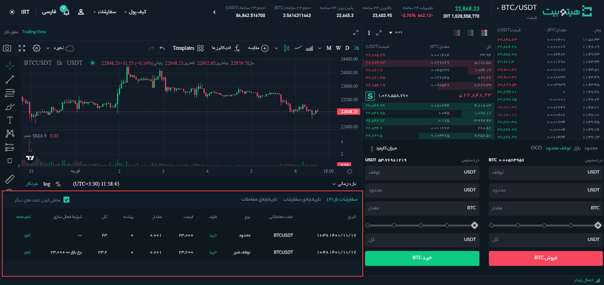
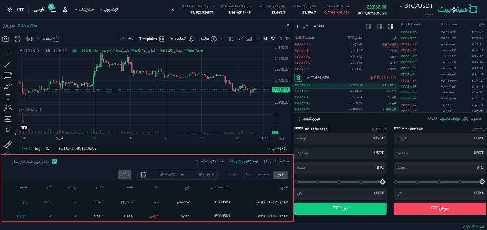

# نحوه ثبت سفارش توقف محدود (Stop-Limit)

سفارش توقف محدود (stop-limit) یکی از انواع سفارش‌های بازار است که دو قیمت شرط و عادی دارد. هنگامی که دارایی به قیمت شرط می‌رسد، سفارش عادی را ثبت می‌کند. قیمت شرط، قیمتی است که پس از رسیدن قیمت بازار به آن، سفارش عادی ثبت می‌شود.

> **توجه**  پس از رسیدن به قیمت شرط، سفارش عادی بلافاصله در لیست سفارش قرار می‌گیرد.

قیمت‌های شرط و عادی می‌تواند یکسان باشد. با این حال، برای سفارش‌های فروش توصیه می‌شود که قیمت شرط را کمی بالاتر از قیمت عادی تعیین کنید. تفاوت قیمت باعث ایجاد گپ معاملاتی بین زمان شروع سفارش و زمان انجام آن می‌شود. 
برای سفارش‌های خرید، قیمت شرط خود را کمی کمتر از قیمت عادی تعیین کنید. در چنین شرایطی احتمال اینکه سفارش شما به صورت کامل انجام شود بیشتر است..

## نحوه ایجاد سفارش توقف محدود (stop-limit)
برای ثبت سفارش توقف محدود باید پارامترهای زیر را وارد کنید:

**قیمت شرط:** زمانی که قیمت دارایی به قیمت شرط مشخص‌شده رسید، ثبت سفارش برای خرید یا فروش دارایی در قیمت عادی انجام می‌شود.

**قیمت عادی:** قیمت مشخص‌شده‌ای است که معامله با آن قیمت در لیست سفارش‌ها ثبت می‌شود.

**مقدار:** مقدار دارایی برای خرید یا فروش است.

برای مثال فرض می‌کنیم آخرین قیمت معامله شده بیت کوین 22,800 دلار است و شما فکر می‌کنید که مقاومتی در حدود 23000 دلار وجود دارد.
اگر تصور می‌کنید که پس از رسیدن به سطح مقاومت، قیمت بالاتر خواهد رفت می‌توانید یک سفارش Stop-Limit برای خرید خودکار بیت کوین  به قیمت 23200 دلار قرار دهید. به‌ این ترتیب مجبور نیستید که به طور مداوم حرکات بازار را دنبال کنید تا قیمت به سطح مورد نظر شما برسد.

برای ثبت سفارش توقف محدود به‌صورت زیر عمل کنید:
1. وارد حساب کاربری خود شوید و از منوی **[معامله]** وارد صفحه **[معاملات پیشرفته]** شوید.

2.    جفت ارز موردنظر خود را انتخاب کنید و در سمت راست صفحه پلتفرم معاملاتی، نوع سفارش را بر روی **[توقف محدود]**  تنظیم کنید.

 
3. جزئیات سفارش شامل قیمت شرط (توقف)، قیمت عادی (محدود) و مقدار رمزارزی را که می‌خواهید بخرید وارد کنید. در مثال ما، قیمت شرط 23,000 دلار و قیمت عادی 23,200 دلار است. برای تأیید جزئیات سفارش، روی **[خرید BTC]** کلیک کنید.

4. سفارش خود را پیش از ارسال به‌دقت بررسی کنید و در صورت اطمینان بر روی **[تأیید]** کلیک کنید. لازم به ذکر است برای فروش نیز باید همین مراحل را دنبال کنید.

## مشاهده سفارش‌های stop-limit موجود

 سفارش‌های stop-limit  پس از ارسال  در **[سفارشات باز]**  قابل مشاهده و بررسی هستند. شما می‌توانید این لیست را در پایین صفحه معاملات خود مشاهده کنید.

سفارش‌های stop-limit اجراشده یا لغوشده نیز در  **[تاریخچه سفارشات]** نمایش داده می‌شوند.

