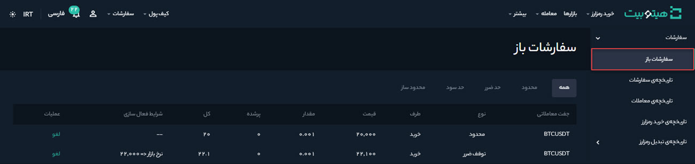
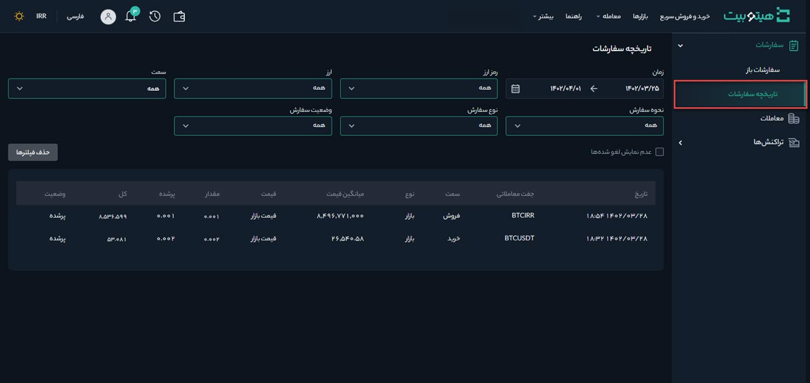

# مشاهده تاریخچه معاملات و سفارش‌ها
برای مشاهده تاریخچه سفارش‌ها به صورت زیر عمل کنید:

1. وارد حساب کاربری خود شوید و از منوی **[تاریخچه]** بر روی **[سفارشات]** کلیک کنید.

2.  ‌سفارش‌های تکمیل نشده در **[سفارش‌های باز]** قابل مشاهده است. این سفارش‌ها را می‌توان بر اساس نحوه سفارش، بازار، خرید یا فروش و نوع سفارش فیلتر کرد.

3. در **[تاریخچه سفارشات]**،  فهرست سفارشات  و اطلاعات مربوط به آنها از جمله تاریخ، جفت معاملاتی، سمت (خرید یا فروش)، نوع، میانگین قیمت، قیمت، مقدار، میزان پرشده سفارش، کل مبلغ سفارش و وضعیت آن  نمایش داده می‌شود. شما می‌توانید سفارشات را بر اساس زمان، نوع رمزارز، ارز، سمت (خرید یا فروش)، نحوه سفارش، نوع سفارش و وضعیت سفارش فیلتر کنید.

4. در   **[معاملات]**، فهرست معاملات انجام‌شده و اطلاعات مربوط به آنها از جمله تاریخ، جفت معاملاتی، سمت (خرید یا فروش)، مقدار، قیمت، میزان کارمزد، ارزی که کارمزد بر اساس آن محاسبه شده است، کل مبلغ معامله و میزان دریافتی نمایش داده می‌شود. شما می‌توانید معاملات را بر اساس زمان، نوع رمزارز، ارز، سمت (خرید یا فروش)، نحوه سفارش و نوع سفارش فیلتر کنید.

